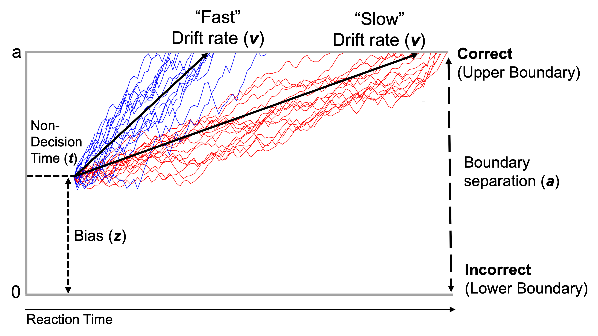

```{r echo=FALSE, results='hide', message=FALSE, warning=FALSE, error=FALSE}
    options(width=80, Ncpus = 6, mc.cores=6,
            papaja.title_page = FALSE)
        
    rm(list=ls())     #Remove everything from environment
    cat("\014")       #Clear Console

  library(knitr)      #allows rmarkdown files
  library(haven)      #helps import stata
  library(MASS)       #calculate residualized scores
  library(tidyverse)  #plotting/cleaning, etc.
  library(broom)      #nice statistical output
  library(here)       #nice file paths
  library(expss)      #labeling variables/values
  library(psych)      #used for statistical analyses
  library(labelled)   #get labelled values when importing from SPSS
  library(confintr)   #get confidence intervals from models
  library(papaja)     #APA formatting
  library(DescTools)  #descriptive statistics
  library(irr)        #ICC
  library(lmerTest)   #p value from mixed effects models
  library(broom.mixed) #tidying output of mixed effects models
  library(ggplot2)    #plotting graphs
  library(ggpubr)
  library(scales)
  library(forcats)
  library(scipub)
  library(datawizard)
  library(workflowr)  #helps with workflow

r_refs("LDDM.bib")
```

```{r analysis-preferences}
knitr::opts_chunk$set(set.seed(312), echo=FALSE, results='hide', message=FALSE, warning=FALSE)
```

```{r}
here::i_am("LDDM_manuscript_working.Rmd")

load(file=here("../data/LDDM_do2_d1_not_outliers.RData"))
load(file=here("../data/LDDM_do2_d2_not_outliers.RData"))
load(file=here("../data/LDDM_do2_d3_not_outliers.RData"))
  
load(file=here("../data/LDDM_cleaning04_calc3_1to3.RData"))
load(file=here("../data/LDDM_do2_irr.RData"))
load(file=here("../data/LDDM_do2.RData"))
load(file=here("../data/LDDM_do2_d.RData"))
load(file=here("../data/spearman_brown_d1.RData"))
load(file=here("../data/spearman_brown_d2.RData"))
load(file=here("../data/spearman_brown_d3.RData"))

load(file=here("../data/LDDM_do3_rdoc.RData"))
load(file=here("../data/LDDM_do3_rdoc_no_outliers.RData"))
load(file=here("../data/spearman_brown_rdoc.RData"))
```

```{r}
make_CI <- function(lower, upper) {
  paste0("[", round(lower,2), ", ", round(upper,2), "]")
}

group.colors <- c(`Drift rate` = "#469990", `Drift rate (congruent)` = "#911eb4", `Drift rate (incongruent)` ="#000075", `Boundary separation` = "#3cb44b", `NIH Toolbox` = "#f58231", `Accuracy (incongruent)` = "#e6194B", `RT interference` = "gold")
```

Cognitive control reflects the ability to coordinate a set of psychological processes to guide behavior toward goals, including sustained attention, action selection, set-shifting, and inhibition [@banichExecutiveFunctionSearch2009; @botvinickMotivationCognitiveControl2015; @oreillyBiologicallyBasedComputational1999].
Deficits in cognitive control are related to a range of mental health disorders [@mcteagueTransdiagnosticImpairmentCognitive2016a; @smucnyCrossdiagnosticAnalysisCognitive2019].

The Eriksen flanker task [@eriksenEffectsNoiseLetters1974] is a robust, commonly used probe of cognitive control abilities, with over 4000 citations of the task’s original 1974 study [@ridderinkhofArrowTimeAdvancing2021].
During this task, participants are asked to identify the direction of the central symbol in a string of symbols that are either congruent (e.g., \< \< \< \< \<) or incongruent (e.g., \< \< \> \< \<) with the central symbol [see @ridderinkhofArrowTimeAdvancing2021].
Typically, participants are instructed to balance responding correctly with responding quickly.
That is, when the central symbol is different from the other symbols (incongruent trials), the outer 'flanking' symbols are distracting and conflicting, necessitating top-down control to avoid erroneous and/or slowed responses.

Historically, researchers have used raw accuracy, reaction time, difference in accuracy or reaction time between conditions, or post-error slowing as behavioral measures from the flanker task [e.g., @huyserDevelopmentalAspectsError2011; @imburgioEstablishingNormsErrorrelated2020; @moorePersistentInfluencePediatric2015; @wylieEffectSpeedaccuracyStrategy2009]; however, these measures exhibit mixed psychometric results.
For example, raw accuracy has poor internal consistency [@wostmannReliabilityPlasticityResponse2013] and mixed test-retest reliability [@sandersPsychometricPropertiesFlanker2018; @paapRoleTestretestReliability2016; @wostmannReliabilityPlasticityResponse2013].
Raw accuracy and reaction time also show variable convergent validity with performance on other measures of cognitive control, including the Stroop and Simon tasks [e.g., correlations of reaction times range from r = -0.01 to 0.67, @keyeIndividualDifferencesConflictmonitoring2009; @stinsResponseInterferenceWorking2005; @paapThereNoCoherent2013].
Moreover, raw accuracy on congruent trials is plagued by ceiling effects, where participants achieve near 100% accuracy on these relatively easier trials.
This limits inter-individual variability and thus the ability to detect meaningful individual differences.

In response to these concerns, a flanker task score was developed that combines accuracy and reaction time to measure visuo-spatial inhibitory attention [@zelazoNIHToolboxCognition2014], and this score is included in the National Institute of Health Toolbox (hereafter referred to as the "NIH Toolbox flanker score").
Although the NIH Toolbox flanker score has exhibited good test-retest reliability (ICCs = 0.83 and 0.92) and convergent validity with other measures of cognitive control in initial studies [e.g., r = 0.60--0.71, @zelazoNihToolboxCognition2013; @zelazoNIHToolboxCognition2014], it has some inherent limitations.
First, it only includes reaction time on incongruent trials, ignoring performance on congruent trials.
This excludes important information, since performance on congruent trials can serve as a useful baseline comparison for performance on incongruent trials.
This is why a common metric used to measure Flanker task performance is an interference score, or difference score between incongruent and congruent accuracy or RT [@danielmeierPostErrorAdjustments2011; @schroderOptimizingAssessmentsPosterror2020].
Second, as with raw accuracy, there is potential for conflating different parts of task performance (e.g., motor preparation, evidence accumulation, speed-accuracy trade-off strategies).
This may explain recent findings that this score has poor construct validity [@ottConstructValidityNIH2022] and test-retest reliability [@anokhinAgerelatedChangesLongitudinal2022; @taylorReliabilityNIHToolbox2022].

An alternative way to measure cognitive control using the flanker task is to apply drift-diffusion modeling/models [DDM, @ratcliffComparisonSequentialSampling2004; @ratcliffDiffusionDecisionModel2008].
Broadly, DDM was developed to delineate processes that influence responses to two alternative choices, such as the flanker task, and has been applied to the flanker task along with other tasks [e.g., @dillonComputationalAnalysisFlanker2015; @priceComputationalModelingApplied2019].
An advantage of DDM over traditional behavioral measures is the inclusion of parameters that capture multiple processes related to different aspects of performance, including those purported to index cognitive control.
Importantly, whereas other measures conflate multiple cognitive processes that contribute to behavior, DDM differentiates them [@whiteUsingDiffusionModels2010; @whiteAnxietyEnhancesThreat2010].
This is important, for example, in clinical studies looking to identify specific processes that are aberrant in psychiatric disorders [e.g., @moserRelationshipAnxietyError2013; @peDiffusionModelAccount2013], or neuroscience studies examining specific brain networks responsible for these functions [@oreillyBiologicallyBasedComputational1999].

DDMs yield parameters that operationalize meaningful psychological processes [see @ratcliffDiffusionDecisionModel2016 for a full discussion of DDMs].
Two DDM parameters particularly relevant for *cognitive control* are (a) drift rate and (b) boundary separation [@bogaczNeuralBasisSpeed2010, see Figure 1].
Drift rate represents the rate at which individuals accumulate evidence for/against choices, with larger drift rate values representing better evidence accumulation, indicative of faster and more accurate responses.
That is, it reflects an individual's ability to extract evidence from stimuli (e.g., determine the direction of the central arrow).
Of note, raw reaction time can be thought of as incorporating the time taken to accumulate evidence (drift rate) and time taken by other processes such as motor preparation (measured by a "non-decision time" parameter in DDM).
Thus, while drift rate is related to raw reaction time, it is more specifically measuring rate of information accumulation.
Boundary separation represents participants' speed-accuracy trade off or "response caution": their willingness to be wrong for the sake of being fast (or slow for the sake of being correct).
Greater boundary separation reflects whether participants prefer being correct over being fast, leading to more accurate, albeit slower, responses (and vice versa for a smaller boundary separation).
Drift rate and boundary separation have been shown to have meaningful relationships with cognitive functions [e.g., effortful control, @ossolaEffortfulControlAssociated2021] and psychopathology [e.g., @dillonComputationalAnalysisFlanker2015; @hallDisentanglingCognitiveProcesses2021a, @hallerComputationalModelingAttentional2021].

Despite its promise and use, limited work has examined the psychometric properties of DDM.
This is important because reliability and validity are necessary to identify whether individuals have stable and meaningful individual differences [@cronbachConstructValidityPsychological1955].
There is reason to believe, however, that DDM-derived measures from the flanker task will be reliable and valid indicators of cognitive control.
Indeed, DDM-derived measures also appear to be more valid than accuracy and reaction time across tasks of cognitive control [@hedgeStrategyProcessingSpeed2022; @priceComputationalModelingApplied2019].
Additionally, DDM parameters from non-cognitive control tasks have been shown to be reliable and stable [i.e., good test-retest reliability, @lercheRetestReliabilityParameters2017; @schubertTraitCharacteristicsDiffusion2016].
The main goal of the current study is to evaluate the reliability (split-half and test-retest reliability) and validity (incremental convergent validity with neural and behavioral indicators of cognitive control) of DDM parameters from flanker task performance and to compare these to typical measures of flanker performance.
Finding that DDM parameters have better reliability and/or validity than traditional measures could add to the potential clinical utility of the flanker task and encourage researchers to re-analyze existing flanker datasets.

As a neural validator, we used the error-related negativity (ERN): an event-related potential (ERP) that occurs in response to the commission of errors [@falkensteinEffectsCrossmodalDivided1991; @gehringNeuralSystemError1993].
Despite the ERN and behavioral measures of cognitive control being conceptualized and validated as different measures of the same construct [@hirshErrorrelatedNegativityPredicts2010; @larsonRelationshipCognitivePerformance2011; @meyerPsychometricPropertiesErrorrelated2014; @meyerReviewExaminingRelationship2019; @toporErrorRelatedCognitiveControl2021], prior investigations have largely found only modest associations between them.
For example, some studies have found that larger ERN amplitudes are related to fewer errors [@holroydNeuralBasisHuman2002; @pailingErrorrelatedNegativityState2004; @pietersActionMonitoringPerfectionism2007; @santessoERPCorrelatesError2005], while others find no relationship at all [@falkensteinERPComponentsReaction2000; @masakiDoesErrorNegativity2007; @weinbergIncreasedErrorrelatedBrain2010].
@meyerReviewExaminingRelationship2019 argue that this may in part be due to raw accuracy and reaction time being coarser measures of behavior.
It is possible that DDM parameters' greater precision and sensitivity would allow these associations to emerge [@bridwellMovingERPComponents2018; @cavanaghSubthalamicNucleusStimulation2011].

As a behavioral validator, we used neuropsychological measures of cognitive control specifically based on task performance from the Delis-Kaplan Executive Function System [D-KEFS, @delisDelisKaplanExecutiveFunction2012a].
The D-KEFS is widely used in research and clinical contexts and exhibits robust reliability and validity [@delisReliabilityValidityDelisKaplan2004; @strongCriterionValidityDelisKaplan2011], making it an ideal standard against which to test the validity of behavioral measures of flanker task performance.

We supplemented these analyses with tests that further inform the extent of the measures' reliability and validity.
For reliability, we aimed to identify the number of trials needed to achieve stable DDM parameter estimates, a necessity to minimize participant burden and help researchers determine whether DDM modeling of extant data will yield meaningful results.
For validity, we compare the familiality of different behavioral measures of the flanker task (i.e., whether the measures "run in families").
Extant studies support cognitive control as a familial, if not heritable trait [@anokhinGeneticsPrefrontalCortex2004; @chenAccessingDevelopmentHeritability2020; @anokhinDevelopmentalGeneticInfluences2010] and establishing a measure as familial has long been viewed as an indicator of a measure's validity[@robinsEstablishmentDiagnosticValidity1970].
Besides supporting the DDM measures' validity, demonstrating shared variance within families would further support future research using the flanker task to study etiology and/or risk of cognitive control deficits [@shankmanPsychopathologyResearchRDoC2015].

Finally, responses to the recent replication crisis in psychology/psychiatry have emphasized the importance of replicating results in independent samples [@opensciencecollaborationOpenLargeScaleCollaborative2012; @opensciencecollaborationEstimatingReproducibilityPsychological2015].
There are also concerns that tasks with strong condition-level effects (in this case, differences between congruent and incongruent) have reduced between-person variability and thus unstable individual differences [@hedgeReliabilityParadoxWhy2018].
Therefore, a final goal was to assess whether findings (e.g., split-half reliability, convergent validity with ERN) would replicate across two independent samples.

In sum, we sought to examine the reliability and validity of measures of behavioral performance on a well-studied behavioral task of cognitive control: the Eriksen flanker task [@eriksenEffectsNoiseLetters1974].
We compared the psychometric properties of DDM parameters to raw accuracy, reaction time (RT) interference, and the NIH Toolbox flanker score across two independent adult samples.
Both studies assessed split-half reliability and incremental convergent validity of the DDM parameters with brain measures (i.e., the ERN).
One study with three time points assessed the test-retest reliability of these parameters, while another study additionally assessed the incremental convergent validity of the DDM parameters with neurocognitive measures (i.e., D-KEFS), and familiality of measures.

# Methods

## Participants

### Study 1

For Study 1, individuals were recruited from mental health clinics and the local community.
Inclusion criteria were being 18--30-years-old, having a biological sibling within the same age range able to participate, and right-handedness.
Exclusion criteria were having a history of a head trauma with loss of consciousness or having a first-degree relative with bipolar or psychotic symptoms [for full method details, see @correaRoleIntoleranceUncertainty2019; @gorkaReactivityUncertainThreat2016; @katzFamilyStudyDSM52018; @weinbergBluntedNeuralResponse2015].
Participants were oversampled for severe internalizing psychopathology using the Depression, Anxiety, and Stress Scale [@lovibondStructureNegativeEmotional1995] during initial screening.
See Supplement for reasons subjects were excluded.
The final sample was N=`r sum(complete.cases(LDDM_do3_rdoc$flanker_score_rdoc))`.
Of note, prior findings have been reported on this sample [@kaiserTestretestFamilialConcordance2020; @letkiewiczChildhoodMaltreatmentPredicts2021; @liElectrophysiologicalEvidenceMaladaptation2023], though none used drift-diffusion modeling of flanker task data.

### Study 2

For Study 2, individuals were recruited from flyers and online.
Inclusion criteria were being 18--60-years-old and right-handed.
Exclusion criteria were a history of major medical or neurological problems, or head trauma with loss of consciousness \> 15 minutes.
Data were from the first three sessions of a longitudinal study [@weinbergEmotionElicitedLate2021] in which participants completed the flanker task each session.
The final N for Study 2 was `r length(LDDM_cleaning04_calc3_1to3$ID)`.
See Table 1 for full demographic information on the final samples.

## Procedure

### Flanker task

In Study 1 and 2, the same arrowhead version of the flanker task was administered using Presentation software (Neurobehavioral Systems, Berkeley, CA).
On each trial, participants were presented with a row of five arrowheads for 200 ms and were asked to indicate the direction of the central arrowhead with the left or right mouse button as quickly and accurately as possible.
Half of the trials were congruent, and half were incongruent with trial order randomized.
Participants completed 11 blocks of 30 trials (330 trials total), with short breaks in between blocks.
At the end of each block, participants received one of three types of performance feedback: if accuracy was 75% or lower, the message "Please try to be more accurate" was displayed; if accuracy was above 90%, the message "Please try to respond faster" was displayed; if accuracy was between 75% and 90%, the message "You're doing a great job" was displayed.

## Validators

```{r}
n_winsorized_ern <- function(full_dataset, winsorized_dataset, var_win){
  sum(winsorized_dataset[,var_win] - (full_dataset[,var_win]*-1)>0, na.rm=T) + 
    sum(winsorized_dataset[,var_win] - (full_dataset[,var_win]*-1)<0, na.rm=T) }

n_winsorized <- function(full_dataset, winsorized_dataset, var_win){
  sum(winsorized_dataset[,var_win] - (full_dataset[,var_win])>0, na.rm=T) + 
    sum(winsorized_dataset[,var_win] - (full_dataset[,var_win])<0, na.rm=T) }
```

### EEG Data Collection for Studies 1 and 2

During the flanker task, continuous EEG activity was recorded at a sampling rate of 1024 Hz using the ActiveTwo BioSemi system (BioSemi, Amsterdam, Netherlands) in Study 1 and at 1000Hz using the Neuroscan Synamp2 system (Compumedics, Charlotte, NC, USA) in Study 2.
In Study 1, recordings were taken from 64 Ag/AgCl electrodes placed according to the 10/20 system.
In Study 2, recordings were taken from six midline electrodes (Fz, FCz, Cz, CPz, Pz, & POz).
See Supplement for further details regarding EEG data processing.
In both studies, response-locked ERN was defined as the mean voltage amplitude from 0 to 80 ms at FCz per prior research and baseline corrected using the 500 to 300 ms pre-response interval [e.g., @gorkaErrorrelatedBrainActivity2018; @letkiewiczChildhoodTraumaPredicts2023].
ERPs were computed separately for correct and error responses, and a residualized score (ERP to error responses regressed on ERP to correct responses) was calculated to isolate activity to errors [@meyerConsideringERPDifference2017], yielding the ERN~resid~ component.
Participant averages had to include at least 10 error and 10 correct artifact free trials per session.
This minimum was chosen per prior studies on the reliability of the ERN~resid~ [@meyerReliabilityERNMultiple2013; @boudewynHowManyTrials2018].
To aid in interpretation, the ERN~resid~ was multiplied by -1 so that larger (i.e., more positive) values indicated an ERN~resid~ with a greater amplitude.
In Study 1, `r n_winsorized_ern(LDDM_do3_rdoc, LDDM_do3_rdoc_no_outliers, "FCz_ERN_080")` subject was winsorized.
In Study 2, `r n_winsorized_ern(LDDM_do2_d1, LDDM_do2_d1_not_outliers, "FCZ_ERN_080")` for Session 1, `r n_winsorized_ern(LDDM_do2_d2, LDDM_do2_d2_not_outliers, "FCZ_ERN_080")` for Session 2, and `r n_winsorized_ern(LDDM_do2_d3, LDDM_do2_d3_not_outliers, "FCZ_ERN_080")` for Session 3 were winsorized.

### Neuropsychological measures from Study 1

Performance on neuropsychological tasks that assess different aspects of cognitive control (inhibition, set-shifting) was summarized into two scores to assess incremental, convergent validity.
First, inhibition was estimated from participants' time to complete the inhibition condition from the D-KEFS Color-Word Interference task [D-KEFS, @delisDelisKaplanExecutiveFunction2012a].
Second, set-shifting was estimated using a mean composite of four measures from the D-KEFS Design Fluency, Verbal Fluency, Trail-Making, and Color-Word Interference tasks.
Specifically, measures used were the (1) total number of designs made during category switching on Design Fluency, (2) total number of successful switches made during the category switching condition on Verbal Fluency, (3) completion time for the number-letter sequencing condition on Trail-Making, and (4) completion time for the inhibition/switching condition on Color-Word Inference.
See Supplement for further details regarding these tasks.
Reverse scoring was applied so that higher scores indicate "better" (i.e., faster and more accurate) performance.

Outliers in each validator were winsorized, such that values greater than 3 standard deviations from the mean were replaced by the maximum/minimum allowed value (the mean ± 3 standard deviations).
Specifically, `r n_winsorized(LDDM_do3_rdoc, LDDM_do3_rdoc_no_outliers, "Inhib_time_rev")` inhibition and `r n_winsorized(LDDM_do3_rdoc, LDDM_do3_rdoc_no_outliers, "exec_composite")` set-shifting scores were winsorized.

### Covariates in Study 1

For regression analyses in Study 1, covariates included: (1) estimated IQ, using the Wechsler Test of Adult Reading [@wechsler2001wechsler; @straussCompendiumNeuropsychologicalTests2006] to account for the impact of general cognitive abilities, and (2) motor speed from the D-KEFS Trail Making Test to account for the overall impact of slowed reaction time.
Subjects' age was also a covariate in regression analyses for both Study 1 and 2.
All predictors of interest and covariates were standardized except participant age.

## Data analysis

### Drift-diffusion modeling

DDM parameters were estimated for participants' flanker task performance using the Hierarchical Drift-Diffusion Model Toolbox [HDDM, version 0.9.6, <http://github.com/hddm-devs/hddm>, @wieckiHDDMHierarchicalBayesian2013].
Specifically, we fit a DDM with a Bayesian estimator, which can yield consistent estimates with fewer trials than maximum likelihood-based estimation approaches [@lercheHowManyTrials2017].
These models use participants' reaction time and choice information from each trial to estimate decision-making processes [@hallerComputationalModelingAttentional2021; @karalunasIntegratingImpairmentsReaction2013; @ratcliffDiffusionDecisionModel2008].
During a trial, evidence will "drift" toward or away from the response boundaries as evidence accumulates in favor of one response over the other (i.e., left or right).
Once enough evidence has accumulated in favor of a particular response, that boundary is crossed, resulting in the execution of that response.
Given prior work with these models [e.g., @aylwardTranslatingRodentMeasure2020; @ossolaEffortfulControlAssociated2021; @zieglerModellingADHDReview2016], the present study assessed the fit of various models with different numbers of estimated parameters (drift rate, boundary separation, non-decision time, starting bias), including models in which parameters varied by condition (e.g., drift rate to congruent stimuli, drift rate to incongruent stimuli), and models including intertrial variability parameters.
Fit was assessed using relative DIC and posterior predictive checks (see Supplement).
The best-fitting model included 9 parameters: drift rate for congruent and incongruent trials, boundary separation for congruent and incongruent trials, non-decision time for congruent and incongruent trials, a single bias parameter, and intertrial variability parameters for drift rate and starting bias (see Supplement).
Analyses focused on two parameters of interest: drift rate (i.e., the slope or speed of evidence accumulation) and boundary separation (i.e., speed-accuracy trade-off, see Figure 1).
Although other parameters were fit to the data, including non-decision time (i.e., time needed for visual processing, motor preparation, and response execution) and response bias (i.e., tendency to make one response over the other), analyses focused on drift rate and separation boundary as they are more widely studied DDM parameters in clinical and cognitive neuroscience literature and more directly indicative of cognitive control-related processes [@robinsonLinkingComputationalModels2023].

Of note, models were coded such that accurate and inaccurate responses represented the upper and lower boundaries (i.e., thresholds), respectively (see Supplement for model selection results).

### Raw accuracy

Raw accuracy was calculated as the proportion of total responses that are correct.
Accuracy on congruent trials was highly skewed with little variability, given participants' high rates of correct responses (Mean = `r round(mean(LDDM_do3_rdoc_no_outliers$accuracy_congruent, na.rm = TRUE),4)*100`%, SD = `r round(sd(LDDM_do3_rdoc_no_outliers$accuracy_congruent, na.rm = TRUE),4)*100`%, Skewness = `r round(skewness(LDDM_do3_rdoc_no_outliers$accuracy_congruent, na.rm = TRUE)[1,1],4)`), whereas accuracy on incongruent trials followed a Gaussian distribution (Mean = `r round(mean(LDDM_do3_rdoc_no_outliers$accuracy_incongruent, na.rm = TRUE),4)*100`%, SD = `r round(sd(LDDM_do3_rdoc_no_outliers$accuracy_incongruent, na.rm = TRUE),4)*100`%, Skewness = `r round(skewness(LDDM_do3_rdoc_no_outliers$accuracy_incongruent, na.rm = TRUE)[1,1],4)`).
Moreover, prior studies have found raw accuracy on incongruent trials to be more reliable than on congruent trials in similar tasks [@wostmannReliabilityPlasticityResponse2013].
For this reason, we only analyzed raw accuracy on incongruent trials.

### Reaction time interference

Per prior studies [e.g., @dillonComputationalAnalysisFlanker2015], for each participant, trials were removed if they were faster than 150ms or the log-transformed RT exceeded the participant's mean log RT ± 3\*SD, computed separately for congruent and incongruent stimuli.
Reaction time (RT) was calculated as the difference between a participants' median-log reaction time on incongruent and median-log reaction time on congruent trials.

### NIH Toolbox flanker score

Scores were calculated according to published instructions from the NIH Toolbox manual [@nationalinstitutesofhealthandnorthwesternuniversityNIHToolboxScoring2021] and prior research [@weintraubCognitionAssessmentUsing2013; @zelazoNIHToolboxCognition2014].
As per @zelazoNIHToolboxCognition2014, accuracy and reaction time were adjusted for the number of trials and log of the median RT, respectively, and transformed so that both values were on a scale ranging from 0-5.
These scores were added together resulting in a score that ranges from 0-10, with higher scores indicating "better" (i.e., faster and more accurate responses); however, per the manual, for participants with accuracy less than or equal to 80%, reaction time was omitted from the calculation of their score [@zelazoNihToolboxCognition2013; @zelazoNIHToolboxCognition2014].

### Reliability: Split-half and test-retest

Split-half reliability was measured by entering the Pearson bivariate correlation between the first and second half of the data into the Spearman-Brown prediction formula [$Spearman \text{ } Brown = \frac{2r}{1+r}$, @infantolinoRobustNotNecessarily2018; @lukingInternalConsistencyFunctional2017].
Split-half reliability was also examined at increments of 15 trials (e.g., first 15 trials vs. second 15 trials, first 30 trials vs. second 30 trials, etc.) up to a complete split-half comparison (first 165 trials vs. second 165 trials, 330 total trials) to assess the point at which the Spearman Brown reached stability.
Cutoffs from @hensonUnderstandingInternalConsistency2001 were used to identify split-half reliability at different levels (\<0.70 = poor, 0.70--0.79 = acceptable, 0.80--0.89 = good, and \>0.90 = excellent).
Test-retest reliability was calculated as the intraclass correlation coefficient (ICC) across all three sessions from Study 2.

### Validity: Correlations, multiple regressions, and familiality

Pearson correlation coefficients were used to examine the association between each flanker behavioral performance measure (DDM parameters, raw accuracy, RT interference, and NIH Toolbox flanker score) and the ERN~resid~ and neuropsychological assessment scores.
Multiple regression models were then used to assess the relative and unique variance accounted for by DDM parameters, raw accuracy, RT interference, and NIH Toolbox flanker score in the validators (ERN~resid~ and neuropsychological scores).
In Study 1, linear mixed effect multiple regression models were used to account for within-family relatedness, a random intercept between sibling pairs; in Study 2, linear multiple regression models were used.
Familiality was estimated as the ICC between siblings from the same family in Study 1 [@katzFamilyStudyDSM52018].

## Data exclusions for each analysis

To clarify, participant data was excluded from DDM modeling and subsequent analyses if they had poor accuracy on the flanker task (i.e., \<50%); however this was only the case for one subject in Study 2 and no subjects in Study 1.
Participant ERN data was excluded from analyses if they had fewer than 10 artifact-free trials per condition (Study 1: N=26, Study 2: N=7 across 11 sessions of data).

## Statistical analyses

DDM modeling was conducted in python and accuracy, RT interference, and NIH Toolbox flanker score were computed in R.
All individual-level behavioral measures (i.e., drift rate, boundary separation, raw accuracy, RT interference, NIH Toolbox flanker score) were imported into `r version$version.string` where remaining analyses were conducted.
Correlations, linear multiple regressions, linear mixed effect multiple regressions, and ICCs used list wise deletion of participants when missing values were present.

# Results

## Split-half reliability

```{r, warning=FALSE}
make_splithalf_datatable <- function (df) {
  data.frame(trials=seq(15,165,15),
                             rvcon=df$avtz_DO_v_df_vcon,
                             rvcon_cilower=df$avtz_DO_v_df_v_con_ci_lower,
                             rvcon_ciupper=df$avtz_DO_v_df_v_con_ci_upper,
                             rvincon=df$avtz_DO_v_df_vinc,
                             rvincon_cilower=df$avtz_DO_v_df_v_inc_ci_lower,
                             rvincon_ciupper=df$avtz_DO_v_df_v_inc_ci_upper,
                             ra=df$avtz_DO_v_df_a,
                             ra_cilower=df$avtz_DO_v_df_a_ci_lower,
                             ra_ciupper=df$avtz_DO_v_df_a_ci_upper)
}

# This function formats a dataset from spearman_brown_ to a plot of Spearman-Brown split-half reliability across blocks
plot_splithalf_data <- function(data) {
  plot_data <- data %>%
  # full_join(spearman_brown_d1_ddm, by = "trials") %>%
  # select(-c("rdriftcon","rdriftincon","rboundary_separation")) %>%
  pivot_longer(-c(trials), names_to="Measure") %>%
  separate(Measure, "_", into = c("Measure", "Stat")) %>%
  pivot_wider(names_from=Stat, values_from=value) %>%
  mutate(r=`NA`) %>%
  select(-c(`NA`)) %>%
  mutate(Measure_long = recode_factor(Measure, rv = "Drift rate", ra = "Boundary separation", rnih = "NIH Toolbox", racc = "Accuracy (incongruent)", rrt= "RT interference"))
                                               
ggplot(plot_data, aes(x=trials*2, y=r, fill=Measure_long)) +
  geom_line(aes(color=Measure_long)) +
  geom_point(aes(color=Measure_long)) +
  geom_ribbon(aes(ymin = cilower, ymax = ciupper, fill=Measure_long), alpha = 0.1) +
  scale_x_continuous(breaks=data$trials*2) +
  scale_y_continuous(limits = c(-0.3, 1), breaks=seq(0,1,by=0.10)) +
  scale_color_manual(name="Measure", values=group.colors,
                    labels=c(str_wrap("Drift rate", 10), str_wrap("Boundary separation",10),
                             str_wrap("NIH Toolbox",10), str_wrap("Accuracy (incongruent)",10),
                             str_wrap("RT interference",10))) +
  scale_fill_manual(guide=NULL, values=group.colors) +
  theme_apa() +
  theme(legend.position="top")
}

sh_d1 <- plot_splithalf_data(spearman_brown_d1)
sh_d2 <- plot_splithalf_data(spearman_brown_d2)
sh_d3 <- plot_splithalf_data(spearman_brown_d3)
sh_rdoc <- plot_splithalf_data(spearman_brown_rdoc)

trial_above_seventy <- function(data, measure) {
  temp <- data %>%
    dplyr::filter({{measure}} >= 0.70) %>% 
    mutate(trials=trials*2) %>% 
    filter(row_number()==1) %>% 
    dplyr::select(trials)
  return(temp$trials)
}

trial_plateaued <- function(data, measure) {
  data %>%
    mutate(rdiff = {{measure}} - last({{measure}}),
           trials = trials*2) %>%
    filter(abs(rdiff) <= 0.01) %>%
    filter(row_number()==1) %>% 
    mutate(r = round({{measure}},2)) %>%
    dplyr::select(r, trials)
}
```

Drift rate and boundary separation both demonstrated comparable split-half reliability to raw accuracy, RT interference, and the NIH Toolbox score in Study 1 and across all three sessions of Study 2 when all 330 trials were used (see Figure 2).

Examination of split half reliability at increments of 15 trials revealed that drift rate to congruent stimuli reached above 0.70 at `r trial_above_seventy(spearman_brown_rdoc, rvcon)` trials and increased until `r trial_plateaued(spearman_brown_rdoc, rvcon)$trials` trials (SB= `r trial_plateaued(spearman_brown_rdoc,rvcon)$r`) at which point it plateaued (i.e., $\Delta r$ $\le$ 0.01 of terminal value at 330 trials, Spearman Brown at 330 trials: Study 1 = `r round(spearman_brown_rdoc[spearman_brown_rdoc$trials==165,"rvcon"],2)`, Study 2 Session 1 = `r round(spearman_brown_d1[spearman_brown_d1$trials==165,"rvcon"],2)`, Study 2 Session 2 = `r round(spearman_brown_d2[spearman_brown_d2$trials==165,"rvcon"],2)`, Study 2 Session 3 = `r round(spearman_brown_d3[spearman_brown_d3$trials==165,"rvcon"],2)`).
Drift rate to incongruent stimuli reached above 0.70 at `r trial_above_seventy(spearman_brown_rdoc, rvincon)` trials and did not increase further (Spearman Brown at 330 trials: Study 1 = `r round(spearman_brown_rdoc[spearman_brown_rdoc$trials==165,"rvincon"],2)`, Study 2 Session 1 = `r round(spearman_brown_d1[spearman_brown_d1$trials==165,"rvincon"],2)`, Study 2 Session 2 = `r round(spearman_brown_d2[spearman_brown_d2$trials==165,"rvincon"],2)`, Study 2 Session 3 = `r round(spearman_brown_d3[spearman_brown_d3$trials==165,"rvincon"],2)`).

Boundary separation to congruent stimuli reached above 0.70 at `r trial_above_seventy(spearman_brown_rdoc, racon)` trials, and did not increase further (Spearman Brown at 330 trials: Study 1 = `r round(spearman_brown_rdoc[spearman_brown_rdoc$trials==165,"racon"],2)`, Study 2 Session 1 = `r round(spearman_brown_d1[spearman_brown_d1$trials==165,"racon"],2)`, Study 2 Session 2 = `r round(spearman_brown_d2[spearman_brown_d2$trials==165,"racon"],2)`, Study 2 Session 3 = `r round(spearman_brown_d3[spearman_brown_d3$trials==165,"racon"],2)`).
Boundary separation to incongruent stimuli reached above 0.70 at `r trial_above_seventy(spearman_brown_rdoc, raincon)` trials, and increased until `r trial_plateaued(spearman_brown_rdoc[3:11,], raincon)$trials` trials (`r trial_plateaued(spearman_brown_rdoc[3:11,], raincon)$r`), at which point it plateaued (Spearman Brown at 330 trials: Study 1 = `r round(spearman_brown_rdoc[spearman_brown_rdoc$trials==165,"raincon"],2)`, Study 2 Session 1 = `r round(spearman_brown_d1[spearman_brown_d1$trials==165,"raincon"],2)`, Study 2 Session 2 = `r round(spearman_brown_d2[spearman_brown_d2$trials==165,"raincon"],2)`, Study 2 Session 3 = `r round(spearman_brown_d3[spearman_brown_d3$trials==165,"raincon"],2)`).

NIH Toolbox score never reached above 0.70 and increased until `r trial_plateaued(spearman_brown_rdoc, rnih)$trials` trials (SB = `r trial_plateaued(spearman_brown_rdoc, rnih)$r`), at which point it plateaued (Spearman Brown at 330 trials: Study 1 = `r round(spearman_brown_rdoc[spearman_brown_rdoc$trials==165,"rnih"],2)`, Study 2 Session 1 = `r round(spearman_brown_d1[spearman_brown_d1$trials==165,"rnih"],2)`, Study 2 Session 2 = `r round(spearman_brown_d2[spearman_brown_d2$trials==165,"rnih"],2)`, Study 2 Session 3 = `r round(spearman_brown_d3[spearman_brown_d3$trials==165,"rnih"],2)`).
Raw accuracy to incongruent stimuli reached above 0.70 at `r trial_above_seventy(spearman_brown_rdoc, racc)` trials and increased until `r trial_plateaued(spearman_brown_rdoc, racc)$trials` trials (SB = `r trial_plateaued(spearman_brown_rdoc, racc)$r`), at which point it plateaued (Spearman Brown at 330 trials: Study 1 = `r round(spearman_brown_rdoc[spearman_brown_rdoc$trials==165,"racc"],2)`, Study 2 Session 1 = `r round(spearman_brown_d1[spearman_brown_d1$trials==165,"racc"],2)`, Study 2 Session 2 = `r round(spearman_brown_d2[spearman_brown_d2$trials==165,"racc"],2)`, Study 2 Session 3 = `r round(spearman_brown_d3[spearman_brown_d3$trials==165,"racc"],2)`).
Reaction time interference reached above 0.70 at `r trial_above_seventy(spearman_brown_rdoc, rrt)` trials and increased until `r trial_plateaued(spearman_brown_rdoc, rrt)$trials` trials (SB = `r trial_plateaued(spearman_brown_rdoc, rrt)$r`), at which point it plateaued (Spearman Brown at 330 trials: Study 1 = `r round(spearman_brown_rdoc[spearman_brown_rdoc$trials==165,"rrt"],2)`, Study 2 Session 1 = `r round(spearman_brown_d1[spearman_brown_d1$trials==165,"rrt"],2)`, Study 2 Session 2 = `r round(spearman_brown_d2[spearman_brown_d2$trials==165,"rrt"],2)`, Study 2 Session 3 = `r round(spearman_brown_d3[spearman_brown_d3$trials==165,"rrt"],2)`).
Thus, of the measures, boundary separation to incongruent stimuli showed the most robust split-half reliability to varying numbers of trials, and the fewest trials in order to achieve excellent reliability.

## Test-retest reliability

```{r}
sttr_icc_table <- read.csv(here("../tables/sttr_icc_table_123.csv"))[-c(5,6,7),]
```

All measures showed significant test-retest reliabilities across the three sessions of Study 2, with moderate effect sizes ranging from `r round(min(sttr_icc_table[,3]),2)` (`r sttr_icc_table[sttr_icc_table$ICC==min(sttr_icc_table$ICC),"parameters"]`) to `r round(max(sttr_icc_table[,3]),2)` (`r sttr_icc_table[sttr_icc_table$ICC==max(sttr_icc_table$ICC),"parameters"]`, see Figure 3).

## Incremental convergent validity

```{r}
inh_acc_cor <- cor.test(LDDM_do3_rdoc_no_outliers$Inhib_time_rev_z, LDDM_do3_rdoc_no_outliers$accuracy_incongruent_z, method="pearson")
exec_acc_cor <- cor.test(LDDM_do3_rdoc_no_outliers$exec_composite_z, LDDM_do3_rdoc_no_outliers$accuracy_incongruent_z, method="pearson")
ern_acc_cor <- cor.test(LDDM_do3_rdoc_no_outliers$exec_composite_z, LDDM_do3_rdoc_no_outliers$accuracy_incongruent_z, method="pearson")
```

### Neural measures

Bivariate correlations between the behavioral measures, ERN, and neurocognitive functioning are presented in Table 2 for Study 1 and Table 3 for Study 2.
Significant relationships emerged for the ERN~resid~ and the following measures: NIH Toolbox flanker score, drift rate to congruent and incongruent stimuli, and boundary separation to incongruent stimuli.
Each DDM parameters was entered into a multiple regression model along with raw accuracy, RT interference, and the NIH Toolbox flanker scores as simultaneous predictors of the ERN~resid~ to evaluate incremental validity (i.e., the improvement in predictive ability of DDM parameters beyond existing measurements).
The DDM parameters (drift rate to congruent and incongruent stimuli, boundary separation to congruent and incongruent stimuli) were entered in separate multiple regression models because they are purported to measure different processes.

Drift rates to congruent and incongruent stimuli were significantly associated with ERN~resid~ amplitude in Study 1 over-and-above ERN~resid~'s association with raw accuracy, RT interference, and the NIH Toolbox flanker scores (see Figure 4).
This relationship indicates that faster or higher quality accumulation of evidence (i.e., drift rate) is associated with larger ERN~resid~ amplitude.
The NIH Toolbox flanker score was no longer significantly associated with ERN~resid~ when drift rate or boundary separation were included in the model.
Results were similar for all sessions of Study 2, though the associations between drift rate to incongruent stimuli and ERN~resid~ were non-significant at all sessions (see Supplement).

```{r}
mr_table_names <- c("X","parameters", "ddm_est", "ddm_lci", "ddm_uci",
                                                 "nih_est", "nih_lci", "nih_uci",
                                                 "acc_est", "acc_lci", "acc_uci",
                                                 "rt_est", "rt_lci", "rt_uci")
mr_ERN_table_d1_raw <- read.csv(file=here("../tables/mr_ERN_table_d1_raw.csv"))
colnames(mr_ERN_table_d1_raw) <- mr_table_names
mr_ERN_table_d1_raw_new <- mr_ERN_table_d1_raw %>%
  select(-X) %>%
  pivot_longer(cols=ddm_est:rt_uci, names_to=c("measure","stat"), names_sep="_") %>%
  pivot_wider(names_from=stat, values_from=value)
```

```{r}
acc_ern_r <- cor.test(LDDM_do3_rdoc_no_outliers$accuracy_incongruent_z, LDDM_do3_rdoc_no_outliers$FCz_ERN_080_z, method="pearson")

acc_inhib_r <- cor.test(LDDM_do3_rdoc_no_outliers$accuracy_incongruent_z, LDDM_do3_rdoc_no_outliers$Inhib_time_rev_z, method="pearson")

acc_exec_r <- cor.test(LDDM_do3_rdoc_no_outliers$accuracy_incongruent_z, LDDM_do3_rdoc_no_outliers$exec_composite_z, method="pearson")
```

Boundary separation to incongruent stimuli was significantly associated with ERN~resid~ amplitude in Study 1 over-and-above ERN~resid~'s association with raw accuracy, RT interference, and the NIH Toolbox flanker scores (see Figure 4).
Direction of effects were consistent in study 2 results, however the associations between boundary separation to incongruent stimuli and ERN~resid~ were non-significant in sessions 1 and 3 (see Supplement).
This relationship indicates that a greater emphasis on being quick (and reduced emphasis on responding correctly) is associated with a larger ERNresid amplitude.
Moreover, in these models, raw accuracy was significantly related to ERN~resid~, such that better performance (i.e., fewer errors) was related to a larger ERN~resid~; however, raw accuracy and ERN~resid~ were not significantly bivariately correlated ($r$ = `r round(acc_ern_r$estimate,3)`, $p$ = `r round(acc_ern_r$p.value,3)`).

NIH Toolbox was significantly associated with ERN~resid~ amplitude in Study 1 over-and-above ERN~resid~'s association with boundary separation to congruent stimuli, raw accuracy, and RT interference.

### Neuropsychological measures

Bivariate correlations show significant relationships between neuropsychological assessments of cognitive control and the following flanker task measures: drift rate and boundary separation to congruent and incongruent stimuli, NIH Toolbox flanker scores, and raw accuracy (though only to set-shifting and not inhibition; see Table 2).
Drift rate, raw accuracy to incongruent stimuli, RT interference, and the NIH Toolbox flanker scores were entered into a multiple regression model as simultaneous predictors of performance on the D-KEFS tasks separately for inhibition and set-shifting.

Drift rate to congruent stimuli was significantly associated with both inhibition and set-shifting, over-and-above raw accuracy, RT interference, and the NIH Toolbox flanker scores.
Drift rate to incongruent stimuli was significantly associated with set-shifting, but not inhibition, over-and-above raw accuracy, RT interference, and the NIH Toolbox flanker scores (see Figure 4).
These relationships indicate that faster or higher quality accumulation of evidence (drift rate) during the flanker task is associated with better performance (i.e., faster) on both inhibition and set-shifting tasks.

Boundary separation to incongruent stimuli was significantly associated with both inhibition and set-shifting over-and-above raw accuracy, RT interference, and the NIH Toolbox flanker scores (see Figure 4).
These relationships indicate that a greater emphasis on being correct (and reduced emphasis on responding quickly) is associated with worse performance on both inhibition and set-shifting tasks.

NIH Toolbox was significantly associated with both neuropsychological measures, over-and-above boundary separation to congruent stimuli, raw accuracy, and RT interference.
Accuracy was significantly associated with set-shifting over-and-above boundary separation to incongruent stimuli, drift rate to congruent and incongruent stimuli, RT interference, the NIH Toolbox flanker scores (see Figure 4).
This negative association, however, suggests that better performance (i.e., fewer errors) was related to worse set-shifting, a counter-intuitive and unexpected effect.

### Familiality

```{r}
LDDM_do3_rdoc_no_outliers_sib <- LDDM_do3_rdoc_no_outliers %>%
  pivot_wider(id_cols=F_ID, names_from=S_ID, 
              values_from=c(v_congruent_z,v_incongruent_z,
                            a_congruent_z,a_incongruent_z,
                            flanker_score_rdoc_z,accuracy_incongruent_z,rt_interference_z))
```

Analyses of familiality (N = `r icc(LDDM_do3_rdoc_no_outliers_sib[c("v_congruent_z_1","v_congruent_z_2")])$subjects` sibling pairs) showed that drift rate to congruent stimuli and RT interference were significantly familial (i.e., similar between siblings), while drift rate to incongruent stimuli was familial at trend levels, boundary separation, NIH Toolbox flanker score, and raw accuracy were not significantly familial (Table 4).

# Discussion

The present study sought to compare psychometric properties of four behavioral performance measures of the Eriksen flanker task.
In sum, we found that drift-diffusion modeling (DDM) produced separable parameters--drift rate to congruent and incongruent stimuli and boundary separation to incongruent stimuli--with comparable reliability (split-half and test-retest) to typical scores (i.e., raw accuracy, RT interference, a NIH Toolbox flanker score), but better incremental and convergent validity with neural (ERN) and behavioral (neuropsychological) indicators of inhibition and set-shifting, as well as somewhat better familiality (for drift rate to congruent stimuli).
Furthermore, several of these findings were replicated in an independent sample.
Taken together, this study provides a robust within- and between-subjects replication of the relative reliability and validity of DDM parameters as measures of cognitive control compared to commonly used behavioral measures of the Eriksen flanker task.

## Drift-diffusion model

Evaluating the psychometrics of behavioral measures such as those derived from the flanker task is imperative if the task is to be used to assess individual differences.
Moreover, identifying the relative advantages and disadvantages of these measures can help to guide decisions about its use.
For example, if stable measurements of DDM parameters can be achieved with fewer trials than are typically collected (\~300 trials), then this could make the task more tolerable in clinical samples.
Indeed, we found that across both samples only about 210-270 trials were needed to reliably estimate drift rate and boundary separation to incongruent stimuli, and that very few trials were needed to estimate drift rate and boundary separation to congruent stimuli (\~60; though because modeling is somewhat dependent on the full sample, studies will need to test for themselves that parameters can be estimated in their sample with fewer trials).
Moreover, our finding that the NIH Toolbox flanker score was fairly unreliable at any number of trials is certainly at odds with the fact that only 20 trials are administered as part of the NIH Toolbox battery.
Including enough trials in cognitive control tasks may be as important---if not more important---than including enough participants in order to detect effects in individual differences research [@rouderPsychometricsIndividualDifferences2019; @rouderWhyManyStudies2023].
This may be why the NIH Toolbox flanker score has demonstrated lower reliability even in very large samples [ICC = 0.43 in N=11,722, @anokhinAgerelatedChangesLongitudinal2022]

In terms of validity, one explanation for why the DDM parameters related to neural and neuropsychological measures over-and-above raw accuracy, RT interference, and the NIH Toolbox flanker score is that they reflect qualitatively different and perhaps "purer" psychological processes.
Drift rate and boundary separation, for example, represent different cognitive processes of evidence accumulation and speed-accuracy trade-off, respectively, making them relatively separate indices of specific aspects of cognitive control.
Modeling a DDM parameter for motor preparation (termed "non-decision time") is also particularly helpful as it removes motor processes implicated in behavioral tasks from cognitive control related abilities [@whiteAnxietyEnhancesThreat2010; @whiteUsingDiffusionModels2010].
This will allow researchers to determine whether participants' speeding up is due to (1) a greater emphasis on responding quickly at the cost of being accurate, (2) improved evidence accumulation (i.e., responding quicker and more accurately), or (3) an altered starting bias towards a particular response.

We also found that boundary separation to incongruent stimuli was related to neuropsychological performance.
Specifically, that a larger boundary separation---indicative of a greater emphasis on being right at the cost of being slow to respond---was related to worse performance on inhibition and set-shifting tasks.
One possible explanation for this effect is that adopting a certain cognitive strategy that emphasizes reducing errors can actually lead to poorer performance when speed is important.
In daily life, such participants may, for example, overly focus on getting every question on an exam correct at the potential cost of not finishing the exam.
On the other hand, individuals may adopt this strategy to compensate for inefficient cognitive control [@moserRelationshipAnxietyError2013].
Nonetheless, the bivariate association between boundary separation and the NIH Toolbox flanker score suggests that the latter may be tapping into this cognitive strategy, but the multiple regression results suggest that boundary separation is a more sensitive measure of this strategy.

Additionally, as drift rate exhibited significant test-retest reliability and significant-to-trending evidence of familiality, drift rate may reflect a trait-like indicator of cognitive control.
Drift rate has been suggested to reflect the quality/strength of a signal in the decision [@boagCognitiveControlWorking2021] and, in other cognitive tasks, drift rate is sensitive to a host of other facets, such as the quality of memories, task difficulty, and memory load [@boagCognitiveControlCapacity2019; @boagStrategicAttentionDecision2019; @ratcliffModelingSimpleDriving2014].
Moreover, drift rate may reflect a cognitive endophenotype [i.e., a heritable trait that appears in patients and their relatives, @iaconoEndophenotypesPsychiatricDisease2018] that predicts risk for psychiatric and neurological disorders.
The present family study [which cannot differentiate genetic from shared environmental factors, @gottesmanEndophenotypeConceptPsychiatry2003], could be followed up with twin studies to test the relative impact of these etiological factors on drift rate.

Some DDM parameters of interest (drift rate to congruent stimuli and boundary separation to incongruent stimuli) exhibited good test-retest reliability, while others (drift rate to incongruent stimuli and boundary separation to congruent stimuli) were still below "good" stability.
Considering that the sessions were only weeks apart, it is unlikely that developmental changes (i.e., true change in cognition) played a role.
One possibility is that tasks designed to minimize inter-individual variability by eliciting condition effects [i.e., within-subject effects such as incongruent relative to congruent, @meyerReviewExaminingRelationship2019], as opposed to tasks designed to maximize inter-individual variability, may show lower between-person reliability [@hedgeReliabilityParadoxWhy2018].
On the one hand, the moderate test-retest reliability of some measures makes it more challenging to assert that measures such as drift rate or boundary separation represent purely trait-like indicators of cognitive control.
On the other hand, DDM parameters may arise from both trait (stable) and state (unstable) factors, making them useful indicators to test how changes in cognitive control track changes in psychopathology [@sharpFormalModelsPsychopathological2020].

This study has broader implications for understanding cognitive control.
First, given enough trials, researchers may immediately apply these models to their own datasets.
Although applying computational modeling to data requires some familiarity with software/statistical packages, DDM modeling is becoming increasingly accessible with free tools developed for Python (<https://hddm.readthedocs.io/en/latest/#>) and R (<https://ccs-lab.github.io/hBayesDM/articles/getting_started.html>).
Second, this DDM model here and in other studies yields reliable and interpretable metrics of underlying cognitive processes [@johnsonAdvancingResearchCognitive2017; @lercheRetestReliabilityParameters2017; @priceComputationalModelingApplied2019] that have strong brain-behavior relationships.
Third, this study supports the premise that (at least) two cognitive control-related processes are associated with individual differences in this task: evidence garnered from the stimulus (i.e., drift rate) and participants' caution/speed-accuracy trade-off (i.e., boundary separation).
Fourth, psychometric studies are necessary in designing individual differences studies and determining the power needed to detect true effects.

Clinically, different aspects of cognitive control may be able to explain heterogeneity and homogeneity between psychiatric disorders.
For example, deficits in accumulating evidence to make decisions (drift rate) could be transdiagnostic; deficits have been identified using other cognitive tasks in attention deficit/hyperactivity disorder (ADHD), depression (MDD), schizophrenia, bipolar disorder, and autism spectrum disorder [ASD, @dillonComputationalAnalysisFlanker2015; @feldmanSlowDriftRate2021; @karalunasOverlappingDistinctCognitive2018; @sripadaImpairedEvidenceAccumulation2021].
These deficits may explain difficulties in inhibition and integrating contextual information, such as inhibiting the flanking arrows to determine the direction of the central arrow.
On the other hand, studying different aspects of cognitive control may explain differences among psychopathologies.
Whereas ADHD, MDD, and ASD share deficits in drift rate, anxious arousal states appear to induce enhanced drift rates [@gorkaPosteriorCingulateCortex2023], perhaps due to greater salience and attentiveness.
ASD and anxious worry on the other hand may share unique differences in boundary separation [i.e., wider boundaries indicative of greater responses caution, @karalunasOverlappingDistinctCognitive2018; @whiteUsingDiffusionModels2010].
Such deficits in trading-off speed and accuracy (knowing when to speed up versus slow down) may be indicators of particular trait-like anxiety-related phenotypes, such as perfectionism, in an attempt to avoid making errors [@rieselFlexibilityErrormonitoringObsessive2019].
Thus, in explaining heterogeneity and homogeneity, DDM parameters derived from this task could be used to aid in diagnosis.

## Raw accuracy, RT interference, and the NIH Toolbox flanker score

One surprising finding was the relatively good test-retest reliability of raw accuracy and reaction time interference, which were better than drift rate to incongruent stimuli and the NIH Toolbox flanker score.
However, these measures also showed variable correlations with other indicators of cognitive control.
This suggests that raw accuracy and RT interference are stable, but that these scores may not directly reflect cognitive control.
Rather, it may simply illustrate that individuals that perform the flanker task accurately (or not) or quickly at one time point tend to continue to do so.

The NIH Toolbox score showed more mixed results than prior studies would suggest [@weintraubCognitionAssessmentUsing2013; @zelazoNihToolboxCognition2013; @zelazoNIHToolboxCognition2014].
While it performed equal to or worse than both the DDM, raw accuracy, and RT inference scores on measures of reliability, it showed some bivariate relationships with validators.
It did not, however, account for unique variance over-and-above most DDM parameters (except for boundary separation to congruent stimuli) at predicting indicators of cognitive control (i.e., ERN~resid~ and neuropsychological performance).
One possible explanation for this is that it represents a score that is measuring cognitive control to a greater extent than raw accuracy (since it includes both raw accuracy and reaction time), but conflates cognitive processes of interest (e.g., drift rate, boundary separation) and introduces noise--thus, reducing both reliability and incremental validity.

## Limitations and Considerations

```{r}
load(file=here("../data/LDDM_cleaning04_rdoc_calc4.RData"))
load(file=here("../data/LDDM_cleaning04_d1_calc4.RData"))
load(file=here("../data/LDDM_cleaning04_d2_calc4.RData"))
load(file=here("../data/LDDM_cleaning04_d3_calc4.RData"))

LDDM_do3_rdoc_no_outliers_rt <- LDDM_cleaning04_rdoc_ind_short %>%
  mutate(SubjectID = subj_idx) %>%
  right_join(y=LDDM_do3_rdoc_no_outliers, by="SubjectID")

LDDM_do3_d1_no_outliers_rt <- LDDM_cleaning04_d1_ind %>%
  mutate(ID = subj_idx) %>%
  right_join(y=LDDM_do2_d1_not_outliers, by="ID")

LDDM_do3_d2_no_outliers_rt <- LDDM_cleaning04_d2_ind %>%
  mutate(ID = subj_idx) %>%
  right_join(y=LDDM_do2_d2_not_outliers, by="ID")

LDDM_do3_d3_no_outliers_rt <- LDDM_cleaning04_d3_ind %>%
  mutate(ID = subj_idx) %>%
  right_join(y=LDDM_do2_d3_not_outliers, by="ID")

# cor_rt_dr <- corr.test(LDDM_do3_rdoc_no_outliers_rt$med_rt, LDDM_do3_rdoc_no_outliers_rt$v_congruent_z, use="complete.obs")
# cor_rt_bs <- corr.test(LDDM_do3_rdoc_no_outliers_rt$med_rt, LDDM_do3_rdoc_no_outliers_rt$a_congruent_z, use="complete.obs")
```

The present study had several limitations.
First, we indicated both statistically significant and trending effects, as well as their 95% confidence interval.
This was done to increase transparency, as well as aid in interpreting effect sizes.
Although the current study relied on frequentist analyses, we hope that such effects may serve as informative priors for future studies that take a Bayesian analytic approach.
Second, we present results from the best fitting version of the DDM model.
The primary model was chosen based on fit with this data.
Third, though we replicated some results in two independent samples of adults, neuropsychological data were only available for Study 1 and results may not generalize to youth and older adults, where neurodevelopmental maturation and neurocognitive abilities differ.
This provides another interesting direction for future work.
Fourth, we used raw accuracy only on incongruent trials and did not assess the psychometrics of raw accuracy to congruent trials as: (a) raw accuracy on congruent trials was near ceiling (`r round(mean(LDDM_do3_rdoc_no_outliers$accuracy_congruent, na.rm=T),4)*100`% ± `r round(sd(LDDM_do3_rdoc_no_outliers$accuracy_congruent, na.rm=T),4)*100`%) and thus had little between-subjects individual differences, and (b) raw accuracy on incongruent trials of similar tasks is more reliable than on congruent trials [@wostmannReliabilityPlasticityResponse2013].
Fifth, given the wide age range of participants in Study 2 (18 to 60-years-old), it is possible that our measure of test-retest reliability was affected by developmental differences.
That is, certain measures may show better test-retest reliability at certain ages.
Future longitudinal studies of participants of different ages could help fill this gap in the literature.
Sixth, it is possible that the feedback participants received during the task to respond faster or respond more accurately led them to adopt wider or narrower boundaries which they otherwise might not have.
One implication of this feedback is that it led to boundary separation to incongruent stimuli being negatively related to ERN~resid~.
Specifically, this feedback may have impacted attentional resources to increased mental fatigue in individuals who needed to slow down to be more accurate [@loristImpairedCognitiveControl2005].
Interestingly, a blunted ERN has been identified in individuals who have a motivational disposition toward wanting to be accurate [@imhofPerformanceMonitoringCorrect2019].
By contrast, those who responded more quickly during the incongruent condition (smaller boundary separation) may have had greater attentional resources available during this condition, thereby exhibiting both larger ERN responses and better accuracy.
Put another way, given explicit instructions to respond quickly and accurately, some participants may have had some difficulty with responding both quickly and accurately (i.e., accurate but less efficient performance) during the incongruent condition, resulting in a greater boundary separation and a smaller ERN.
Because this finding was not consistently significant across study sessions, however, additional studies are needed to further clarify the relationship between boundary separation and the ERN.
Seventh, the best fitting model allowed non-decision time to vary by condition (congruent, incongruent).
Although somewhat unexpected, this has been observed in other studies [e.g., @ongDiffusionModelApproach2017] and is theoretically defensible because the non-decision time parameter captures perceptual processes.
For the Flanker task, the congruent and incongruent trials have different stimulus features, and it is plausible that the brain perceives the stimuli differently (e.g., needing more edge detector neurons in the visual cortex to perceive the incongruent than congruent trial stimulus “\<\<\>\<\<” vs. “\<\<\<\<\<”).
Eighth, we allowed boundary separation to vary by condition.
Although this approach improved our model fit, boundary separation should not theoretically differ by condition and is typically fixed across conditions.
It is possible that by allowing boundary separation to vary by condition we are capturing a meaningful, but currently unexplained, feature of the data.
Condition differences could reflect participants’ tendency to take longer to respond on incongruent than congruent trials, resulting in greater urgency to respond as time progresses in the incongruent trials.
While we could have attempted to fit additional models to try to further understand this finding, we considered this outside the goals of the current paper.
Future studies could test whether applying a collapsing (dynamic) boundary model accounts for condition differences in boundary separation [e.g., @palestroTaskDemandsInduce2018; @kirschnerCorticalPowerReflects2024].
Finally, we cannot rule out that alternative DDM model specifications may alter results.
We conducted sensitivity analyses and found a similar pattern of results regardless of model parameterization.
Nonetheless, researchers should seek to balance theory- and data-driven approaches in determining which parameters to include in their model, and which parameters to estimate separately for congruent and incongruent stimuli.

In conclusion, this study found that that DDM parameters of drift rate and boundary separation from the flanker task have comparable split-half and test-retest reliability to raw accuracy, RT interference, and the NIH Toolbox flanker score measure.
However, drift rate and boundary separation had better incremental, convergent validity than traditional measures, showing positive significant relationships between drift rate, neural (ERN~resid~), and neuropsychological validators (inhibition, set-shifting), and negative relationships between boundary separation to incongruent stimuli and neural (ERN~resid~) and neuropsychological validators, as well as demonstrating significant-to-trending levels of familiality.
One hope of this work is that it inspires researchers to reanalyze existing data to more powerfully capture and disentangle the multiple cognitive processes that contribute to Flanker task performance.
Additionally, one could examine the developmental change in these parameters, as well as the extent to which these parameters are related to current, past, or future psychopathology, such as anxiety, neurodevelopmental, and externalizing symptoms--conditions which are often linked to impairments in cognitive control [@barchChapterSystemsLevel2018; @goschkeDysfunctionsDecisionmakingCognitive2014; @mcteagueTransdiagnosticImpairmentCognitive2016a].
In doing so, such findings have the potential to inform low-cost, behavioral targets for clinical diagnosis and intervention.

\newpage

# Acknowledgments

This work was supported, in part, by the National Institutes of Health's National Center for Advancing Translational Sciences TL1 TR001423 and National Institute of Mental Health T32 MH126368, K23 MH129607, R01 MH098093, and R01 MH11874 grants.
The content is solely the responsibility of the authors and does not necessarily represent the official views of the National Institutes of Health.
The authors would like to thank all the participants from both studies.

# Open Practices Statement

Data will be made available when requested and data for Study 1 is available as part of the "Family Study of Reward and Threat Sensitivity in Internalizing Psychopathology" study at <http://nda.nih.gov>.
Analytic R code is available at <https://github.com/brappaport/LDDM-work>.
This study was not preregistered.

# Declaration

## Funding

This study was funded, in part, by the National Institutes of Health's National Center for Advancing Translational Sciences TL1 TR001423 and National Institute of Mental Health T32 MH126368, K23 MH129607, R01 MH098093, and R01 MH11874 grants.
The content is solely the responsibility of the authors and does not necessarily represent the official views of the National Institutes of Health.

## Conflicts of interest/Competing interests

The authors have no conflicts of interest or competing interests to declare.

## Ethics approval

All procedures performed in studies involving human participants were in accordance with the ethical standards of the institutional and/or national research committee and with the 1964 Helsinki Declaration and its later amendments or comparable ethical standards.
Both studies presented here were reviewed and approved by the University of Illinois Chicago IRB and meet guidelines for ethical conduct and reporting of research.

## Consent to participate

Informed consent was obtained from all individual participants included in both studies.

## Consent for publication

N/A. No identifiable data is published.

## Availability of data and measures

Data will be made available when requested and data for Study 1 is available as part of the "Family Study of Reward and Threat Sensitivity in Internalizing Psychopathology" study at <http://nda.nih.gov>.

## Code availability

Analytic R code is available at <https://github.com/brappaport/LDDM-work>.

## Authors' contributions

The authors made the following contributions.
Brent Ian Rappaport: Conceptualization, Formal Analysis, Methodology, Writing - Original Draft Preparation, Writing - Review & Editing; Stewart A. Shankman: Conceptualization, Funding Acquisition, Methodology, Project Administration, Resources, Supervision, Writing - Original Draft Preparation, Writing - Review & Editing; James E. Glazer: Software, Writing - Review & Editing; Savannah N. Buchanan: Writing - Review & Editing; Anna Weinberg: Data Curation, Investigation, Project Administration, Writing - Review & Editing; Allison M. Letkiewicz: Conceptualization, Formal Analysis, Methodology, Writing - Review & Editing.

# References

::: {#refs custom-style="Bibliography"}
:::

```{r}
here::i_am("./manuscript/LDDM_tables_and_figures.Rmd")
load(file=here("./data/LDDM_do2_d1_not_outliers.RData"))
load(file=here("./data/LDDM_do2_d2_not_outliers.RData"))
load(file=here("./data/LDDM_do2_d3_not_outliers.RData"))

load(file=here("./data/LDDM_cleaning04_calc3_1to3.RData"))
load(file=here("./data/LDDM_do2_irr.RData"))
load(file=here("./data/LDDM_do2.RData"))
load(file=here("./data/spearman_brown_d1.RData"))
load(file=here("./data/spearman_brown_d2.RData"))
load(file=here("./data/spearman_brown_d3.RData"))

load(file=here("./data/LDDM_do3_rdoc.RData"))
load(file=here("./data/LDDM_do3_rdoc_no_outliers.RData"))
load(file=here("./data/spearman_brown_rdoc.RData"))
```

```{r}
 correlation_matrix <- function(df, 
                                type = "pearson",
                                digits = 2, 
                                decimal.mark = ".",
                                use = "all", 
                                show_significance = TRUE, 
                                replace_diagonal = FALSE, 
                                replacement = ""){
   
   # check arguments
   stopifnot({
     is.numeric(digits)
     digits >= 0
     use %in% c("all", "upper", "lower")
     is.logical(replace_diagonal)
     is.logical(show_significance)
     is.character(replacement)
   })
   # we need the Hmisc package for this
   require(Hmisc)
   
   # retain only numeric and boolean columns
   isNumericOrBoolean = vapply(df, function(x) is.numeric(x) | is.logical(x), logical(1))
   if (sum(!isNumericOrBoolean) > 0) {
     cat('Dropping non-numeric/-boolean column(s):', paste(names(isNumericOrBoolean)[!isNumericOrBoolean], collapse = ', '), '\n\n')
   }
   df = df[isNumericOrBoolean]
   
   # transform input data frame to matrix
   x <- as.matrix(df)
   
   # run correlation analysis using Hmisc package
   correlation_matrix <- Hmisc::rcorr(x, type = "pearson")
   R <- correlation_matrix$r # Matrix of correlation coeficients
   p <- correlation_matrix$P # Matrix of p-value 
   
   # transform correlations to specific character format
   Rformatted = formatC(R, format = 'f', digits = digits, decimal.mark = decimal.mark)
   
   # if there are any negative numbers, we want to put a space before the positives to align all
   if (sum(R < 0) > 0) {
     Rformatted = ifelse(R > 0, paste0(' ', Rformatted), Rformatted)
   }
   
   # add significance levels if desired
   if (show_significance) {
     # define notions for significance levels; spacing is important.
     stars <- ifelse(is.na(p), "   ", ifelse(p < .01, "**", ifelse(p < .05, "* ", "   ")))
     Rformatted = paste0(Rformatted, stars)
   }
   # build a new matrix that includes the formatted correlations and their significance stars
   Rnew <- matrix(Rformatted, ncol = ncol(x))
   rownames(Rnew) <- colnames(x)
   colnames(Rnew) <- paste(colnames(x), "", sep =" ")
   
   # replace undesired values
   if (use == 'upper') {
     Rnew[lower.tri(Rnew, diag = replace_diagonal)] <- replacement
   } else if (use == 'lower') {
     Rnew[upper.tri(Rnew, diag = replace_diagonal)] <- replacement
   } else if (replace_diagonal) {
     diag(Rnew) <- replacement
   }
   
   return(Rnew)
 }

 save_correlation_matrix = function(df, filename, ...) {
   write.csv2(correlation_matrix(df, ...), file = filename)
 }
```

```{r}
make_CI <- function(lower, upper) {
  paste0("[", round(lower,2), ", ", round(upper,2), "]")
}

group.colors <- c(`Drift rate (congruent)` = "#911eb4", `Drift rate (incongruent)` ="#000075", `Boundary separation (congruent)` = "springgreen2", `Boundary separation (incongruent)` = "springgreen4", `NIH Toolbox` = "#e6194B", `Accuracy (incongruent)` = "#f58231", `RT interference` = "gold")
```

```{r}
load(file=here("./data/LDDM_cleaning02_demo.RData"))
LDDM_do2_d1_demo <- full_join(LDDM_do2_d1_not_outliers, LDDM_cleaning02_demo) %>%
  mutate(rt_interference_ms = rt_interference*1000)
LDDM_do2_d1_demo$Gender <- case_match(LDDM_do2_d1_demo$Gender, 1~"Male", 2~"Female")
LDDM_do2_d2_not_outliers <- LDDM_do2_d2_not_outliers %>%
  mutate(rt_interference_ms = rt_interference*1000) %>%
  full_join(dplyr::select(LDDM_do2_d1_demo, ID, Gender), by="ID")
LDDM_do2_d3_not_outliers <- LDDM_do2_d3_not_outliers %>%
  mutate(rt_interference_ms = rt_interference*1000) %>%
  full_join(dplyr::select(LDDM_do2_d1_demo, ID, Gender), by="ID")

LDDM_do3_rdoc_no_outliers$rt_interference_ms <- LDDM_do3_rdoc_no_outliers$rt_interference*1000
LDDM_do3_rdoc_no_outliers$exec_composite_pos <- -1*LDDM_do3_rdoc_no_outliers$exec_composite
LDDM_do3_rdoc_no_outliers$Gender <- case_match(LDDM_do3_rdoc_no_outliers$Gender, 1~"Male", 2~"Female")
demo_rdoc <- FullTable1(vars=c("Gender","Age","accuracy","accuracy_congruent","accuracy_incongruent","rt_interference_ms","flanker_score_rdoc","Pred_FSIQ","Motor_time","Inhib_time","exec_composite_pos"), 
                        var_names=c("Gender","Age","Raw accuracy","Accuracy (congruent)","Accuracy (incongruent)","RT interference",
                                    "NIH Toolbox score","IQ","Motor speed","Inhibition","Set-shifting"),
                        data=filter(LDDM_do3_rdoc_no_outliers, complete.cases(accuracy)))

demo_d1 <- FullTable1(vars=c("Gender","Age","accuracy","accuracy_congruent","accuracy_incongruent","rt_interference_ms","flanker_score"),
                      var_names=c("Gender","Age","Overall accuracy","Accuracy (congruent)","Accuracy (incongruent)","RT interference",
                                    "NIH Toolbox score"),
                      data=filter(LDDM_do2_d1_demo, complete.cases(accuracy)))
demo_d2 <- FullTable1(vars=c("Gender","Age","accuracy","accuracy_congruent","accuracy_incongruent","rt_interference_ms","flanker_score"),
                      var_names=c("Gender","Age","Overall accuracy","Accuracy (congruent)","Accuracy (incongruent)","RT interference",
                                    "NIH Toolbox score"),
                      data=filter(LDDM_do2_d2_not_outliers, complete.cases(accuracy)))
demo_d3 <- FullTable1(vars=c("Gender","Age","accuracy","accuracy_congruent","accuracy_incongruent","rt_interference_ms","flanker_score"),
                      var_names=c("Gender","Age","Overall accuracy","Accuracy (congruent)","Accuracy (incongruent)","RT interference",
                                    "NIH Toolbox score"),
                      data=filter(LDDM_do2_d3_not_outliers, complete.cases(accuracy)))

full_demo <- data.frame("Variable"= c(demo_rdoc$table[,1]),
                        "Study1"= c(demo_rdoc$table[,2]),
                        "Session1"= c(demo_d1$table[,2],"--","--","--","--"),
                        "Session2"= c(demo_d2$table[,2],"--","--","--","--"),
                        "Session3"= c(demo_d3$table[,2],"--","--","--","--"))

# Add total sample size as the first row of the full_demo table
full_demo[length(full_demo$Variable) + 1,] <- c("N", 
                                       sum(complete.cases(LDDM_do3_rdoc_no_outliers$accuracy)), 
                                       sum(complete.cases(LDDM_do2_d1_not_outliers$accuracy)), 
                                       sum(complete.cases(LDDM_do2_d2_not_outliers$accuracy)), 
                                       sum(complete.cases(LDDM_do2_d3_not_outliers$accuracy)))

row_to_move <- full_demo %>% slice_tail(n = 1)
remaining_rows <- full_demo %>% slice_head(n = length(full_demo$Variable) - 1)
full_demo <- bind_rows(row_to_move, remaining_rows)
```

```{r include=TRUE, results='asis'}
# Print the demographic table
apa_table(full_demo,
          caption="Demographics of two study samples",
          note=paste0("Means (SD) for continuous variables, N (%) for dichotomous variables. Study 1: ",substr(demo_rdoc$caption,7,150),"Study 2: ",substr(demo_d1$caption,7,150)),
          col_spanners = list(`Variables` = c(1,1),`Study 1` = c(2,2), `Study 2` = c(3,5)),
          col.names = c("", "", "Session 1", "Session 2", "Session 3"),
          align = c("l", rep("c", 4)),
          landscape=TRUE
)
```

```{r schematic, include=TRUE, fig.cap = "Depiction drift-diffusion modeling of flanker behavioral data.", out.width='100%'}
# Include the image of the DDM modeling that Allie made

```

```{r Correlation tables}
# all_measures_sttr <- c("FCZ_ERN_080_d1_z","flanker_score_d1_z","accuracy_incongruent_d1_z","rt_interference_d1_z",
#                    "B11_avtz_v_d1_z","B11_avtz_a_d1_z",
#                    "FCZ_ERN_080_d2_z","flanker_score_d2_z","accuracy_incongruent_d2_z","rt_interference_d2_z",
#                    "B11_avtz_v_d2_z","B11_avtz_a_d2_z",
#                    "FCZ_ERN_080_d3_z","flanker_score_d3_z","accuracy_incongruent_d3_z","rt_interference_d3_z",
#                    "B11_avtz_v_d3_z","B11_avtz_a_d3_z")
all_measures_sttr <- c("FCZ_ERN_080_d1_z","flanker_score_d1_z","accuracy_incongruent_d1_z","rt_interference_d1_z",
                   paste0(c("v_congruent","v_incongruent","a_congruent","a_incongruent"),"_d1_z"),
                   "FCZ_ERN_080_d2_z","flanker_score_d2_z","accuracy_incongruent_d2_z","rt_interference_d2_z",
                   paste0(c("v_congruent","v_incongruent","a_congruent","a_incongruent"),"_d2_z"),
                   "FCZ_ERN_080_d3_z","flanker_score_d3_z","accuracy_incongruent_d3_z","rt_interference_d3_z",
                   paste0(c("v_congruent","v_incongruent","a_congruent","a_incongruent"),"_d3_z"))

# all_measures_rdoc <- c("FCz_ERN_080_z","flanker_score_rdoc_z","accuracy_incongruent_z","rt_interference_z",
#                    "B11_avtz_v_z","B11_avtz_a_z","Inhib_time_rev_z","exec_composite_z")
all_measures_rdoc <- c("FCz_ERN_080_z","flanker_score_rdoc_z","accuracy_incongruent_z","rt_interference_z",
                   paste0(c("v_congruent","v_incongruent","a_congruent","a_incongruent"),"_z"),"Inhib_time_rev_z","exec_composite_z")

# Merge all STTR datasets together
LDDM_do2_sttr_not_outliers <- LDDM_do2_d1_not_outliers %>%
   full_join(LDDM_do2_d2_not_outliers, by="ID") %>%
   full_join(LDDM_do2_d3_not_outliers, by="ID")

# Make correlation matrices for STTR and RDOC
sttr_correlations <- correlation_matrix(LDDM_do2_sttr_not_outliers[c(all_measures_sttr)], 
                                        type = c("pearson"), use = 'lower', replace_diagonal=TRUE, replacement="")
rdoc_correlations <- correlation_matrix(LDDM_do3_rdoc_no_outliers[c(all_measures_rdoc)], 
                                        type = c("pearson"), use = 'lower', replace_diagonal=TRUE, replacement="")

# For STTR, specify variables in each Session
session_len = length(all_measures_sttr)/3
`Session 1` <- 1:session_len
`Session 2` <- (session_len+1):(session_len*2)
`Session 3` <- (session_len*2+1):(session_len*3)
table_list <- list(`Session 1`, `Session 2`, `Session 3`)

# Set all missing values to be empty
sttr_correlations[is.na(sttr_correlations)] <- ""
sttr_correlations[is.na(rdoc_correlations)] <- ""

# Rename all columns and rows for STTR and RDOC correlation matrices
sttr_correlations_interest <-  as.data.frame(sttr_correlations) %>%
  mutate(measures=rep(c("ERN","NIH","Acc","RT","DR(c)","DR(in)","BS(c)","BS(in)"),3)) %>%
  select(measures, everything())
 
rownames(rdoc_correlations)=rep(c("ERN\\textsubscript{r}","NIH","Acc","RT",
                   "DR(c)","DR(in)","BS(c)","BS(in)","Inhibition","SS"),1)
```

<!-- \begin{landscape} -->

\setlength{\tabcolsep}{-1pt}

```{r include=TRUE, results='asis'}
# Make the actual tables
apa_table(rdoc_correlations[,-ncol(rdoc_correlations)], # remove the last column which is empty
           row.names=TRUE,
           align = c("p{2.6cm}", rep("p{1.6cm}", ncol(rdoc_correlations)-1)),
           col.names=c("Measures","ERN\\textsubscript{r}","NIH","Acc","RT",
                   "DR(c)","DR(in)","BS(c)", "BS(in)","Inhib"),
           font_size="footnotesize",
           caption = "Bivariate pearson correlations among Study 1 variables",
           note = "** p < .01, * p < .05. ERN\\textsubscript{r}: error-related negativity residualized score, NIH: NIH Toolbox flanker score, Acc: raw accuracy (incongruent), RT: reaction time interference, DR: drift rate, BS: boundary separation, SS: set-shifting, (c) = congruent, (in) = incongruent, Inhib = Inhibition time",
           landscape=TRUE,
           escape=FALSE
)
  
apa_table(sttr_correlations_interest[,-length(colnames(sttr_correlations_interest))], # remove the last column which is empty
           row.names=FALSE,
           align = c("p{1.7cm}", rep("p{1cm}", ncol(sttr_correlations)-1)),
           col.names=c("Measures",rep(c("ERN\\textsubscript{r}","NIH","Acc","RT","DR(c)","DR(in)","BS(c)", "BS(in)"),2),
                   c("ERN\\textsubscript{r}","NIH","Acc","RT","DR(c)","DR(in)","BS(c)")),
           font_size="tiny",
           col_spanners = list(` ` = c(1,1),
                               `Session 1` = c(2,(session_len+1)), 
                               `Session 2` = c((session_len+2),(session_len*2+1)), 
                               `Session 3` = c((session_len*2+2),(session_len*3))),
           caption = "Bivariate pearson correlations among Study 2 variables",
           note = "** p < .01, * p < .05. ERN\\textsubscript{r}: error-related negativity residualized score, NIH: NIH Toolbox, Acc: raw accuracy (incongruent), RT: reaction time interference, DR: drift rate, BS: boundary separation, (c) = congruent, (in) = incongruent.",
           stub_indents=list(`Session 1`=c(1:session_len), `Session 2`=c((session_len+1):(session_len*2)), `Session 3`=c(session_len*2+1):(session_len*3)),
           landscape=TRUE,
           escape=FALSE
)
```

\setlength{\tabcolsep}{6pt}

<!-- \end{landscape} -->

```{r}
spearman_brown_d1_plot <- spearman_brown_d1 %>%
  pivot_longer(-c(trials), names_to="Measure") %>%
  separate(Measure, "_", into = c("Measure", "Stat")) %>%
  pivot_wider(names_from=Stat, values_from=value) %>%
  mutate(r=`NA`, `NA`=NULL)

spearman_brown_d1_plot$Measure_long <- recode_factor(spearman_brown_d1_plot$Measure, 
                                                     rvcon = "Drift rate (congruent)", rvincon = "Drift rate (incongruent)", 
                                                     racon = "Boundary separation (congruent)", raincon = "Boundary separation (incongruent)", 
                                                     rnih = "NIH Toolbox", racc = "Accuracy (incongruent)", rrt = "RT interference")

ymin <- plyr::round_any(as.numeric(spearman_brown_d1_plot %>% filter(cilower>-5) %>% reframe(min(cilower))),0.1)

sh_d1 <- ggplot(spearman_brown_d1_plot, aes(x=trials*2, y=r, fill=Measure_long)) +
  geom_line(aes(color=Measure_long)) +
  geom_point(aes(color=Measure_long)) +
  geom_ribbon(aes(ymin = cilower, ymax = ciupper, fill=Measure_long), alpha = 0.1) +
  scale_x_continuous(breaks=spearman_brown_d1$trials*2) +
  scale_y_continuous(breaks=seq(ymin,1,by=0.10)) +
  coord_cartesian(ylim = c(ymin, 1)) +
  scale_color_manual(name="Measure", values=group.colors,
                    labels=label_wrap(10)) +
  scale_fill_manual(guide=NULL, values=group.colors) +
  geom_hline(yintercept=0) +
  theme_apa() +
  theme(legend.position="top")

spearman_brown_d2_plot <- spearman_brown_d2 %>%
  pivot_longer(-c(trials), names_to="Measure") %>%
  separate(Measure, "_", into = c("Measure", "Stat")) %>%
  pivot_wider(names_from=Stat, values_from=value) %>%
  mutate(r=`NA`, `NA`=NULL)

spearman_brown_d2_plot$Measure_long <- recode_factor(spearman_brown_d2_plot$Measure, 
                                                     rvcon = "Drift rate (congruent)", rvincon = "Drift rate (incongruent)", 
                                                     racon = "Boundary separation (congruent)", raincon = "Boundary separation (incongruent)", 
                                                     rnih = "NIH Toolbox", racc = "Accuracy (incongruent)", rrt = "RT interference")

ymin <- plyr::round_any(as.numeric(spearman_brown_d2_plot %>% filter(cilower>-5) %>% reframe(min(cilower))),0.1)

sh_d2 <- ggplot(spearman_brown_d2_plot, aes(x=trials*2, y=r, fill=Measure_long)) +
  geom_line(aes(color=Measure_long)) +
  geom_point(aes(color=Measure_long)) +
  geom_ribbon(aes(ymin = cilower, ymax = ciupper, fill=Measure_long), alpha = 0.1) +
  scale_x_continuous(breaks=spearman_brown_d2$trials*2) +
  scale_y_continuous(breaks=seq(ymin,1,by=0.10)) +
  coord_cartesian(ylim = c(ymin, 1)) +
  scale_color_manual(name="Measure", values=group.colors,
                    labels=label_wrap(10)) +
  scale_fill_manual(guide=NULL, values=group.colors) +
  geom_hline(yintercept=0) +
  theme_apa() +
  theme(legend.position="top")

spearman_brown_d3_plot <- spearman_brown_d3 %>%
  pivot_longer(-c(trials), names_to="Measure") %>%
  separate(Measure, "_", into = c("Measure", "Stat")) %>%
  pivot_wider(names_from=Stat, values_from=value) %>%
  mutate(r=`NA`, `NA`=NULL)

spearman_brown_d3_plot$Measure_long <- recode_factor(spearman_brown_d3_plot$Measure, 
                                                     rvcon = "Drift rate (congruent)", rvincon = "Drift rate (incongruent)", 
                                                     racon = "Boundary separation (congruent)", raincon = "Boundary separation (incongruent)", 
                                                     rnih = "NIH Toolbox", racc = "Accuracy (incongruent)", rrt = "RT interference")

ymin <- plyr::round_any(as.numeric(spearman_brown_d3_plot %>% filter(cilower>-5) %>% reframe(min(cilower))),0.1)

sh_d3 <- ggplot(spearman_brown_d3_plot, aes(x=trials*2, y=r, fill=Measure_long)) +
  geom_line(aes(color=Measure_long)) +
  geom_point(aes(color=Measure_long)) +
  geom_ribbon(aes(ymin = cilower, ymax = ciupper, fill=Measure_long), alpha = 0.1) +
  scale_x_continuous(breaks=spearman_brown_d3$trials*2) +
  scale_y_continuous(breaks=seq(ymin,1,by=0.10)) +
  coord_cartesian(ylim = c(ymin, 1)) +
  scale_color_manual(name="Measure", values=group.colors,
                    labels=label_wrap(10)) +
  scale_fill_manual(guide=NULL, values=group.colors) +
  geom_hline(yintercept=0) +
  theme_apa() +
  theme(legend.position="top")

spearman_brown_rdoc_plot <- spearman_brown_rdoc %>%
  pivot_longer(-c(trials), names_to="Measure") %>%
  separate(Measure, "_", into = c("Measure", "Stat")) %>%
  pivot_wider(names_from=Stat, values_from=value) %>%
  mutate(r=`NA`, `NA`=NULL)

spearman_brown_rdoc_plot$Measure_long <- recode_factor(spearman_brown_rdoc_plot$Measure, 
                                                       rvcon = "Drift rate (congruent)", rvincon = "Drift rate (incongruent)", 
                                                     racon = "Boundary separation (congruent)", raincon = "Boundary separation (incongruent)", 
                                                     rnih = "NIH Toolbox", racc = "Accuracy (incongruent)", rrt = "RT interference")

ymin <- plyr::round_any(as.numeric(spearman_brown_rdoc_plot %>% filter(cilower>-5) %>% reframe(min(cilower))),0.1)

sh_rdoc <- ggplot(spearman_brown_rdoc_plot, aes(x=trials*2, y=r)) +
  geom_line(aes(color=Measure_long)) +
  geom_point(aes(color=Measure_long)) +
  geom_ribbon(aes(ymin = cilower, ymax = ciupper, fill=Measure_long), alpha = 0.1) +
  scale_x_continuous(breaks=spearman_brown_rdoc$trials*2) +
  scale_y_continuous(breaks=seq(ymin,1,by=0.10)) +
  coord_cartesian(ylim = c(ymin, 1)) +
  scale_color_manual(name="Measure", values=group.colors,
                    labels=label_wrap(10)) +
  scale_fill_manual(guide=NULL, values=group.colors) +
  labs(y="Spearman-Brown", x="Total trials") +
  geom_hline(yintercept=0) +
  theme_apa() +
  theme(legend.position="bottom")
```


<!-- \newpage -->
<!-- \begin{landscape} -->
```{r, include=TRUE, fig.cap = "Spearman-Brown split-half reliability with increasing trials across Study 1 and all three sessions of Study 2. Y axes formated to interpretability; some statistics extend beyond y axes.", fig.width=10, fig.height=8}
sh <- ggarrange(sh_rdoc + rremove("xylab") + rremove("x.text") + rremove("legend"),
          sh_d1 + rremove("xylab") + rremove("x.text") + rremove("legend") + 
            coord_cartesian(ylim = c(-0.7, 1)) +
            scale_y_continuous(breaks=round(seq(-0.7,1,by=0.1),1)),
          sh_d2 + rremove("xylab") + rremove("legend"),
          sh_d3 + rremove("xylab") + rremove("legend") + 
            coord_cartesian(ylim = c(-0.9, 1)) +
            scale_y_continuous(breaks=round(seq(-0.9,1,by=0.1),1)),
          labels=c("Study 1","Study 2: Session 1","Study 2: Session 2","Study 2: Session 3"),
          hjust=c(-5.75, rep(-1.5, 3)),
          vjust=rep(17,4),
          common.legend = TRUE,
          align="hv",
          legend="top",
          ncol=2, nrow=2,
          heights = c(1, 1, 1, 1))

sh <- annotate_figure(sh, left = grid::textGrob("Spearman-Brown split-half [95% CI]", rot = 90, vjust = 1, gp = grid::gpar(cex = 1.3)),
                bottom = grid::textGrob("Number of total trials", gp = grid::gpar(cex = 1.3)),
                fig.lab.size=12)
sh
```

<!-- \end{landscape} -->
<!-- \newpage -->

```{r}
all_measures_sttr <- c(all_measures_sttr,
                       paste0("t_congruent","_d1_z"),
                       paste0("t_congruent","_d2_z"),
                       paste0("t_congruent","_d3_z"),
                       paste0("t_incongruent","_d1_z"),
                       paste0("t_incongruent","_d2_z"),
                       paste0("t_incongruent","_d3_z"),
                       paste0("z","_d1_z"),
                       paste0("z","_d2_z"),
                       paste0("z","_d3_z"))
                       
sttr_icc_table <- data.frame(
                           parameters= c("Drift rate (congruent)", "Drift rate (incongruent)", 
                                         "Boundary separation (congruent)", "Boundary separation (incongruent)", 
                                         "Non-decision time (congruent)", "Non-decision time (incongruent)", 
                                         "Starting bias", 
                                         "NIH Toolbox", "Accuracy (incongruent)", "RT interference"),
                                 
                           ICC=c(icc(LDDM_do2_irr[all_measures_sttr[grep("^v_congruent", all_measures_sttr)]])$value,
                           icc(LDDM_do2_irr[all_measures_sttr[grep("^v_incongruent", all_measures_sttr)]])$value,
                           icc(LDDM_do2_irr[all_measures_sttr[grep("^a_congruent", all_measures_sttr)]])$value,
                           icc(LDDM_do2_irr[all_measures_sttr[grep("^a_incongruent", all_measures_sttr)]])$value,
                           icc(LDDM_do2_irr[all_measures_sttr[grep("^t_congruent", all_measures_sttr)]])$value,
                           icc(LDDM_do2_irr[all_measures_sttr[grep("^t_incongruent", all_measures_sttr)]])$value,
                           icc(LDDM_do2_irr[all_measures_sttr[grep("^z", all_measures_sttr)]])$value,
                           icc(LDDM_do2_irr[all_measures_sttr[grep("^flanker_score", all_measures_sttr)]])$value,
                           icc(LDDM_do2_irr[all_measures_sttr[grep("^accuracy_incongruent", all_measures_sttr)]])$value,
                           icc(LDDM_do2_irr[all_measures_sttr[grep("^rt_interference", all_measures_sttr)]])$value),
                           
                           CI=c(make_CI(icc(LDDM_do2_irr[all_measures_sttr[grep("^v_congruent", all_measures_sttr)]])$lbound,
                                        icc(LDDM_do2_irr[all_measures_sttr[grep("^v_congruent", all_measures_sttr)]])$ubound),
                           make_CI(icc(LDDM_do2_irr[all_measures_sttr[grep("^v_incongruent", all_measures_sttr)]])$lbound,
                                        icc(LDDM_do2_irr[all_measures_sttr[grep("^v_incongruent", all_measures_sttr)]])$ubound),
                           make_CI(icc(LDDM_do2_irr[all_measures_sttr[grep("^a_congruent", all_measures_sttr)]])$lbound,
                                   icc(LDDM_do2_irr[all_measures_sttr[grep("^a_congruent", all_measures_sttr)]])$ubound),
                           make_CI(icc(LDDM_do2_irr[all_measures_sttr[grep("^a_incongruent", all_measures_sttr)]])$lbound,
                                   icc(LDDM_do2_irr[all_measures_sttr[grep("^a_incongruent", all_measures_sttr)]])$ubound),
                           make_CI(icc(LDDM_do2_irr[all_measures_sttr[grep("^t_congruent", all_measures_sttr)]])$lbound,
                                   icc(LDDM_do2_irr[all_measures_sttr[grep("^t_congruent", all_measures_sttr)]])$ubound),
                           make_CI(icc(LDDM_do2_irr[all_measures_sttr[grep("^t_incongruent", all_measures_sttr)]])$lbound,
                                   icc(LDDM_do2_irr[all_measures_sttr[grep("^t_incongruent", all_measures_sttr)]])$ubound),
                           make_CI(icc(LDDM_do2_irr[all_measures_sttr[grep("^z", all_measures_sttr)]])$lbound,
                                   icc(LDDM_do2_irr[all_measures_sttr[grep("^z", all_measures_sttr)]])$ubound),
                           make_CI(icc(LDDM_do2_irr[all_measures_sttr[grep("^flanker_score", all_measures_sttr)]])$lbound,
                                   icc(LDDM_do2_irr[all_measures_sttr[grep("^flanker_score", all_measures_sttr)]])$ubound),
                           make_CI(icc(LDDM_do2_irr[all_measures_sttr[grep("^accuracy_incongruent", all_measures_sttr)]])$lbound,
                                   icc(LDDM_do2_irr[all_measures_sttr[grep("^accuracy_incongruent", all_measures_sttr)]])$ubound),
                           make_CI(icc(LDDM_do2_irr[all_measures_sttr[grep("^rt_interference", all_measures_sttr)]])$lbound,
                                   icc(LDDM_do2_irr[all_measures_sttr[grep("^rt_interference", all_measures_sttr)]])$ubound)),

                           lower_ci=c(icc(LDDM_do2_irr[all_measures_sttr[grep("^v_congruent", all_measures_sttr)]])$lbound,
                           icc(LDDM_do2_irr[all_measures_sttr[grep("^v_incongruent", all_measures_sttr)]])$lbound,
                           icc(LDDM_do2_irr[all_measures_sttr[grep("^a_congruent", all_measures_sttr)]])$lbound,
                           icc(LDDM_do2_irr[all_measures_sttr[grep("^a_incongruent", all_measures_sttr)]])$lbound,
                           icc(LDDM_do2_irr[all_measures_sttr[grep("^t_congruent", all_measures_sttr)]])$lbound,
                           icc(LDDM_do2_irr[all_measures_sttr[grep("^t_incongruent", all_measures_sttr)]])$lbound,
                           icc(LDDM_do2_irr[all_measures_sttr[grep("^z", all_measures_sttr)]])$lbound,
                           icc(LDDM_do2_irr[all_measures_sttr[grep("^flanker_score", all_measures_sttr)]])$lbound,
                           icc(LDDM_do2_irr[all_measures_sttr[grep("^accuracy_incongruent", all_measures_sttr)]])$lbound,
                           icc(LDDM_do2_irr[all_measures_sttr[grep("^rt_interference", all_measures_sttr)]])$lbound),

                           upper_ci=c(icc(LDDM_do2_irr[all_measures_sttr[grep("^v_congruent", all_measures_sttr)]])$ubound,
                           icc(LDDM_do2_irr[all_measures_sttr[grep("^v_incongruent", all_measures_sttr)]])$ubound,
                           icc(LDDM_do2_irr[all_measures_sttr[grep("^a_congruent", all_measures_sttr)]])$ubound,
                           icc(LDDM_do2_irr[all_measures_sttr[grep("^a_incongruent", all_measures_sttr)]])$ubound,
                           icc(LDDM_do2_irr[all_measures_sttr[grep("^t_congruent", all_measures_sttr)]])$ubound,
                           icc(LDDM_do2_irr[all_measures_sttr[grep("^t_incongruent", all_measures_sttr)]])$ubound,
                           icc(LDDM_do2_irr[all_measures_sttr[grep("^z", all_measures_sttr)]])$ubound,
                           icc(LDDM_do2_irr[all_measures_sttr[grep("^flanker_score", all_measures_sttr)]])$ubound,
                           icc(LDDM_do2_irr[all_measures_sttr[grep("^accuracy_incongruent", all_measures_sttr)]])$ubound,
                           icc(LDDM_do2_irr[all_measures_sttr[grep("^rt_interference", all_measures_sttr)]])$ubound))

sttr_icc_table$ICC <- round(sttr_icc_table$ICC, 2)
write.csv(sttr_icc_table, here("./tables/sttr_icc_table.csv"))
```

```{r include=TRUE, fig.cap = "Test-retest reliability of DDM parameters and traditional behavioral measures across three sessions.", out.width='100%'}
sttr_icc_table$parameters <- fct_rev(factor(sttr_icc_table$parameters, levels = sttr_icc_table$parameters))

ggplot(sttr_icc_table[c(1:4,8:10),], aes(y=parameters, x=ICC, color=parameters)) +
  geom_point() +
  geom_text(aes(label=round(ICC,2)),vjust=-0.75)+
  geom_errorbar(aes(xmin=lower_ci, xmax=upper_ci), colour="black", width=.1) +
  scale_x_continuous(breaks=seq(0,1,0.1)) +
  scale_y_discrete(labels = label_wrap(10)) +
  coord_cartesian(xlim = c(0,1)) +
  labs(y="Flanker behavioral measures", x="ICC (95% CI)") +
  scale_color_manual(values=rev(group.colors)) +
  # scale_x_discrete(guide = guide_axis(n.dodge = 2)) +
  theme_apa() +
  theme(legend.position="none")
```

```{r Multiple regression RDoC table}
mr_ERN_table_rdoc <- read.csv(file=here("./tables/mr_ERN_table_rdoc.csv"))

mr_table_names <- c("X","parameters", "ddm_est", "ddm_lci", "ddm_uci",
                                                 "nih_est", "nih_lci", "nih_uci",
                                                 "acc_est", "acc_lci", "acc_uci",
                                                 "rt_est", "rt_lci", "rt_uci")

# RDoC Study
mr_ERN_table_rdoc_raw <- read.csv(file=here("./tables/mr_ERN_table_rdoc_raw.csv"))
colnames(mr_ERN_table_rdoc_raw) <- mr_table_names
mr_ERN_table_rdoc_raw_new <- mr_ERN_table_rdoc_raw %>%
  select(-X) %>%
  pivot_longer(cols=ddm_est:rt_uci, names_to=c("measure","stat"), names_sep="_") %>%
  pivot_wider(names_from=stat, values_from=value)

fit_rdoc <- lmer(FCz_ERN_080 ~ v_congruent_z + flanker_score_rdoc_z + accuracy_incongruent_z + rt_interference_z + (1 | F_ID), LDDM_do3_rdoc_no_outliers)
# ggplot(LDDM_do3_rdoc_no_outliers, aes(x = B11_avtz_DO_v_v, y = FCz_ERN_080)) +
#   labs(x="ERN mean ampitude (µV)",y="Drift rate")+
#   geom_point(shape = 16, size=1.8) +
#   geom_abline(aes(intercept=`(Intercept)`, slope=B11_avtz_DO_v_v), as.data.frame(t(fixef(fit_rdoc)))) +
#   theme_apa()

mr_ERN_table_rdoc_raw_new <- mr_ERN_table_rdoc_raw_new %>%
  mutate(measure_new = ifelse(measure=="ddm", parameters, ifelse(measure=="nih", "NIH Toolbox", ifelse(measure=="acc", "Accuracy (incongruent)", ifelse(measure=="rt", "RT interference", NA))))) %>%
  mutate(measure_new = factor(measure_new, levels=c("NIH Toolbox", "Accuracy (incongruent)", "RT interference", "Drift rate (congruent)","Drift rate (incongruent)", "Boundary separation (congruent)", "Boundary separation (incongruent)")))

# New facet label names for supp variable
param.labs <- c("Model 1", "Model 2")
names(param.labs) <- c("Drift rate", "Boundary separation")

ern_rdoc <- ggplot(mr_ERN_table_rdoc_raw_new[c(1:16),], aes(x=est, label=parameters, y=measure_new, color=measure_new)) +
  geom_point(position=position_dodge(width = 1), stat = "identity") +
  geom_errorbar(aes(xmin=lci, xmax=uci), width=.1,  position=position_dodge(width = 1), stat="identity") +
  geom_vline(xintercept = 0) +
  labs(y="Flanker behavioral measure", x="beta [95% CI]", title=expression("ERN"[resid])) +
  scale_color_manual(values=group.colors) +
  facet_grid(parameters~., scales = "free", space = "fixed") +
    #          labeller = as_labeller(
    # c(`Boundary separation (conguent)` = "Model 2", 
    #   `Boundary separation (incongruent)` = "Model 2", 
    #   `Drift rate (congruent)` = "Model 1",
    #   `Drift rate (incongruent)` = "Model 1"))) +
  theme_apa() +
  theme(strip.background = element_blank(), #remove background for facet labels
        strip.text.y = element_blank(),
        panel.border = element_rect(colour = "black", fill = NA), #add black border
        panel.spacing = unit(0, "lines"), #remove space between facets)
        legend.position = "none") #hide legend
```

```{r Multiple regression SS tables}
mr_Inhib_table_rdoc_nocov <- read.csv(file=here("./tables/mr_INHIB_table_rdoc_nocov.csv"))
mr_Inhib_table_rdoc_cov <- read.csv(file=here("./tables/mr_INHIB_table_rdoc_cov.csv"))

mr_Inhib_table_rdoc_cov_raw <- read.csv(file=here("./tables/mr_INHIB_table_rdoc_cov_raw.csv"))
colnames(mr_Inhib_table_rdoc_cov_raw) <- mr_table_names
mr_Inhib_table_rdoc_cov_raw_new <- mr_Inhib_table_rdoc_cov_raw %>%
  select(-X) %>%
  pivot_longer(cols=ddm_est:rt_uci, names_to=c("measure","stat"), names_sep="_") %>%
  pivot_wider(names_from=stat, values_from=value)

mr_Inhib_table_rdoc_cov_raw_new <- mr_Inhib_table_rdoc_cov_raw_new %>%
  mutate(measure_new = ifelse(measure=="ddm", parameters, ifelse(measure=="nih", "NIH Toolbox", ifelse(measure=="acc", "Accuracy (incongruent)", ifelse(measure=="rt", "RT interference", NA))))) %>%
  mutate(measure_new = factor(measure_new, levels=c("NIH Toolbox", "Accuracy (incongruent)", "RT interference", "Drift rate (congruent)","Drift rate (incongruent)", "Boundary separation (congruent)", "Boundary separation (incongruent)")))

inh <- ggplot(mr_Inhib_table_rdoc_cov_raw_new[c(1:16),], aes(x=est, label=parameters, y=measure_new, color=measure_new)) +
  geom_point(position=position_dodge(width = 1), stat = "identity") +
  geom_errorbar(aes(xmin=lci, xmax=uci), width=.1,  position=position_dodge(width = 1), stat="identity") +
  geom_vline(xintercept = 0) +
  labs(y="Flanker behavioral measure", x="beta [95% CI]", title="Inhibition") +
  scale_color_manual(values=group.colors) +
  facet_grid(parameters~., scales = "free", space = "fixed") +
    #          labeller = as_labeller(
    # c(`Boundary separation (conguent)` = "Model 2", 
    #   `Boundary separation (incongruent)` = "Model 2", 
    #   `Drift rate (congruent)` = "Model 1",
    #   `Drift rate (incongruent)` = "Model 1"))) +
  theme_apa() +
  theme(strip.background = element_blank(), #remove background for facet labels
        strip.text.y = element_blank(),
        panel.border = element_rect(colour = "black", fill = NA), #add black border
        panel.spacing = unit(0, "lines"), #remove space between facets)
        legend.position = "none") #hide legend

# mr_Exec_table_rdoc_nocov <- read.csv(file=here("./tables/mr_Exec_table_rdoc_nocov.csv"))
mr_Exec_table_rdoc_cov <- read.csv(file=here("./tables/mr_Exec_table_rdoc_cov.csv"))

mr_Exec_table_rdoc_cov_raw <- read.csv(file=here("./tables/mr_Exec_table_rdoc_cov_raw.csv"))
colnames(mr_Exec_table_rdoc_cov_raw) <- mr_table_names
mr_Exec_table_rdoc_cov_raw_new <- mr_Exec_table_rdoc_cov_raw %>%
  select(-X) %>%
  pivot_longer(cols=ddm_est:rt_uci, names_to=c("measure","stat"), names_sep="_") %>%
  pivot_wider(names_from=stat, values_from=value)

mr_Exec_table_rdoc_cov_raw_new <- mr_Exec_table_rdoc_cov_raw_new %>%
  mutate(measure_new = ifelse(measure=="ddm", parameters, ifelse(measure=="nih", "NIH Toolbox", ifelse(measure=="acc", "Accuracy (incongruent)", ifelse(measure=="rt", "RT interference", NA))))) %>%
  mutate(measure_new = factor(measure_new, levels=c("NIH Toolbox", "Accuracy (incongruent)", "RT interference", "Drift rate (congruent)","Drift rate (incongruent)", "Boundary separation (congruent)", "Boundary separation (incongruent)")))

model_names <- list(
  'Boundary separation'="Model 2",
  'Drift rate'="Model 1"
)

ss <- ggplot(mr_Exec_table_rdoc_cov_raw_new[c(1:16),], aes(x=est, label=parameters, y=measure_new, color=measure_new)) +
  geom_point(position=position_dodge(width = 1), stat = "identity") +
  geom_errorbar(aes(xmin=lci, xmax=uci), width=.1,  position=position_dodge(width = 1), stat="identity") +
  geom_vline(xintercept = 0) +
  labs(y="Flanker behavioral measure", x="beta [95% CI]", title="Set-shifting") +
  scale_color_manual(values=group.colors) +
  facet_grid(parameters~., scales = "free", space = "fixed") +
    #          labeller = as_labeller(
    # c(`Boundary separation (conguent)` = "Model 4",
    #   `Boundary separation (incongruent)` = "Model 3",
    #   `Drift rate (congruent)` = "Model 2",
    #   `Drift rate (incongruent)` = "Model 1"))) +
  theme_apa() +
  theme(strip.background = element_blank(), #remove background for facet labels
        strip.text.y = element_blank(),
        panel.border = element_rect(colour = "black", fill = NA), #add black border
        panel.spacing = unit(0, "lines"), #remove space between facets)
        legend.position = "none") #hide legend
```

```{r}
acc_ern_r <- cor.test(LDDM_do3_rdoc_no_outliers$accuracy_incongruent_z, LDDM_do3_rdoc_no_outliers$FCz_ERN_080_z, method="pearson")
acc_inhib_r <- cor.test(LDDM_do3_rdoc_no_outliers$accuracy_incongruent_z, LDDM_do3_rdoc_no_outliers$Inhib_time_rev_z, method="pearson")
acc_exec_r <- cor.test(LDDM_do3_rdoc_no_outliers$accuracy_incongruent_z, LDDM_do3_rdoc_no_outliers$exec_composite_z, method="pearson")
```

\newpage
\begin{landscape}

```{r include=TRUE, fig.cap = paste0("Multiple regression of behavioral measures predicting ERN and neuropsychological tests of inhibition and set-shifting."), out.width='1\\linewidth', fig.width=10, fig.height=8}

val_rdoc <- ggarrange(ern_rdoc + rremove("xylab") + coord_cartesian(xlim = c(-0.5,0.5)) + scale_y_discrete(labels = label_wrap(10)),
                      inh + rremove("xylab") + rremove("y.text") + rremove("y.ticks")+ coord_cartesian(xlim = c(-0.5,0.5)),
          ss + rremove("xylab") + rremove("y.text") + rremove("y.ticks") + coord_cartesian(xlim = c(-0.5,0.5)),
          ncol=3, nrow=1,
          widths = c(1.6, .9, 1))

val_rdoc <- annotate_figure(val_rdoc, left = grid::textGrob("Behavioral measure", rot = 90, vjust = 1, gp = grid::gpar(cex = 1.3)),
                bottom = grid::textGrob("beta [95% CI]", gp = grid::gpar(cex = 1.3)),
                fig.lab.size=12)
val_rdoc
```
\end{landscape}

```{r include=TRUE, results='asis'}
rdoc_heritability_table <- read.csv(here("./tables/rdoc_heritability_table.csv"))[,-1]
rdoc_heritability_table <- rdoc_heritability_table[-c(5:7),]
rdoc_heritability_table[,1] <- c("Drift rate (congruent)", "Drift rate (incongruent)",
                                 "Boundary separation (congruent)", "Boundary separation (incongruent)",
                                 "NIH Toolbox", "Raw accuracy", "RT interference")
rdoc_heritability_table[,2:3] <- round(rdoc_heritability_table[,2:3], 2)
rdoc_heritability_table[,4] <- rdoc_heritability_table[,3]
rdoc_heritability_table[,3] <- "  "

apa_table(rdoc_heritability_table,
          align = c("l","c","c"),
          col.names=c("Measures", "ICC", "   ", "p value"),
          caption="Familiality of flanker task measures")
```
