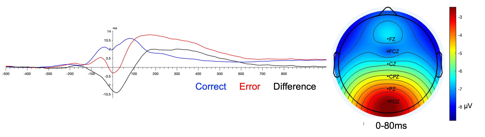

```{r echo=FALSE, results='asis', message=FALSE, warning=FALSE}
    options(width=80, Ncpus = 6, mc.cores=6) #Set width
    rm(list=ls())     #Remove everything from environment
    cat("\014")       #Clear Console

  library(knitr)      #allows rmarkdown files
  library(haven)      #helps import stata
  library(MASS)       #calculate residualized scores
  library(tidyverse)  #plotting/cleaning, etc.
  library(broom)      #nice statistical output
  library(here)       #nice file paths
  library(expss)      #labeling variables/values
  library(psych)      #used for statistical analyses
  library(labelled)   #get labelled values when importing from SPSS
  library(confintr)   #get confidence intervals from models
  library(papaja)     #APA formatting
  library(DescTools)  #descriptive statistics
  library(irr)        #ICC
  library(lmerTest)   #p value from mixed effects models
  library(broom.mixed) #tidying output of mixed effects models
  library(ggplot2)    #plotting graphs
  library(ggpubr)
  library(scales)
  library(forcats)
  library(workflowr)  #helps with workflow

r_refs("LDDM.bib")
```
```{r analysis-preferences}
# Set options including set.seed for random number generation
knitr::opts_chunk$set(cache=FALSE, set.seed(312), echo=FALSE,  message=FALSE, warning=FALSE, fig.pos='H')
```

```{r Load data}
here::i_am("work/manuscript/LDDM_supplement.Rmd")

load(file=here("./work/data/LDDM_do2_d1_not_outliers.RData"))
load(file=here("./work/data/LDDM_do2_d2_not_outliers.RData"))
load(file=here("./work/data/LDDM_do2_d3_not_outliers.RData"))

load(file=here("./work/data/LDDM_cleaning04_calc3_1to3.RData"))
load(file=here("./work/data/LDDM_do2_irr.RData"))
load(file=here("./work/data/LDDM_do2.RData"))
load(file=here("./work/data/spearman_brown_d1.RData"))
load(file=here("./work/data/spearman_brown_d2.RData"))
load(file=here("./work/data/spearman_brown_d3.RData"))

load(file=here("./work/data/LDDM_do3_rdoc_with_bad_data.RData"))
load(file=here("./work/data/LDDM_do3_rdoc.RData"))
load(file=here("./work/data/LDDM_do3_rdoc_no_outliers.RData"))
load(file=here("./work/data/spearman_brown_rdoc.RData"))
```

```{r}
make_CI <- function(lower, upper) {
  paste0("[", round(lower,2), ", ", round(upper,2), "]")
}

group.colors <- c(`Drift rate` = "blue", `Drift rate (congruent)` = "#911eb4", `Drift rate (incongruent)` ="#000075", `Boundary separation` = "#3cb44b", `NIH Toolbox` = "#e6194B", `Accuracy (incongruent)` = "#f58231", `RT interference` = "gold")
```

```{r}
correlation_matrix <- function(df, 
                               type = "pearson",
                               digits = 3, 
                               decimal.mark = ".",
                               use = "all", 
                               show_significance = TRUE, 
                               replace_diagonal = FALSE, 
                               replacement = ""){
  
  # check arguments
  stopifnot({
    is.numeric(digits)
    digits >= 0
    use %in% c("all", "upper", "lower")
    is.logical(replace_diagonal)
    is.logical(show_significance)
    is.character(replacement)
  })
  # we need the Hmisc package for this
  require(Hmisc)
  
  # retain only numeric and boolean columns
  isNumericOrBoolean = vapply(df, function(x) is.numeric(x) | is.logical(x), logical(1))
  if (sum(!isNumericOrBoolean) > 0) {
    cat('Dropping non-numeric/-boolean column(s):', paste(names(isNumericOrBoolean)[!isNumericOrBoolean], collapse = ', '), '\n\n')
  }
  df = df[isNumericOrBoolean]
  
  # transform input data frame to matrix
  x <- as.matrix(df)
  
  # run correlation analysis using Hmisc package
  correlation_matrix <- Hmisc::rcorr(x, type = "pearson")
  R <- correlation_matrix$r # Matrix of correlation coeficients
  p <- correlation_matrix$P # Matrix of p-value 
  
  # transform correlations to specific character format
  Rformatted = formatC(R, format = 'f', digits = digits, decimal.mark = decimal.mark)
  
  # if there are any negative numbers, we want to put a space before the positives to align all
  if (sum(R < 0) > 0) {
    Rformatted = ifelse(R > 0, paste0(' ', Rformatted), Rformatted)
  }
  
  # add significance levels if desired
  if (show_significance) {
    # define notions for significance levels; spacing is important.
    stars <- ifelse(is.na(p), "   ", ifelse(p < .001, "***", ifelse(p < .01, "** ", ifelse(p < .05, "*  ", "   "))))
    Rformatted = paste0(Rformatted, stars)
  }
  # build a new matrix that includes the formatted correlations and their significance stars
  Rnew <- matrix(Rformatted, ncol = ncol(x))
  rownames(Rnew) <- colnames(x)
  colnames(Rnew) <- paste(colnames(x), "", sep =" ")
  
  # replace undesired values
  if (use == 'upper') {
    Rnew[lower.tri(Rnew, diag = replace_diagonal)] <- replacement
  } else if (use == 'lower') {
    Rnew[upper.tri(Rnew, diag = replace_diagonal)] <- replacement
  } else if (replace_diagonal) {
    diag(Rnew) <- replacement
  }
  
  return(Rnew)
}

save_correlation_matrix = function(df, filename, ...) {
  write.csv2(correlation_matrix(df, ...), file = filename)
}
```

\
# Methods
## Participants
### Study 1
Participants were excluded for scoring too low on IQ test (N=`r sum(LDDM_do3_rdoc_with_bad_data$Reason==1)`), meeting criteria for mania or hypomania (N=`r sum(LDDM_do3_rdoc_with_bad_data$Reason==2)`), meeting criteria for psychosis (N=`r sum(LDDM_do3_rdoc_with_bad_data$Reason==3)`), only having a half-sibling (N=`r sum(LDDM_do3_rdoc_with_bad_data$Reason==4)`), having a history of traumatic brain injury (N=`r sum(LDDM_do3_rdoc_with_bad_data$Reason==5)`), or having a sibling excluded from the study for scoring too low on the IQ test (N=`r sum(LDDM_do3_rdoc_with_bad_data$Reason==1)`). Additionally, subjects' data was excluded from analyses with the ERN due to: poor accuracy on the flanker task (i.e., <50%; N=0), poor EEG data quality (i.e., fewer than 10 artifact-free error trials (N=`r sum(LDDM_do3_rdoc_with_bad_data$Number_of_errors_included_in_average<9 & LDDM_do3_rdoc_with_bad_data$Number_of_errors_included_in_average>-1, na.rm=T)`), or data collection issues or too little artifact free data (N=`r sum(LDDM_do3_rdoc_with_bad_data$DQ<0.5 & LDDM_do3_rdoc_with_bad_data$DQ>-1, na.rm=T)`), resulting in a final sample of `r sum(complete.cases(LDDM_do3_rdoc$flanker_score_rdoc))`.

## EEG Data Collection for brain-based measures in Studies 1 and 2
The electrooculogram (EOG) generated from eye movements and blinks was recorded using facial electrodes placed approximately 1 cm above and below the left eye and 1 cm to the right and left of the eyes. All electrode impedances were below 5 kΩ, and data were recorded with a sampling rate of 1,024 Hz in Study 1 and 1,000 Hz in Study 2. Pre and postprocessing were conducted offline in MATLAB using EEGLAB [@delormeEEGLABOpenSource2004] and ERPLAB [@lopez-calderonERPLABOpensourceToolbox2014]. Across both studies, data was resampled to 500 Hz and re-referenced to the average of the two mastoids. In Study 1, a band-pass filter was then applied from 1 to 100 Hz (an ideal range for ICA decomposition), in Study 2 the filter was applied from 0.1 to 30 Hz (given that there were too few channels to apply ICA).
Artifact rejection differed between Study 1 and Study 2, given the different number of electrodes used to collect data. In Study 1, the 60 Hz line noise was removed using the cleanLineNoise function, which uses a sliding window to adaptively estimate and subtract the line noise component [@bigdely-shamloPREPPipelineStandardized2015]. Next, using the clean_rawdata function, artifactual channels were removed, defined as those (a) containing more than 5s of flat signal, (b) correlating less than 0.8 with surrounding channels, (c) containing high frequency noise to signal ratio greater than 4 SD [@kotheBCILABPlatformBrain2013]. Artifact subspace reconstruction [ASR, @mullenRealtimeNeuroimagingCognitive2015] was then applied to correct for significant noise bursts, also implemented within clean_rawdata. ASR is a principal-component-analysis-based (PCA-based) technique in which data within a 500ms sliding window (window step=250 ms) are PCA-decomposed. Noisy components, defined as those with variance greater than 20 SD above that of the clean portions of the data, were removed and the data were reconstructed from the remaining components. Further, time windows were removed if more than 25% of the channels contained high-power artifacts, defined as greater than 7 SD above the clean power estimates in the channel. All artifactual channels were replaced by whole head spline interpolation, and data were again re-referenced to the common average so that the sum across all channels was zero. Lastly, independent component analysis (ICA) was implemented to retain brain-related components only. These components were defined as (a) having greater probability to be brain than artifacts according to an automatic IC classifier [ICLabel, @pion-tonachiniICLabelAutomatedElectroencephalographic2019], (b) having residual variance (i.e., the difference between IC’s scalp projection and the projection of fitted equivalent current dipole) less than 15%, and (c) having fitted dipole location within the brain. Response-locked epochs were segmented from -1500 to 1500 ms. All epochs were then low-pass filtered at 30 Hz and baseline corrected from -500 to -300ms. **Study 1 capitalized on available data from prior studies which used time frequency analysis. Because such analyses typically require a larger epoch length, the epoch length is larger for this study than Study 2, which has only been used for event-related potential (ERP) analyses.**
In Study 2, Response-locked epochs were segmented from -500 (before response) to 1000ms (after response) and baseline corrected with the same interval as Study 1. Eyeblink and ocular artifacts were corrected [@grattonNewMethodOffline1983] and artifact detection and rejection was conducted on all scalp electrodes. Specifically, the criteria applied were a voltage step of more than 50 $\mu$V between sample points, a voltage difference of 175 $\mu$V within a trial, or a minimum voltage difference of less than 0.50 $\mu$V within 100ms intervals. These intervals were rejected from individual channels in each trial. 

For grand average waveforms for Study 1, see @liElectrophysiologicalEvidenceMaladaptation2023.
See below for grand average waveforms across all Study 2 sessions.
```{r ERNplot, fig.cap = "Grand average ERN waveform and topographic map collapsing across all participants and sessions.", out.width='100%'}

```

### Neuropsychological measures from Study 1
During the D-KEFS color-word interference task, participants name the ink color of 50 consecutive words that are printed in an ink color that is incongruent with the word (e.g., the word “blue” is printed in red ink). Participants are instructed to say the ink color aloud as quickly as they can “without making mistakes,” which requires overriding (i.e., inhibiting) the prepotent word reading response. The dependent measures were time to completion, but multiplied by -1 for reverse-scoring, with more negative scores representing poorer inhibition and set-shifting. During the category switching condition in design fluency, participants switch between connecting empty and filled dots with four straight lines as quickly as they can within 60s. In verbal fluency, participants switch between naming types of fruit and types of furniture as quickly as they can within 60s. In the switching condition of trail making, participants must switch between connecting numbers and letters in order (instructed to draw lines between the numbers [1 through 16] and letters [A through P] as quickly as they can). During the switching condition of the Color-Word interference test, participants alternate between naming the ink color of the word and reading the word when cued. Participants must override the more automatic word-reading response during the color-naming trials, and, when prompted, inhibit an old rule and shift to a new rule (e.g., changing from word reading to color naming); thus, this condition involves inhibition as well as switching abilities.

## Drift-diffusion modeling and fitting
**HDDM version 0.9.6 was utilized with Python version 3.8 and Jupyter Notebook. The DDM models were specified using accuracy coding (i.e., subject responses were coded as accurate and inaccurate, with the upper (1) and lower (0) boundaries reflecting accurate and inaccurate responses, respectively. Starting values were initialized by finding the maximum a posteriori (MAP) via optimization. For all models, 2000 samples were drawn with 200 burn-in samples. To account for potential outliers and/or contaminated responses, the models were specified to assume that 5% of trials may not result from the drift-diffusion process by fitting a mixture model (see Supplement 2 section 3 for the model specification code). Trace plots indicated that all models converged (see Supplement 2 section 4). Hierarchical DDM estimates the joint posterior distribution of all model parameters using a hierarchical approach. Specifically, group (i.e., mean-level across all participants) and individual-specific parameters are estimated. The parameter estimates that were carried forward into the main analyses were the individual-level parameter estimates.**

Model 1 included a boundary separation, drift rate, and non-decision time parameter. Model 2 included a boundary separation, drift rate, non-decision time, and bias parameter. The drift rate parameter for Models 1 and 2 collapsed across trial type, such that congruent and incongruent trials were included in this estimate. Model 3 included a boundary separation and non-decision time parameter, and two drift rate parameters: one for congruent and one for incongruent trials. Model 4 included a boundary separation, non-decision time, and bias parameter, and two drift rate parameters: one for congruent and one for incongruent trials.

\
# Results
## Drift-diffusion model fit
Multiple alternative models were fit to assure that findings were not dependent on parameters modeled. Deviance information criterion (DIC) can be used to compare relative model fit, where a lower DIC indicates better model fit. Posterior checks indicated there were no issues with model convergence. Model selection was based on most used models in prior literature rather than model fit so as to assure that 1) overfitting did not affect psychometric results, and 2) that findings from the current study could provide the most useful information to others fitting their data with DDM models. Several alternative models were also fit to identify whether model parameterization affected the overall pattern of results. Results were comparable across models.

\setlength{\tabcolsep}{6pt}
```{r}
hddm_model_fits <- data.frame(Model=c(1,2,3,4),
                              Sample=c(rep("Study 1",4),rep("Study 2: Session 1",4),rep("Study 2: Session 2",4),rep("Study 2: Session 3",4)),
                              DIC=c(154031.57,173689.83,178167.01,210360.42,
                                    28062.80,32888.84,32305.20,39259.40,
                                    30653.61,34087.93,34616.37,39905.23,
                                    31251.17, 34395.58, 34740.09, 39350.65
                                    ))
hddm_model_fits[,1] <- round(hddm_model_fits[,1],0)
apa_table(hddm_model_fits,
          caption="Model fit of primary DDM model and alternative model specifications.",
          note="Model 1 = Drift rate, boundary separation, non-decision time,
          Model 2 = Primary model chosen: Drift rate, boundary separation, non-decision time, starting bias,
          Model 3 = Drift rate (congruent), Drift rate (incongruent), boundary separation, non-decision time,
          Model 4 = Drift rate (congruent), Drift rate (incongruent), boundary separation, non-decision time, starting bias",
          placement="H",
          font_size="small"
          )
```

<!-- ## Test-retest reliability -->

```{r Test-retest, eval=FALSE}
sttr_hddm_variables <- c("v_S1_B11","v_S2_B11","v_S3_B11",
                         "v_congruent_S1_B11.x","v_congruent_S2_B11.x","v_congruent_S3_B11.x",
                         "v_incongruent_S1_B11.x","v_incongruent_S2_B11.x","v_incongruent_S3_B11.x",
                         "a_S1_B11.x","a_S2_B11.x","a_S3_B11.x",
                         "t_S1_B11.x","t_S2_B11.x","t_S3_B11.x",
                         "z_S1_B11.x","z_S2_B11.x","z_S3_B11.x",
                         "flanker_score_d1_z","flanker_score_d2_z","flanker_score_d3_z",
                         "accuracy_d1_z","accuracy_d2_z","accuracy_d3_z",
                         "accuracy_incongruent_d1_z","accuracy_incongruent_d2_z","accuracy_incongruent_d3_z","rt_interference_d1_z","rt_interference_d2_z","rt_interference_d3_z")

sttr_icc_table <- data.frame(
                           parameters= c("Drift rate", "Drift rate (congruent)", "Drift rate (incongruent)", "Boundary separation", "Non-decision time", "Starting bias", "NIH Toolbox", "Accuracy (incongruent)", "RT interference"),
                                 
                           ICC=c(icc(LDDM_do2_irr[sttr_hddm_variables[1:3]])$value,
                           icc(LDDM_do2_irr[sttr_hddm_variables[4:6]])$value,
                           icc(LDDM_do2_irr[sttr_hddm_variables[7:9]])$value,
                           icc(LDDM_do2_irr[sttr_hddm_variables[10:12]])$value,
                           icc(LDDM_do2_irr[sttr_hddm_variables[13:15]])$value,
                           icc(LDDM_do2_irr[sttr_hddm_variables[16:18]])$value,
                           icc(LDDM_do2_irr[sttr_hddm_variables[19:21]])$value,
                           icc(LDDM_do2_irr[sttr_hddm_variables[25:27]])$value,
                           icc(LDDM_do2_irr[sttr_hddm_variables[28:30]])$value),
                           
                           CI=c(make_CI(icc(LDDM_do2_irr[sttr_hddm_variables[1:3]])$lbound,icc(LDDM_do2_irr[sttr_hddm_variables[1:3]])$ubound),
                           make_CI(icc(LDDM_do2_irr[sttr_hddm_variables[4:6]])$lbound,icc(LDDM_do2_irr[sttr_hddm_variables[4:6]])$ubound),
                           make_CI(icc(LDDM_do2_irr[sttr_hddm_variables[7:9]])$lbound,icc(LDDM_do2_irr[sttr_hddm_variables[7:9]])$ubound),
                           make_CI(icc(LDDM_do2_irr[sttr_hddm_variables[10:12]])$lbound,icc(LDDM_do2_irr[sttr_hddm_variables[10:12]])$ubound),
                           make_CI(icc(LDDM_do2_irr[sttr_hddm_variables[13:15]])$lbound,icc(LDDM_do2_irr[sttr_hddm_variables[13:15]])$ubound),
                           make_CI(icc(LDDM_do2_irr[sttr_hddm_variables[16:18]])$lbound,icc(LDDM_do2_irr[sttr_hddm_variables[16:18]])$ubound),
                           make_CI(icc(LDDM_do2_irr[sttr_hddm_variables[19:21]])$lbound,icc(LDDM_do2_irr[sttr_hddm_variables[19:21]])$ubound),
                           make_CI(icc(LDDM_do2_irr[sttr_hddm_variables[25:27]])$lbound,icc(LDDM_do2_irr[sttr_hddm_variables[25:27]])$ubound),
                           make_CI(icc(LDDM_do2_irr[sttr_hddm_variables[28:30]])$lbound,icc(LDDM_do2_irr[sttr_hddm_variables[28:30]])$ubound)),
                           
                           lower_ci=c(icc(LDDM_do2_irr[sttr_hddm_variables[1:3]])$lbound,
                           icc(LDDM_do2_irr[sttr_hddm_variables[4:6]])$lbound,
                           icc(LDDM_do2_irr[sttr_hddm_variables[7:9]])$lbound,
                           icc(LDDM_do2_irr[sttr_hddm_variables[10:12]])$lbound,
                           icc(LDDM_do2_irr[sttr_hddm_variables[13:15]])$lbound,
                           icc(LDDM_do2_irr[sttr_hddm_variables[16:18]])$lbound,
                           icc(LDDM_do2_irr[sttr_hddm_variables[19:21]])$lbound,
                           icc(LDDM_do2_irr[sttr_hddm_variables[25:27]])$lbound,
                           icc(LDDM_do2_irr[sttr_hddm_variables[28:30]])$lbound),

                           upper_ci=c(icc(LDDM_do2_irr[sttr_hddm_variables[1:3]])$ubound,
                           icc(LDDM_do2_irr[sttr_hddm_variables[4:6]])$ubound,
                           icc(LDDM_do2_irr[sttr_hddm_variables[7:9]])$ubound,
                           icc(LDDM_do2_irr[sttr_hddm_variables[10:12]])$ubound,
                           icc(LDDM_do2_irr[sttr_hddm_variables[13:15]])$ubound,
                           icc(LDDM_do2_irr[sttr_hddm_variables[16:18]])$ubound,
                           icc(LDDM_do2_irr[sttr_hddm_variables[19:21]])$ubound,
                           icc(LDDM_do2_irr[sttr_hddm_variables[25:27]])$ubound,
                           icc(LDDM_do2_irr[sttr_hddm_variables[28:30]])$ubound))

sttr_icc_table$ICC <- round(sttr_icc_table$ICC, 2)
write.csv(sttr_icc_table, here("work/tables/sttr_icc_table.csv"))
```

```{r, eval=FALSE, fig.cap = "Test-retest reliability of drift rate separated by condition across three sessions.", out.width='100%'}
sttr_icc_table$parameters <- fct_rev(factor(sttr_icc_table$parameters, levels = sttr_icc_table$parameters))

ggplot(sttr_icc_table[c(2:3),], aes(y=parameters, x=ICC, color=parameters)) +
  geom_point() +
  geom_text(aes(label=ICC),vjust=-0.75)+
  geom_errorbar(aes(xmin=lower_ci, xmax=upper_ci), colour="black", width=.1) +
  scale_x_continuous(limits = c(0, 1), breaks=seq(0,1,0.1)) +
  scale_y_discrete(labels = label_wrap(10)) +
  labs(y="DDM parameters/Measures", x="ICC (95% CI)") +
  scale_color_manual(values=group.colors) +
  # scale_x_discrete(guide = guide_axis(n.dodge = 2)) +
  theme_apa() +
  theme(legend.position="none")
```

## Incremental convergent validity
### Study 2
```{r}
LDDM_do1_alt_rdoc <- read.csv(here("./RDoC/DDM_Results/Block_Based/RDoC_Day1_Block11_Alternative_Models.csv"), header=TRUE)

LDDM_do2_rdoc <- LDDM_do3_rdoc_no_outliers %>%
  left_join(LDDM_do1_alt_rdoc, by="ID") %>%
  filter(DQ >= 0.5)

make_CI <- function(lower, upper) {
  paste0("[", round(lower,2), ", ", round(upper,2), "]")
}
```

```{r, fig.cap = "Multiple regression of behavioral measures predicting ERN across three sessions of Study 2.", out.width='1\\linewidth', fig.width=10, fig.height=8}
mr_table_names <- c("X","parameters", "ddm_est", "ddm_lci", "ddm_uci",
                                                 "nih_est", "nih_lci", "nih_uci",
                                                 "acc_est", "acc_lci", "acc_uci",
                                                 "rt_est", "rt_lci", "rt_uci")

mr_ERN_table_d1 <- read.csv(file=here("./work/tables/mr_ERN_table_d1.csv"))
mr_ERN_table_d2 <- read.csv(file=here("./work/tables/mr_ERN_table_d2.csv"))
mr_ERN_table_d3 <- read.csv(file=here("./work/tables/mr_ERN_table_d3.csv"))

# STTR Study
# Session 1
mr_ERN_table_d1_raw <- read.csv(file=here("./work/tables/mr_ERN_table_d1_raw.csv"))
colnames(mr_ERN_table_d1_raw) <- mr_table_names
mr_ERN_table_d1_raw_new <- mr_ERN_table_d1_raw %>%
  pivot_longer(cols=ddm_est:rt_uci, names_to=c("measure","stat"), names_sep="_") %>%
  pivot_wider(names_from=stat, values_from=value)

mr_ERN_table_d1_raw_new <- mr_ERN_table_d1_raw_new %>%
  mutate(measure_new = ifelse(measure=="ddm", parameters, ifelse(measure=="nih", "NIH Toolbox", ifelse(measure=="acc", "Accuracy (incongruent)", ifelse(measure=="rt", "RT interference", NA))))) %>%
  mutate(measure_new = factor(measure_new, levels=c("NIH Toolbox", "Accuracy (incongruent)", "RT interference", "Drift rate", "Boundary separation")))

ern_d1 <- ggplot(mr_ERN_table_d1_raw_new[c(1:8),], aes(x=est, label=parameters, y=measure_new, color=measure_new)) +
  geom_point(position=position_dodge(width = 1), stat = "identity") +
  geom_errorbar(aes(xmin=lci, xmax=uci), width=.1,  position=position_dodge(width = 1), stat="identity") +
  geom_vline(xintercept = 0) +
  labs(y="Flanker behavioral measure", x="beta [95% CI]", title="Session 1") +
  # scale_x_continuous(limits=c(-0.5, 0.5), breaks=seq(-0.5,0.5, 0.25)) +
  # scale_y_discrete(name="Measure", labels=c("Accuracy", "NIH Toolbox")) +
  scale_color_manual(values=group.colors) +
  facet_grid(parameters~., scales = "free", space = "fixed") + #facet by group
  theme_apa() +
  theme(strip.background = element_blank(), #remove background for facet labels
        strip.text.y = element_blank(),
        panel.border = element_rect(colour = "black", fill = NA), #add black border
        panel.spacing = unit(0, "lines"), #remove space between facets)
        legend.position = "none") #hide legend

# Session 2
mr_ERN_table_d2_raw <- read.csv(file=here("./work/tables/mr_ERN_table_d2_raw.csv"))
colnames(mr_ERN_table_d2_raw) <- mr_table_names
mr_ERN_table_d2_raw_new <- mr_ERN_table_d2_raw %>%
  pivot_longer(cols=ddm_est:rt_uci, names_to=c("measure","stat"), names_sep="_") %>%
  pivot_wider(names_from=stat, values_from=value)

mr_ERN_table_d2_raw_new <- mr_ERN_table_d2_raw_new %>%
  mutate(measure_new = ifelse(measure=="ddm", parameters, ifelse(measure=="nih", "NIH Toolbox", ifelse(measure=="acc", "Accuracy (incongruent)", ifelse(measure=="rt", "RT interference", NA))))) %>%
  mutate(measure_new = factor(measure_new, levels=c("NIH Toolbox", "Accuracy (incongruent)", "RT interference", "Drift rate", "Boundary separation")))

ern_d2 <- ggplot(mr_ERN_table_d2_raw_new[c(1:8),], aes(x=est, label=parameters, y=measure_new, color=measure_new)) +
  geom_point(position=position_dodge(width = 1), stat = "identity") +
  geom_errorbar(aes(xmin=lci, xmax=uci), width=.1,  position=position_dodge(width = 1), stat="identity") +
  geom_vline(xintercept = 0) +
  labs(y="Flanker behavioral measure", x="beta [95% CI]", title="Session 2") +
  # scale_x_continuous(limits=c(-0.5, 0.5), breaks=seq(-0.5,0.5, 0.25)) +
  # scale_y_discrete(name="Measure", labels=c("Accuracy", "NIH Toolbox")) +
  scale_color_manual(values=group.colors) +
  facet_grid(parameters~., scales = "free", space = "fixed") + #facet by group
  theme_apa() +
  theme(strip.background = element_blank(), #remove background for facet labels
        strip.text.y = element_blank(),
        panel.border = element_rect(colour = "black", fill = NA), #add black border
        panel.spacing = unit(0, "lines"), #remove space between facets)
        legend.position = "none") #hide legend

# Session 3
mr_ERN_table_d3_raw <- read.csv(file=here("./work/tables/mr_ERN_table_d3_raw.csv"))
colnames(mr_ERN_table_d3_raw) <- mr_table_names
mr_ERN_table_d3_raw_new <- mr_ERN_table_d3_raw %>%
  pivot_longer(cols=ddm_est:rt_uci, names_to=c("measure","stat"), names_sep="_") %>%
  pivot_wider(names_from=stat, values_from=value)

mr_ERN_table_d3_raw_new <- mr_ERN_table_d3_raw_new %>%
  mutate(measure_new = ifelse(measure=="ddm", parameters, ifelse(measure=="nih", "NIH Toolbox", ifelse(measure=="acc", "Accuracy (incongruent)", ifelse(measure=="rt", "RT interference", NA))))) %>%
  mutate(measure_new = factor(measure_new, levels=c("NIH Toolbox", "Accuracy (incongruent)", "RT interference", "Drift rate", "Boundary separation")))

ern_d3 <- ggplot(mr_ERN_table_d3_raw_new[c(1:8),], aes(x=est, label=parameters, y=measure_new, color=measure_new)) +
  geom_point(position=position_dodge(width = 1), stat = "identity") +
  geom_errorbar(aes(xmin=lci, xmax=uci), width=.1,  position=position_dodge(width = 1), stat="identity") +
  geom_vline(xintercept = 0) +
  labs(y="Flanker behavioral measure", x="beta [95% CI]", title="Session 3") +
  # scale_x_continuous(limits=c(-0.5, 0.5), breaks=seq(-0.5,0.5, 0.25)) +
  # scale_y_discrete(name="Measure", labels=c("Accuracy", "NIH Toolbox")) +
  scale_color_manual(values=group.colors) +
  facet_grid(parameters~., scales = "free", space = "fixed") + #facet by group
  theme_apa() +
  theme(strip.background = element_blank(), #remove background for facet labels
        strip.text.y = element_blank(),
        panel.border = element_rect(colour = "black", fill = NA), #add black border
        panel.spacing = unit(0, "lines"), #remove space between facets)
        legend.position = "none") #hide legend

ern <- ggarrange(ern_d1 + rremove("xylab"), 
          ern_d2 + rremove("xylab") + rremove("y.text") + rremove("y.ticks"),
          ern_d3 + rremove("xylab") + rremove("y.text") + rremove("y.ticks"),
          ncol=3, nrow=1,
          widths = c(1.9, 1, 1))

ern <- annotate_figure(ern, left = grid::textGrob("Flanker behavioral measure", rot = 90, vjust = 1, gp = grid::gpar(cex = 1.3)),
                bottom = grid::textGrob("beta [95% CI]", gp = grid::gpar(cex = 1.3)),
                fig.lab.size=10)
ern
```

```{r}
mr_ERN_table_rdoc_raw <- read.csv(file=here("./work/tables/mr_ERN_table_rdoc_raw.csv"))
colnames(mr_ERN_table_rdoc_raw) <- mr_table_names
mr_ERN_table_rdoc_raw_new <- mr_ERN_table_rdoc_raw %>%
  select(-X) %>%
  pivot_longer(cols=ddm_est:rt_uci, names_to=c("measure","stat"), names_sep="_") %>%
  pivot_wider(names_from=stat, values_from=value)

mr_ERN_table_rdoc_raw_plot <- mr_ERN_table_rdoc_raw_new %>%
  mutate(measure_new = ifelse(measure=="ddm", parameters, ifelse(measure=="nih", "NIH Toolbox", ifelse(measure=="acc", "Accuracy (incongruent)", ifelse(measure=="rt", "RT interference", NA))))) %>%
  mutate(measure_new = factor(measure_new, levels=c("NIH Toolbox", "Accuracy (incongruent)", "RT interference", "Drift rate", "Boundary separation")))

ern_rdoc <- ggplot(mr_ERN_table_rdoc_raw_plot[c(1:8),], aes(x=est, label=parameters, y=measure_new, color=measure_new)) +
  geom_point(position=position_dodge(width = 1), stat = "identity") +
  geom_errorbar(aes(xmin=lci, xmax=uci), width=.1,  position=position_dodge(width = 1), stat="identity") +
  geom_vline(xintercept = 0) +
  labs(y="Flanker behavioral measure", x="beta [95% CI]", title="ERN") +
  # scale_x_continuous(limits=c(-0.5, 0.5), breaks=seq(-0.5,0.5, 0.25)) +
  # scale_y_discrete(name="Measure", labels=c("Accuracy", "NIH Toolbox")) +
  scale_color_manual(values=group.colors) +
  facet_grid(parameters~., scales = "free", space = "fixed") + #facet by group
  theme_apa() +
  theme(strip.background = element_blank(), #remove background for facet labels
        strip.text.y = element_blank(),
        panel.border = element_rect(colour = "black", fill = NA), #add black border
        panel.spacing = unit(0, "lines"), #remove space between facets)
        legend.position = "none") #hide legend
```

```{r}
mr_Inhib_table_rdoc_cov <- read.csv(file=here("./work/tables/mr_INHIB_table_rdoc_cov.csv"))

mr_Inhib_table_rdoc_cov_raw <- read.csv(file=here("./work/tables/mr_INHIB_table_rdoc_cov_raw.csv"))
colnames(mr_Inhib_table_rdoc_cov_raw) <- mr_table_names
mr_Inhib_table_rdoc_cov_raw_new <- mr_Inhib_table_rdoc_cov_raw %>%
  select(-X) %>%
  pivot_longer(cols=ddm_est:rt_uci, names_to=c("measure","stat"), names_sep="_") %>%
  pivot_wider(names_from=stat, values_from=value)

mr_Inhib_table_rdoc_cov_raw_new <- mr_Inhib_table_rdoc_cov_raw_new %>%
  mutate(measure_new = ifelse(measure=="ddm", parameters, ifelse(measure=="nih", "NIH Toolbox", ifelse(measure=="acc", "Accuracy (incongruent)", ifelse(measure=="rt", "RT interference", NA))))) %>%
  mutate(measure_new = factor(measure_new, levels=c("NIH Toolbox", "Accuracy (incongruent)", "RT interference", "Drift rate",  "Boundary separation")))

inh <- ggplot(mr_Inhib_table_rdoc_cov_raw_new[c(5:12),], aes(x=est, label=parameters, y=measure_new, color=measure_new)) +
  geom_point(position=position_dodge(width = 1), stat = "identity") +
  geom_errorbar(aes(xmin=lci, xmax=uci), width=.1,  position=position_dodge(width = 1), stat="identity") +
  geom_vline(xintercept = 0) +
  labs(y="Flanker behavioral measure", x="beta [95% CI]", title="Inhibition") +
  scale_color_manual(values=group.colors) +
  facet_grid(parameters~., scales = "free", space = "fixed") + #facet by group
  theme_apa() +
  theme(strip.background = element_blank(), #remove background for facet labels
        strip.text.y = element_blank(),
        panel.border = element_rect(colour = "black", fill = NA), #add black border
        panel.spacing = unit(0, "lines"), #remove space between facets)
        legend.position = "none") #hide legend

# mr_Exec_table_rdoc_nocov <- read.csv(file=here("./work/tables/mr_Exec_table_rdoc_nocov.csv"))
mr_Exec_table_rdoc_cov <- read.csv(file=here("./work/tables/mr_Exec_table_rdoc_cov.csv"))

mr_Exec_table_rdoc_cov_raw <- read.csv(file=here("./work/tables/mr_Exec_table_rdoc_cov_raw.csv"))
colnames(mr_Exec_table_rdoc_cov_raw) <- mr_table_names
mr_Exec_table_rdoc_cov_raw_new <- mr_Exec_table_rdoc_cov_raw %>%
  select(-X) %>%
  pivot_longer(cols=ddm_est:rt_uci, names_to=c("measure","stat"), names_sep="_") %>%
  pivot_wider(names_from=stat, values_from=value)

mr_Exec_table_rdoc_cov_raw_new <- mr_Exec_table_rdoc_cov_raw_new %>%
  mutate(measure_new = ifelse(measure=="ddm", parameters, ifelse(measure=="nih", "NIH Toolbox", ifelse(measure=="acc", "Accuracy (incongruent)", ifelse(measure=="rt", "RT interference", NA))))) %>%
  mutate(measure_new = factor(measure_new, levels=c("NIH Toolbox", "Accuracy (incongruent)", "RT interference", "Drift rate",  "Boundary separation")))

ss <- ggplot(mr_Exec_table_rdoc_cov_raw_new[c(5:12),], aes(x=est, label=parameters, y=measure_new, color=measure_new)) +
  geom_point(position=position_dodge(width = 1), stat = "identity") +
  geom_errorbar(aes(xmin=lci, xmax=uci), width=.1,  position=position_dodge(width = 1), stat="identity") +
  geom_vline(xintercept = 0) +
  labs(y="Flanker behavioral measure", x="beta [95% CI]", title="Set-shifting") +
  scale_color_manual(values=group.colors) +
  facet_grid(parameters~., scales = "free", space = "fixed") + #facet by group
  theme_apa() +
  theme(strip.background = element_blank(), #remove background for facet labels
        panel.border = element_rect(colour = "black", fill = NA), #add black border
        panel.spacing = unit(0, "lines"), #remove space between facets)
        legend.position = "none") #hide legend
```

```{r}
acc_ern_r <- cor.test(LDDM_do3_rdoc_no_outliers$FCz_ERN_080_z, LDDM_do3_rdoc_no_outliers$Inhib_time_rev_z, method="pearson")

acc_inhib_r <- cor.test(LDDM_do3_rdoc_no_outliers$accuracy_incongruent_z, LDDM_do3_rdoc_no_outliers$Inhib_time_rev_z, method="pearson")

acc_exec_r <- cor.test(LDDM_do3_rdoc_no_outliers$accuracy_incongruent_z, LDDM_do3_rdoc_no_outliers$exec_composite_z, method="pearson")
```

```{r, fig.cap = paste0("Multiple regression of behavioral measures predicting ERN and neuropsychological tests of inhibition and set-shifting with drift rate separated by condition in Study 1. Note: The bivariate correlations between accuracy and ern ($r$ = ",round(acc_ern_r$estimate,3),", $p$ = ",round(acc_ern_r$p.value,3),"), accuracy and inhibition ($r$ = ",round(acc_inhib_r$estimate,3),", $p$ = ",round(acc_inhib_r$p.value,3),"), and accuracy and set-shifting ($r$ = ",round(acc_exec_r$estimate,3),", $p$ = ",round(acc_exec_r$p.value,3),") are non-significant, suggesting the presence of a suppression effect."), out.width='1\\linewidth', fig.width=10, fig.height=8}

val_rdoc <- ggarrange(ern_rdoc + rremove("xylab"),
                      inh + rremove("xylab") + rremove("y.text") + rremove("y.ticks"),
          ss + rremove("xylab") + rremove("y.text") + rremove("y.ticks"),
          ncol=3, nrow=1,
          widths = c(1.6, .9, 1))

val_rdoc <- annotate_figure(val_rdoc, left = grid::textGrob("Flanker behavioral measure", rot = 90, vjust = 1, gp = grid::gpar(cex = 1.3)),
                bottom = grid::textGrob("beta [95% CI]", gp = grid::gpar(cex = 1.3)),
                fig.lab.size=12)
val_rdoc
```

\setlength{\tabcolsep}{2pt}
```{r, eval=T}
i=1
mr_ERN_table_rdoc_alt1 <- as.data.frame(matrix(nrow=3, ncol=5))
mr_ERN_table_rdoc_alt1[,1] <- c("Drift rate","Boundary separation","Non-decision time")
mr_ERN_table_rdoc_alt1_raw <- as.data.frame(matrix(nrow=3, ncol=5))
mr_ERN_table_rdoc_alt1_raw[,1] <- c("Drift rate","Boundary separation","Non-decision time")

for (var in c("B11_avt_v_z","B11_avt_a_z","B11_avt_t_z")) {
  eval(parse(text=paste0("
             model <- lmer(FCz_ERN_080_z ~ ",var," + flanker_score_rdoc_z + accuracy_incongruent_z + rt_interference_z + Age + Pred_FSIQ_z + Motor_time_z + (1 | F_ID), LDDM_do3_rdoc_no_outliers)
             
             mr_ERN_table_rdoc_alt1[i,2] <- paste0(round(tidy(model)$estimate[2],2), ifelse(tidy(model)$p.value[2]<0.01, '** ', ifelse(tidy(model)$p.value[2]<0.05, '* ', ' ')), 
                                            make_CI(confint(model)[4,1], confint(model)[4,2]))
             mr_ERN_table_rdoc_alt1[i,3] <- paste0(round(tidy(model)$estimate[3],2), ifelse(tidy(model)$p.value[3]<0.01, '** ', ifelse(tidy(model)$p.value[3]<0.05, '* ', ' ')), 
                                            make_CI(confint(model)[5,1], confint(model)[5,2]))
             mr_ERN_table_rdoc_alt1[i,4] <- paste0(round(tidy(model)$estimate[4],2), ifelse(tidy(model)$p.value[4]<0.01, '** ', ifelse(tidy(model)$p.value[4]<0.05, '* ', ' ')), 
                                            make_CI(confint(model)[6,1], confint(model)[6,2]))
             mr_ERN_table_rdoc_alt1[i,5] <- paste0(round(tidy(model)$estimate[5],2), ifelse(tidy(model)$p.value[5]<0.01, '** ', ifelse(tidy(model)$p.value[5]<0.05, '* ', ' ')), 
                                            make_CI(confint(model)[7,1], confint(model)[7,2]))

            mr_ERN_table_rdoc_alt1_raw[i,2] <- tidy(model)$estimate[2]
            mr_ERN_table_rdoc_alt1_raw[i,3] <- confint(model)[4,1]
            mr_ERN_table_rdoc_alt1_raw[i,4] <- confint(model)[4,2]
            
            mr_ERN_table_rdoc_alt1_raw[i,5] <- tidy(model)$estimate[3]
            mr_ERN_table_rdoc_alt1_raw[i,6] <- confint(model)[5,1]
            mr_ERN_table_rdoc_alt1_raw[i,7] <- confint(model)[5,2]
            
            mr_ERN_table_rdoc_alt1_raw[i,8] <- tidy(model)$estimate[4]
            mr_ERN_table_rdoc_alt1_raw[i,9] <- confint(model)[6,1]
            mr_ERN_table_rdoc_alt1_raw[i,10] <- confint(model)[6,2]
            
            mr_ERN_table_rdoc_alt1_raw[i,11] <- tidy(model)$estimate[5]
            mr_ERN_table_rdoc_alt1_raw[i,12] <- confint(model)[7,1]
            mr_ERN_table_rdoc_alt1_raw[i,13] <- confint(model)[7,2]
                                   ")))
  i=i+1
}

colnames(mr_ERN_table_rdoc_alt1) <- c("Parameters","DDM Parameter", "NIH Toolbox", "Accuracy (incongruent)", "RT interference")

i=1
mr_ERN_table_rdoc_alt2 <- as.data.frame(matrix(nrow=4, ncol=4))
mr_ERN_table_rdoc_alt2[,1] <- c("Drift rate","Boundary separation","Non-decision time", "Starting bias")
mr_ERN_table_rdoc_alt2_raw <- as.data.frame(matrix(nrow=4, ncol=4))
mr_ERN_table_rdoc_alt2_raw[,1] <- c("Drift rate","Boundary separation","Non-decision time", "Starting bias")

for (var in c("B11_avtz_v_z","B11_avtz_a_z","B11_avtz_t_z","B11_avtz_z_z")) {
  eval(parse(text=paste0("
             model <- lmer(FCz_ERN_080_z ~ ",var," + flanker_score_rdoc_z + accuracy_incongruent_z + rt_interference_z + Age + Pred_FSIQ_z + Motor_time_z + (1 | F_ID), LDDM_do3_rdoc_no_outliers)
             
             mr_ERN_table_rdoc_alt2[i,2] <- paste0(round(tidy(model)$estimate[2],2), ifelse(tidy(model)$p.value[2]<0.01, '** ', ifelse(tidy(model)$p.value[2]<0.05, '* ', ' ')), 
                                            make_CI(confint(model)[4,1], confint(model)[4,2]))
             mr_ERN_table_rdoc_alt2[i,3] <- paste0(round(tidy(model)$estimate[3],2), ifelse(tidy(model)$p.value[3]<0.01, '** ', ifelse(tidy(model)$p.value[3]<0.05, '* ', ' ')), 
                                            make_CI(confint(model)[5,1], confint(model)[5,2]))
             mr_ERN_table_rdoc_alt2[i,4] <- paste0(round(tidy(model)$estimate[4],2), ifelse(tidy(model)$p.value[4]<0.01, '** ', ifelse(tidy(model)$p.value[4]<0.05, '* ', ' ')), 
                                            make_CI(confint(model)[6,1], confint(model)[6,2]))
             mr_ERN_table_rdoc_alt2[i,5] <- paste0(round(tidy(model)$estimate[5],2), ifelse(tidy(model)$p.value[5]<0.01, '** ', ifelse(tidy(model)$p.value[5]<0.05, '* ', ' ')), 
                                            make_CI(confint(model)[7,1], confint(model)[7,2]))

            mr_ERN_table_rdoc_alt2_raw[i,2] <- tidy(model)$estimate[2]
            mr_ERN_table_rdoc_alt2_raw[i,3] <- confint(model)[4,1]
            mr_ERN_table_rdoc_alt2_raw[i,4] <- confint(model)[4,2]
            
            mr_ERN_table_rdoc_alt2_raw[i,5] <- tidy(model)$estimate[3]
            mr_ERN_table_rdoc_alt2_raw[i,6] <- confint(model)[5,1]
            mr_ERN_table_rdoc_alt2_raw[i,7] <- confint(model)[5,2]
            
            mr_ERN_table_rdoc_alt2_raw[i,8] <- tidy(model)$estimate[4]
            mr_ERN_table_rdoc_alt2_raw[i,9] <- confint(model)[6,1]
            mr_ERN_table_rdoc_alt2_raw[i,10] <- confint(model)[6,2]
                        
            mr_ERN_table_rdoc_alt2_raw[i,11] <- tidy(model)$estimate[5]
            mr_ERN_table_rdoc_alt2_raw[i,12] <- confint(model)[7,1]
            mr_ERN_table_rdoc_alt2_raw[i,13] <- confint(model)[7,2]
                                   ")))
  i=i+1
}

colnames(mr_ERN_table_rdoc_alt2) <- c("Parameters","DDM Parameter", "NIH Toolbox", "Accuracy (incongruent)", "RT interference")

i=1
mr_ERN_table_rdoc_alt3 <- as.data.frame(matrix(nrow=4, ncol=4))
mr_ERN_table_rdoc_alt3[,1] <- c("Drift rate (congruent)","Drift rate (incongruent)","Boundary separation","Non-decision time")
mr_ERN_table_rdoc_alt3_raw <- as.data.frame(matrix(nrow=4, ncol=4))
mr_ERN_table_rdoc_alt3_raw[,1] <- c("Drift rate (congruent)","Drift rate (incongruent)","Boundary separation","Non-decision time")

for (var in c("B11_avt_DO_v_v_con_z","B11_avt_DO_v_v_incon_z","B11_avt_DO_v_a_z","B11_avt_DO_v_t_z")) {
  eval(parse(text=paste0("
             model <- lmer(FCz_ERN_080_z ~ ",var," + flanker_score_rdoc_z + accuracy_incongruent_z + rt_interference_z + Age + Pred_FSIQ_z + Motor_time_z + (1 | F_ID), LDDM_do3_rdoc_no_outliers)
             
             mr_ERN_table_rdoc_alt3[i,2] <- paste0(round(tidy(model)$estimate[2],2), ifelse(tidy(model)$p.value[2]<0.01, '** ', ifelse(tidy(model)$p.value[2]<0.05, '* ', ' ')), 
                                            make_CI(confint(model)[4,1], confint(model)[4,2]))
             mr_ERN_table_rdoc_alt3[i,3] <- paste0(round(tidy(model)$estimate[3],2), ifelse(tidy(model)$p.value[3]<0.01, '** ', ifelse(tidy(model)$p.value[3]<0.05, '* ', ' ')), 
                                            make_CI(confint(model)[5,1], confint(model)[5,2]))
             mr_ERN_table_rdoc_alt3[i,4] <- paste0(round(tidy(model)$estimate[4],2), ifelse(tidy(model)$p.value[4]<0.01, '** ', ifelse(tidy(model)$p.value[4]<0.05, '* ', ' ')), 
                                            make_CI(confint(model)[6,1], confint(model)[6,2]))
             mr_ERN_table_rdoc_alt3[i,5] <- paste0(round(tidy(model)$estimate[5],2), ifelse(tidy(model)$p.value[5]<0.01, '** ', ifelse(tidy(model)$p.value[5]<0.05, '* ', ' ')), 
                                            make_CI(confint(model)[7,1], confint(model)[7,2]))

            mr_ERN_table_rdoc_alt3_raw[i,2] <- tidy(model)$estimate[2]
            mr_ERN_table_rdoc_alt3_raw[i,3] <- confint(model)[4,1]
            mr_ERN_table_rdoc_alt3_raw[i,4] <- confint(model)[4,2]
            
            mr_ERN_table_rdoc_alt3_raw[i,5] <- tidy(model)$estimate[3]
            mr_ERN_table_rdoc_alt3_raw[i,6] <- confint(model)[5,1]
            mr_ERN_table_rdoc_alt3_raw[i,7] <- confint(model)[5,2]
            
            mr_ERN_table_rdoc_alt3_raw[i,8] <- tidy(model)$estimate[4]
            mr_ERN_table_rdoc_alt3_raw[i,9] <- confint(model)[6,1]
            mr_ERN_table_rdoc_alt3_raw[i,10] <- confint(model)[6,2]
                        
            mr_ERN_table_rdoc_alt3_raw[i,11] <- tidy(model)$estimate[5]
            mr_ERN_table_rdoc_alt3_raw[i,12] <- confint(model)[7,1]
            mr_ERN_table_rdoc_alt3_raw[i,13] <- confint(model)[7,2]
                                   ")))
  i=i+1
}

colnames(mr_ERN_table_rdoc_alt3) <- c("Parameters","DDM Parameter", "NIH Toolbox", "Accuracy (incongruent)", "RT interference")

i=1
mr_ERN_table_rdoc_alt4 <- as.data.frame(matrix(nrow=5, ncol=4))
mr_ERN_table_rdoc_alt4[,1] <- c("Drift rate (congruent)","Drift rate (incongruent)","Boundary separation","Non-decision time","Starting bias")
mr_ERN_table_rdoc_alt4_raw <- as.data.frame(matrix(nrow=5, ncol=4))
mr_ERN_table_rdoc_alt4_raw[,1] <- c("Drift rate (congruent)","Drift rate (incongruent)","Boundary separation","Non-decision time","Starting bias")

for (var in c("B11_avtz_DO_v_v_con_z","B11_avtz_DO_v_v_incon_z","B11_avtz_DO_v_a_z","B11_avtz_DO_v_t_z","B11_avtz_DO_v_z_z")) {
  eval(parse(text=paste0("
             model <- lmer(FCz_ERN_080_z ~ ",var," + flanker_score_rdoc_z + accuracy_incongruent_z + rt_interference_z + Age + Pred_FSIQ_z + Motor_time_z + (1 | F_ID), LDDM_do3_rdoc_no_outliers)
             
             mr_ERN_table_rdoc_alt4[i,2] <- paste0(round(tidy(model)$estimate[2],2), ifelse(tidy(model)$p.value[2]<0.01, '** ', ifelse(tidy(model)$p.value[2]<0.05, '* ', ' ')), 
                                            make_CI(confint(model)[4,1], confint(model)[4,2]))
             mr_ERN_table_rdoc_alt4[i,3] <- paste0(round(tidy(model)$estimate[3],2), ifelse(tidy(model)$p.value[3]<0.01, '** ', ifelse(tidy(model)$p.value[3]<0.05, '* ', ' ')), 
                                            make_CI(confint(model)[5,1], confint(model)[5,2]))
             mr_ERN_table_rdoc_alt4[i,4] <- paste0(round(tidy(model)$estimate[4],2), ifelse(tidy(model)$p.value[4]<0.01, '** ', ifelse(tidy(model)$p.value[4]<0.05, '* ', ' ')), 
                                            make_CI(confint(model)[6,1], confint(model)[6,2]))
             mr_ERN_table_rdoc_alt4[i,5] <- paste0(round(tidy(model)$estimate[5],2), ifelse(tidy(model)$p.value[5]<0.01, '** ', ifelse(tidy(model)$p.value[5]<0.05, '* ', ' ')), 
                                            make_CI(confint(model)[7,1], confint(model)[7,2]))

            mr_ERN_table_rdoc_alt4_raw[i,2] <- tidy(model)$estimate[2]
            mr_ERN_table_rdoc_alt4_raw[i,3] <- confint(model)[4,1]
            mr_ERN_table_rdoc_alt4_raw[i,4] <- confint(model)[4,2]
            
            mr_ERN_table_rdoc_alt4_raw[i,5] <- tidy(model)$estimate[3]
            mr_ERN_table_rdoc_alt4_raw[i,6] <- confint(model)[5,1]
            mr_ERN_table_rdoc_alt4_raw[i,7] <- confint(model)[5,2]
            
            mr_ERN_table_rdoc_alt4_raw[i,8] <- tidy(model)$estimate[4]
            mr_ERN_table_rdoc_alt4_raw[i,9] <- confint(model)[6,1]
            mr_ERN_table_rdoc_alt4_raw[i,10] <- confint(model)[6,2]
            
            mr_ERN_table_rdoc_alt4_raw[i,11] <- tidy(model)$estimate[5]
            mr_ERN_table_rdoc_alt4_raw[i,12] <- confint(model)[7,1]
            mr_ERN_table_rdoc_alt4_raw[i,13] <- confint(model)[7,2]
                                   ")))
  i=i+1
}

colnames(mr_ERN_table_rdoc_alt4) <- c("Parameters","DDM Parameter", "NIH Toolbox", "Raw accuracy")

write.csv(t(mr_ERN_table_rdoc_alt1), here("./work/tables/rdoc_ERN_table_alt1.csv"))
write.csv(t(mr_ERN_table_rdoc_alt2), here("./work/tables/rdoc_ERN_table_alt2.csv"))
write.csv(t(mr_ERN_table_rdoc_alt3), here("./work/tables/rdoc_ERN_table_alt3.csv"))
write.csv(t(mr_ERN_table_rdoc_alt4), here("./work/tables/rdoc_ERN_table_alt4.csv"))

apa_table(mr_ERN_table_rdoc_alt1,
          caption="Multiple regression analyses for DDM alternative model 1, including drift rate, boundary separation, and non-decision time.",
                    font_size="footnotesize",
          placement="H")

apa_table(mr_ERN_table_rdoc_alt2,
          caption="Multiple regression analyses for DDM alternative model 2, including drift rate, boundary separation, non-decision time, and starting bias.",
                    font_size="footnotesize",
          placement="H")

apa_table(mr_ERN_table_rdoc_alt3,
          caption="Multiple regression analyses for DDM alternative model 3, including drift rate to congrunet stimuli, drift rate to incongrunet stimuli, boundary separation, and non-decision time.",
                    font_size="footnotesize",
          placement="H")
```

### RT interference omitted from multiple regressions
```{r}
i=1
mr_ERN_table_rdoc_no_rt <- as.data.frame(matrix(nrow=6, ncol=4))
mr_ERN_table_rdoc_no_rt[,1] <- c("Drift rate","Drift rate (congruent)","Drift rate (incongruent)","Boundary separation","Non-decision time","Starting bias")
mr_ERN_table_rdoc_no_rt_raw <- as.data.frame(matrix(nrow=6, ncol=4))
mr_ERN_table_rdoc_no_rt_raw[,1] <- c("Drift rate","Drift rate (congruent)","Drift rate (incongruent)","Boundary separation","Non-decision time","Starting bias")

for (var in c("B11_avtz_DO_v_v_z","B11_avtz_DO_v_v_con_z","B11_avtz_DO_v_v_incon_z","B11_avtz_DO_v_a_z","B11_avtz_DO_v_t_z","B11_avtz_DO_v_z_z")) {
  eval(parse(text=paste0("
             model <- lmer(FCz_ERN_080_z ~ ",var," + flanker_score_rdoc_z + accuracy_incongruent_z + Age + Pred_FSIQ_z + Motor_time_z + (1 | F_ID), LDDM_do3_rdoc_no_outliers)
             
             mr_ERN_table_rdoc_no_rt[i,2] <- paste0(round(tidy(model)$estimate[2],2), ifelse(tidy(model)$p.value[2]<0.01, '** ', ifelse(tidy(model)$p.value[2]<0.05, '* ', ' ')), 
                                            make_CI(confint(model)[4,1], confint(model)[4,2]))
             mr_ERN_table_rdoc_no_rt[i,3] <- paste0(round(tidy(model)$estimate[3],2), ifelse(tidy(model)$p.value[3]<0.01, '** ', ifelse(tidy(model)$p.value[3]<0.05, '* ', ' ')), 
                                            make_CI(confint(model)[5,1], confint(model)[5,2]))
             mr_ERN_table_rdoc_no_rt[i,4] <- paste0(round(tidy(model)$estimate[4],2), ifelse(tidy(model)$p.value[4]<0.01, '** ', ifelse(tidy(model)$p.value[4]<0.05, '* ', ' ')), 
                                            make_CI(confint(model)[6,1], confint(model)[6,2]))

            mr_ERN_table_rdoc_no_rt_raw[i,2] <- tidy(model)$estimate[2]
            mr_ERN_table_rdoc_no_rt_raw[i,3] <- confint(model)[4,1]
            mr_ERN_table_rdoc_no_rt_raw[i,4] <- confint(model)[4,2]
            
            mr_ERN_table_rdoc_no_rt_raw[i,5] <- tidy(model)$estimate[3]
            mr_ERN_table_rdoc_no_rt_raw[i,6] <- confint(model)[5,1]
            mr_ERN_table_rdoc_no_rt_raw[i,7] <- confint(model)[5,2]
            
            mr_ERN_table_rdoc_no_rt_raw[i,8] <- tidy(model)$estimate[4]
            mr_ERN_table_rdoc_no_rt_raw[i,9] <- confint(model)[6,1]
            mr_ERN_table_rdoc_no_rt_raw[i,10] <- confint(model)[6,2]
                                   ")))
  i=i+1
}

colnames(mr_ERN_table_rdoc_no_rt) <- c("Parameters","Drift rate", "NIH Toolbox", "Raw accuracy")
```


```{r}
LDDM_do3_rdoc_no_outliers$NL_time_rev <- -1*LDDM_do3_rdoc_no_outliers$NL_time
LDDM_do3_rdoc_no_outliers$Inhib_time_rev <- -1*LDDM_do3_rdoc_no_outliers$Inhib_time
LDDM_do3_rdoc_no_outliers$Inhib_time_rev_z <- scale(LDDM_do3_rdoc_no_outliers$Inhib_time_rev, center=T, scale=T)

i=1
mr_INHIB_table_rdoc_cov_no_rt <- as.data.frame(matrix(nrow=6, ncol=4))
mr_INHIB_table_rdoc_cov_no_rt[,1] <- c("Drift rate","Drift rate (congruent)","Drift rate (incongruent)","Boundary separation","Non-decision time","Starting bias")
mr_INHIB_table_rdoc_cov_no_rt_raw <- as.data.frame(matrix(nrow=6, ncol=4))
mr_INHIB_table_rdoc_cov_no_rt_raw[,1] <- c("Drift rate","Drift rate (congruent)","Drift rate (incongruent)","Boundary separation","Non-decision time","Starting bias")

for (var in c("B11_avtz_DO_v_v_z","B11_avtz_DO_v_v_con_z","B11_avtz_DO_v_v_incon_z","B11_avtz_DO_v_a_z","B11_avtz_DO_v_t_z","B11_avtz_DO_v_z_z")) {
  eval(parse(text=paste0("
             model_cov <- lmer(Inhib_time_rev_z ~ ",var," + flanker_score_rdoc_z + accuracy_incongruent_z + Age + Pred_FSIQ + Motor_time + (1 | F_ID), LDDM_do3_rdoc_no_outliers)
             
             mr_INHIB_table_rdoc_cov_no_rt[i,2] <- paste0(round(tidy(model_cov)$estimate[2],2), ifelse(tidy(model_cov)$p.value[2]<0.01, '** ', ifelse(tidy(model_cov)$p.value[2]<0.05, '* ', ' ')), 
                                            make_CI(confint(model_cov)[4,1], confint(model_cov)[4,2]))
             mr_INHIB_table_rdoc_cov_no_rt[i,3] <- paste0(round(tidy(model_cov)$estimate[3],2), ifelse(tidy(model_cov)$p.value[3]<0.01, '** ', ifelse(tidy(model_cov)$p.value[3]<0.05, '* ', ' ')), 
                                            make_CI(confint(model_cov)[5,1], confint(model_cov)[5,2]))
             mr_INHIB_table_rdoc_cov_no_rt[i,4] <- paste0(round(tidy(model_cov)$estimate[4],2), ifelse(tidy(model_cov)$p.value[4]<0.01, '** ', ifelse(tidy(model_cov)$p.value[4]<0.05, '* ', ' ')), 
                                            make_CI(confint(model_cov)[6,1], confint(model_cov)[6,2]))
                                            
            mr_INHIB_table_rdoc_cov_no_rt_raw[i,2] <- tidy(model_cov)$estimate[2]
            mr_INHIB_table_rdoc_cov_no_rt_raw[i,3] <- confint(model_cov)[4,1]
            mr_INHIB_table_rdoc_cov_no_rt_raw[i,4] <- confint(model_cov)[4,2]
            
            mr_INHIB_table_rdoc_cov_no_rt_raw[i,5] <- tidy(model_cov)$estimate[3]
            mr_INHIB_table_rdoc_cov_no_rt_raw[i,6] <- confint(model_cov)[5,1]
            mr_INHIB_table_rdoc_cov_no_rt_raw[i,7] <- confint(model_cov)[5,2]
            
            mr_INHIB_table_rdoc_cov_no_rt_raw[i,8] <- tidy(model_cov)$estimate[4]
            mr_INHIB_table_rdoc_cov_no_rt_raw[i,9] <- confint(model_cov)[6,1]
            mr_INHIB_table_rdoc_cov_no_rt_raw[i,10] <- confint(model_cov)[6,2]
                                   ")))
  i=i+1
}

colnames(mr_INHIB_table_rdoc_cov_no_rt) <- c("Parameters","Drift rate", "NIH Toolbox", "Raw accuracy (incongruent)")

# apa_table(mr_INHIB_table_rdoc_cov_no_rt,
          # caption="Multiple regression of behavioral measures predicting ERN and neuropsychological tests of inhibition and set-shifting")
```


```{r}
LDDM_do3_rdoc_no_outliers$NL_time_rev <- -1*LDDM_do3_rdoc_no_outliers$NL_time
LDDM_do3_rdoc_no_outliers$InSw_time_rev <- -1*LDDM_do3_rdoc_no_outliers$InSw_time

LDDM_do3_rdoc_no_outliers$exec_composite <- rowMeans(LDDM_do3_rdoc_no_outliers[,c("FF_cor","Switch_cor","NL_time_rev","InSw_time_rev")], na.rm=F)
LDDM_do3_rdoc_no_outliers$exec_composite_z <- scale(LDDM_do3_rdoc_no_outliers$exec_composite, center=T, scale=T)

i=1
mr_EXEC_table_rdoc_nocov_no_rt <- as.data.frame(matrix(nrow=6, ncol=4))
mr_EXEC_table_rdoc_nocov_no_rt[,1] <- c("Drift rate","Drift rate (congruent)","Drift rate (incongruent)","Boundary separation","Non-decision time","Starting bias")

mr_EXEC_table_rdoc_cov_no_rt <- as.data.frame(matrix(nrow=6, ncol=4))
mr_EXEC_table_rdoc_cov_no_rt[,1] <- c("Drift rate","Drift rate (congruent)","Drift rate (incongruent)","Boundary separation","Non-decision time","Starting bias")
mr_EXEC_table_rdoc_cov_no_rt_raw <- as.data.frame(matrix(nrow=6, ncol=4))
mr_EXEC_table_rdoc_cov_no_rt_raw[,1] <- c("Drift rate","Drift rate (congruent)","Drift rate (incongruent)","Boundary separation","Non-decision time","Starting bias")

for (var in c("B11_avtz_DO_v_v_z","B11_avtz_DO_v_v_con_z","B11_avtz_DO_v_v_incon_z","B11_avtz_DO_v_a_z","B11_avtz_DO_v_t_z","B11_avtz_DO_v_z_z")) {
  eval(parse(text=paste0("
             model_cov <- lmer(exec_composite_z ~ ",var," + flanker_score_rdoc_z + accuracy_incongruent_z + Age + Pred_FSIQ + Motor_time + (1 | F_ID), LDDM_do3_rdoc_no_outliers)
             
             mr_EXEC_table_rdoc_cov_no_rt[i,2] <- paste0(round(tidy(model_cov)$estimate[2],2), ifelse(tidy(model_cov)$p.value[2]<0.01, '** ', ifelse(tidy(model_cov)$p.value[2]<0.05, '* ', ' ')), 
                                            make_CI(confint(model_cov)[4,1], confint(model_cov)[4,2]))
             mr_EXEC_table_rdoc_cov_no_rt[i,3] <- paste0(round(tidy(model_cov)$estimate[3],2), ifelse(tidy(model_cov)$p.value[3]<0.01, '** ', ifelse(tidy(model_cov)$p.value[3]<0.05, '* ', ' ')), 
                                            make_CI(confint(model_cov)[5,1], confint(model_cov)[5,2]))
             mr_EXEC_table_rdoc_cov_no_rt[i,4] <- paste0(round(tidy(model_cov)$estimate[4],2), ifelse(tidy(model_cov)$p.value[4]<0.01, '** ', ifelse(tidy(model_cov)$p.value[4]<0.05, '* ', ' ')), 
                                            make_CI(confint(model_cov)[6,1], confint(model_cov)[6,2]))
                                            
            mr_EXEC_table_rdoc_cov_no_rt_raw[i,2] <- tidy(model_cov)$estimate[2]
            mr_EXEC_table_rdoc_cov_no_rt_raw[i,3] <- confint(model_cov)[4,1]
            mr_EXEC_table_rdoc_cov_no_rt_raw[i,4] <- confint(model_cov)[4,2]
            
            mr_EXEC_table_rdoc_cov_no_rt_raw[i,5] <- tidy(model_cov)$estimate[3]
            mr_EXEC_table_rdoc_cov_no_rt_raw[i,6] <- confint(model_cov)[5,1]
            mr_EXEC_table_rdoc_cov_no_rt_raw[i,7] <- confint(model_cov)[5,2]
            
            mr_EXEC_table_rdoc_cov_no_rt_raw[i,8] <- tidy(model_cov)$estimate[4]
            mr_EXEC_table_rdoc_cov_no_rt_raw[i,9] <- confint(model_cov)[6,1]
            mr_EXEC_table_rdoc_cov_no_rt_raw[i,10] <- confint(model_cov)[6,2]
                                   ")))
  i=i+1
}

colnames(mr_EXEC_table_rdoc_cov_no_rt) <- c("Parameters","Drift rate", "NIH Toolbox", "Raw accuracy (incongruent)")

# apa_table(mr_EXEC_table_rdoc_cov_no_rt)
```

```{r}
mr_table_names <- c("parameters", "ddm_est", "ddm_lci", "ddm_uci",
                                                 "nih_est", "nih_lci", "nih_uci",
                                                 "acc_est", "acc_lci", "acc_uci")

# RDoC Study
colnames(mr_ERN_table_rdoc_no_rt_raw) <- mr_table_names
mr_ERN_table_rdoc_no_rt_raw_new <- mr_ERN_table_rdoc_no_rt_raw %>%
  pivot_longer(cols=ddm_est:acc_uci, names_to=c("measure","stat"), names_sep="_") %>%
  pivot_wider(names_from=stat, values_from=value)

mr_ERN_table_rdoc_no_rt_raw_new <- mr_ERN_table_rdoc_no_rt_raw_new %>%
  mutate(measure_new = ifelse(measure=="ddm", parameters, ifelse(measure=="nih", "NIH Toolbox", ifelse(measure=="acc", "Accuracy (incongruent)", ifelse(measure=="rt", "RT interference", NA))))) %>%
  mutate(measure_new = factor(measure_new, levels=c("NIH Toolbox", "Accuracy (incongruent)", "RT interference", "Drift rate","Boundary separation")))

# New facet label names for supp variable
param.labs <- c("Model 1", "Model 2")
names(param.labs) <- c("Drift rate", "Boundary separation")

ern_rdoc_no_rt <- ggplot(mr_ERN_table_rdoc_no_rt_raw_new[c(1:3, 10:12),], aes(x=est, label=parameters, y=measure_new, color=measure_new)) +
  geom_point(position=position_dodge(width = 1), stat = "identity") +
  geom_errorbar(aes(xmin=lci, xmax=uci), width=.1,  position=position_dodge(width = 1), stat="identity") +
  geom_vline(xintercept = 0) +
  labs(y="Flanker behavioral measure", x="beta [95% CI]", title=expression("ERN"[resid])) +
  scale_color_manual(values=group.colors) +
  facet_grid(parameters~., scales = "free", space = "fixed", labeller = as_labeller(
    c(`Boundary separation` = "Model 2", 
      `Drift rate` = "Model 1"))) +
  theme_apa() +
  theme(strip.background = element_blank(), #remove background for facet labels
        strip.text.y = element_blank(),
        panel.border = element_rect(colour = "black", fill = NA), #add black border
        panel.spacing = unit(0, "lines"), #remove space between facets)
        legend.position = "none") #hide legend


colnames(mr_EXEC_table_rdoc_cov_no_rt_raw) <- mr_table_names
mr_EXEC_table_rdoc_cov_no_rt_raw_new <- mr_EXEC_table_rdoc_cov_no_rt_raw %>%
  pivot_longer(cols=ddm_est:acc_uci, names_to=c("measure","stat"), names_sep="_") %>%
  pivot_wider(names_from=stat, values_from=value)

mr_EXEC_table_rdoc_cov_no_rt_raw_new <- mr_EXEC_table_rdoc_cov_no_rt_raw_new %>%
  mutate(measure_new = ifelse(measure=="ddm", parameters, ifelse(measure=="nih", "NIH Toolbox", ifelse(measure=="acc", "Accuracy (incongruent)", ifelse(measure=="rt", "RT interference", NA))))) %>%
  mutate(measure_new = factor(measure_new, levels=c("NIH Toolbox", "Accuracy (incongruent)", "RT interference", "Drift rate","Boundary separation")))

inh_no_rt <- ggplot(mr_EXEC_table_rdoc_cov_no_rt_raw_new[c(1:3, 10:12),], aes(x=est, label=parameters, y=measure_new, color=measure_new)) +
  geom_point(position=position_dodge(width = 1), stat = "identity") +
  geom_errorbar(aes(xmin=lci, xmax=uci), width=.1,  position=position_dodge(width = 1), stat="identity") +
  geom_vline(xintercept = 0) +
  labs(y="Flanker behavioral measure", x="beta [95% CI]", title="Inhibition") +
  scale_color_manual(values=group.colors) +
  facet_grid(parameters~., scales = "free", space = "fixed", labeller = as_labeller(
    c(`Boundary separation` = "Model 2", 
      `Drift rate` = "Model 1"))) +
  theme_apa() +
  theme(strip.background = element_blank(), #remove background for facet labels
        strip.text.y = element_blank(),
        panel.border = element_rect(colour = "black", fill = NA), #add black border
        panel.spacing = unit(0, "lines"), #remove space between facets)
        legend.position = "none") #hide legend


colnames(mr_EXEC_table_rdoc_cov_no_rt_raw) <- mr_table_names
mr_EXEC_table_rdoc_cov_no_rt_raw_new <- mr_EXEC_table_rdoc_cov_no_rt_raw %>%
  pivot_longer(cols=ddm_est:acc_uci, names_to=c("measure","stat"), names_sep="_") %>%
  pivot_wider(names_from=stat, values_from=value)

mr_EXEC_table_rdoc_cov_no_rt_raw_new <- mr_EXEC_table_rdoc_cov_no_rt_raw_new %>%
  mutate(measure_new = ifelse(measure=="ddm", parameters, ifelse(measure=="nih", "NIH Toolbox", ifelse(measure=="acc", "Accuracy (incongruent)", ifelse(measure=="rt", "RT interference", NA))))) %>%
  mutate(measure_new = factor(measure_new, levels=c("NIH Toolbox", "Accuracy (incongruent)", "RT interference", "Drift rate","Boundary separation")))

model_names <- list(
  'Boundary separation'="Model 2",
  'Drift rate'="Model 1"
)

ss_no_rt <- ggplot(mr_EXEC_table_rdoc_cov_no_rt_raw_new[c(1:3, 10:12),], aes(x=est, label=parameters, y=measure_new, color=measure_new)) +
  geom_point(position=position_dodge(width = 1), stat = "identity") +
  geom_errorbar(aes(xmin=lci, xmax=uci), width=.1,  position=position_dodge(width = 1), stat="identity") +
  geom_vline(xintercept = 0) +
  labs(y="Flanker behavioral measure", x="beta [95% CI]", title="Set-shifting") +
  scale_color_manual(values=group.colors) +
  facet_grid(parameters~., scales = "free", space = "fixed", labeller = as_labeller(
    c(`Boundary separation` = "Model 2", 
      `Drift rate` = "Model 1"))) +
  theme_apa() +
  theme(strip.background = element_blank(), #remove background for facet labels
        panel.border = element_rect(colour = "black", fill = NA), #add black border
        panel.spacing = unit(0, "lines"), #remove space between facets)
        legend.position = "none") #hide legend
```

\newpage
\begin{landscape}
```{r, fig.cap = paste0("Multiple regression of behavioral measures predicting ERN and neuropsychological tests of inhibition and set-shifting with RT interference omitted (Study 1)."), out.width='1\\linewidth', fig.width=10, fig.height=8}

val_rdoc_no_rt <- ggarrange(ern_rdoc_no_rt + rremove("xylab"),
                      inh_no_rt + rremove("xylab") + rremove("y.text") + rremove("y.ticks"),
          ss_no_rt + rremove("xylab") + rremove("y.text") + rremove("y.ticks"),
          ncol=3, nrow=1,
          widths = c(1.6, .9, 1))

val_rdoc_no_rt <- annotate_figure(val_rdoc_no_rt, left = grid::textGrob("Flanker behavioral measure", rot = 90, vjust = 1, gp = grid::gpar(cex = 1.3)),
                bottom = grid::textGrob("beta [95% CI]", gp = grid::gpar(cex = 1.3)),
                fig.lab.size=12)
val_rdoc_no_rt
```
\end{landscape}

\newpage
```{r, fig.cap = "Multiple regression of behavioral measures predicting ERN across three sessions of Study 2 with RT interference omitted.", out.width='1\\linewidth', fig.width=10, fig.height=8}
mr_table_names <- c("parameters", "ddm_est", "ddm_lci", "ddm_uci",
                                                 "nih_est", "nih_lci", "nih_uci",
                                                 "acc_est", "acc_lci", "acc_uci")

i=1
mr_ERN_table_d1_no_rt <- as.data.frame(matrix(nrow=4, ncol=5))
mr_ERN_table_d1_no_rt[,1] <- c("Drift rate","Boundary separation","Non-decision time","Starting bias")
mr_ERN_table_d1_no_rt_raw <- as.data.frame(matrix(nrow=4, ncol=5))
mr_ERN_table_d1_no_rt_raw[,1] <- c("Drift rate","Boundary separation","Non-decision time","Starting bias")

for (var in paste0(c("B11_avtz_v","B11_avtz_a","B11_avtz_t","B11_avtz_z"),"_d1_z")) {
  eval(parse(text=paste0("
             model <- lm(FCZ_ERN_080_d1_z ~ ",var," + flanker_score_d1_z + accuracy_incongruent_d1_z + Age, LDDM_do2_d1_not_outliers)
             
             mr_ERN_table_d1_no_rt[i,2] <- paste0(round(tidy(model)$estimate[2],2), ifelse(tidy(model)$p.value[2]<0.01, '** ', ifelse(tidy(model)$p.value[2]<0.05, '* ', ' ')), 
                                            make_CI(confint(model)[2,1], confint(model)[2,2]))
             mr_ERN_table_d1_no_rt[i,3] <- paste0(round(tidy(model)$estimate[3],2), ifelse(tidy(model)$p.value[3]<0.01, '** ', ifelse(tidy(model)$p.value[3]<0.05, '* ', ' ')), 
                                            make_CI(confint(model)[3,1], confint(model)[3,2]))
             mr_ERN_table_d1_no_rt[i,4] <- paste0(round(tidy(model)$estimate[4],2), ifelse(tidy(model)$p.value[4]<0.01, '** ', ifelse(tidy(model)$p.value[4]<0.05, '* ', ' ')), 
                                            make_CI(confint(model)[4,1], confint(model)[4,2]))
                                            
            mr_ERN_table_d1_no_rt_raw[i,2] <- tidy(model)$estimate[2]
            mr_ERN_table_d1_no_rt_raw[i,3] <- confint(model)[2,1]
            mr_ERN_table_d1_no_rt_raw[i,4] <- confint(model)[2,2]
            
            mr_ERN_table_d1_no_rt_raw[i,5] <- tidy(model)$estimate[3]
            mr_ERN_table_d1_no_rt_raw[i,6] <- confint(model)[3,1]
            mr_ERN_table_d1_no_rt_raw[i,7] <- confint(model)[3,2]
            
            mr_ERN_table_d1_no_rt_raw[i,8] <- tidy(model)$estimate[4]
            mr_ERN_table_d1_no_rt_raw[i,9] <- confint(model)[4,1]
            mr_ERN_table_d1_no_rt_raw[i,10] <- confint(model)[4,2]
                                   ")))
  i=i+1
}
colnames(mr_ERN_table_d1_no_rt) <- c("Parameters","DDM", "NIH Toolbox", "Accuracy (incongruent)")


### Day 2
i=1
mr_ERN_table_d2_no_rt <- as.data.frame(matrix(nrow=4, ncol=5))
mr_ERN_table_d2_no_rt[,1] <- c("Drift rate","Boundary separation","Non-decision time","Starting bias")
mr_ERN_table_d2_no_rt_raw <- as.data.frame(matrix(nrow=4, ncol=5))
mr_ERN_table_d2_no_rt_raw[,1] <- c("Drift rate","Boundary separation","Non-decision time","Starting bias")

for (var in paste0(c("B11_avtz_v","B11_avtz_a","B11_avtz_t","B11_avtz_z"),"_d2_z")) {
  eval(parse(text=paste0("
             model <- lm(FCZ_ERN_080_d2_z ~ ",var," + flanker_score_d2_z + accuracy_incongruent_d2_z + Age, LDDM_do2_d2_not_outliers)
             
             mr_ERN_table_d2_no_rt[i,2] <- paste0(round(tidy(model)$estimate[2],2), ifelse(tidy(model)$p.value[2]<0.01, '** ', ifelse(tidy(model)$p.value[2]<0.05, '* ', ' ')), 
                                            make_CI(confint(model)[2,1], confint(model)[2,2]))
             mr_ERN_table_d2_no_rt[i,3] <- paste0(round(tidy(model)$estimate[3],2), ifelse(tidy(model)$p.value[3]<0.01, '** ', ifelse(tidy(model)$p.value[3]<0.05, '* ', ' ')), 
                                            make_CI(confint(model)[3,1], confint(model)[3,2]))
             mr_ERN_table_d2_no_rt[i,4] <- paste0(round(tidy(model)$estimate[4],2), ifelse(tidy(model)$p.value[4]<0.01, '** ', ifelse(tidy(model)$p.value[4]<0.05, '* ', ' ')), 
                                            make_CI(confint(model)[4,1], confint(model)[4,2]))
                                            
            mr_ERN_table_d2_no_rt_raw[i,2] <- tidy(model)$estimate[2]
            mr_ERN_table_d2_no_rt_raw[i,3] <- confint(model)[2,1]
            mr_ERN_table_d2_no_rt_raw[i,4] <- confint(model)[2,2]
            
            mr_ERN_table_d2_no_rt_raw[i,5] <- tidy(model)$estimate[3]
            mr_ERN_table_d2_no_rt_raw[i,6] <- confint(model)[3,1]
            mr_ERN_table_d2_no_rt_raw[i,7] <- confint(model)[3,2]
            
            mr_ERN_table_d2_no_rt_raw[i,8] <- tidy(model)$estimate[4]
            mr_ERN_table_d2_no_rt_raw[i,9] <- confint(model)[4,1]
            mr_ERN_table_d2_no_rt_raw[i,10] <- confint(model)[4,2]
                                   ")))
  i=i+1
}
colnames(mr_ERN_table_d2_no_rt) <- c("Parameters","DDM", "NIH Toolbox", "Accuracy (incongruent)")

### Day 3
i=1
mr_ERN_table_d3_no_rt <- as.data.frame(matrix(nrow=4, ncol=5))
mr_ERN_table_d3_no_rt[,1] <- c("Drift rate","Boundary separation","Non-decision time","Starting bias")
mr_ERN_table_d3_no_rt_raw <- as.data.frame(matrix(nrow=4, ncol=5))
mr_ERN_table_d3_no_rt_raw[,1] <- c("Drift rate","Boundary separation","Non-decision time","Starting bias")

for (var in paste0(c("B11_avtz_v","B11_avtz_a","B11_avtz_t","B11_avtz_z"),"_d3_z")) {
  eval(parse(text=paste0("
             model <- lm(FCZ_ERN_080_d3_z ~ ",var," + flanker_score_d3_z + accuracy_incongruent_d3_z + Age, LDDM_do2_d3_not_outliers)
             
             mr_ERN_table_d3_no_rt[i,2] <- paste0(round(tidy(model)$estimate[2],2), ifelse(tidy(model)$p.value[2]<0.01, '** ', ifelse(tidy(model)$p.value[2]<0.05, '* ', ' ')), 
                                            make_CI(confint(model)[2,1], confint(model)[2,2]))
             mr_ERN_table_d3_no_rt[i,3] <- paste0(round(tidy(model)$estimate[3],2), ifelse(tidy(model)$p.value[3]<0.01, '** ', ifelse(tidy(model)$p.value[3]<0.05, '* ', ' ')), 
                                            make_CI(confint(model)[3,1], confint(model)[3,2]))
             mr_ERN_table_d3_no_rt[i,4] <- paste0(round(tidy(model)$estimate[4],2), ifelse(tidy(model)$p.value[4]<0.01, '** ', ifelse(tidy(model)$p.value[4]<0.05, '* ', ' ')), 
                                            make_CI(confint(model)[4,1], confint(model)[4,2]))
                                            
            mr_ERN_table_d3_no_rt_raw[i,2] <- tidy(model)$estimate[2]
            mr_ERN_table_d3_no_rt_raw[i,3] <- confint(model)[2,1]
            mr_ERN_table_d3_no_rt_raw[i,4] <- confint(model)[2,2]
            
            mr_ERN_table_d3_no_rt_raw[i,5] <- tidy(model)$estimate[3]
            mr_ERN_table_d3_no_rt_raw[i,6] <- confint(model)[3,1]
            mr_ERN_table_d3_no_rt_raw[i,7] <- confint(model)[3,2]
            
            mr_ERN_table_d3_no_rt_raw[i,8] <- tidy(model)$estimate[4]
            mr_ERN_table_d3_no_rt_raw[i,9] <- confint(model)[4,1]
            mr_ERN_table_d3_no_rt_raw[i,10] <- confint(model)[4,2]
                                   ")))
  i=i+1
}
colnames(mr_ERN_table_d3_no_rt) <- c("Parameters","DDM", "NIH Toolbox", "Accuracy (incongruent)")

colnames(mr_ERN_table_d1_no_rt_raw) <- mr_table_names
mr_ERN_table_d1_no_rt_raw_new <- mr_ERN_table_d1_no_rt_raw %>%
  pivot_longer(cols=ddm_est:acc_uci, names_to=c("measure","stat"), names_sep="_") %>%
  pivot_wider(names_from=stat, values_from=value)

mr_ERN_table_d1_no_rt_raw_new <- mr_ERN_table_d1_no_rt_raw_new %>%
  mutate(measure_new = ifelse(measure=="ddm", parameters, ifelse(measure=="nih", "NIH Toolbox", ifelse(measure=="acc", "Accuracy (incongruent)", ifelse(measure=="rt", "RT interference", NA))))) %>%
  mutate(measure_new = factor(measure_new, levels=c("NIH Toolbox", "Accuracy (incongruent)", "Drift rate", "Boundary separation")))

ern_d1_no_rt <- ggplot(mr_ERN_table_d1_no_rt_raw_new[c(1:6),], aes(x=est, label=parameters, y=measure_new, color=measure_new)) +
  geom_point(position=position_dodge(width = 1), stat = "identity") +
  geom_errorbar(aes(xmin=lci, xmax=uci), width=.1,  position=position_dodge(width = 1), stat="identity") +
  geom_vline(xintercept = 0) +
  labs(y="Flanker behavioral measure", x="beta [95% CI]", title="Session 1") +
  # scale_x_continuous(limits=c(-0.5, 0.5), breaks=seq(-0.5,0.5, 0.25)) +
  # scale_y_discrete(name="Measure", labels=c("Accuracy", "NIH Toolbox")) +
  scale_color_manual(values=group.colors) +
  facet_grid(parameters~., scales = "free", space = "fixed") + #facet by group
  theme_apa() +
  theme(strip.background = element_blank(), #remove background for facet labels
        strip.text.y = element_blank(),
        panel.border = element_rect(colour = "black", fill = NA), #add black border
        panel.spacing = unit(0, "lines"), #remove space between facets)
        legend.position = "none") #hide legend

# Session 2
colnames(mr_ERN_table_d2_no_rt_raw) <- mr_table_names
mr_ERN_table_d2_no_rt_raw_new <- mr_ERN_table_d2_no_rt_raw %>%
  pivot_longer(cols=ddm_est:acc_uci, names_to=c("measure","stat"), names_sep="_") %>%
  pivot_wider(names_from=stat, values_from=value)

mr_ERN_table_d2_no_rt_raw_new <- mr_ERN_table_d2_no_rt_raw_new %>%
  mutate(measure_new = ifelse(measure=="ddm", parameters, ifelse(measure=="nih", "NIH Toolbox", ifelse(measure=="acc", "Accuracy (incongruent)", ifelse(measure=="rt", "RT interference", NA))))) %>%
  mutate(measure_new = factor(measure_new, levels=c("NIH Toolbox", "Accuracy (incongruent)", "Drift rate", "Boundary separation")))

ern_d2_no_rt <- ggplot(mr_ERN_table_d2_no_rt_raw_new[c(1:6),], aes(x=est, label=parameters, y=measure_new, color=measure_new)) +
  geom_point(position=position_dodge(width = 1), stat = "identity") +
  geom_errorbar(aes(xmin=lci, xmax=uci), width=.1,  position=position_dodge(width = 1), stat="identity") +
  geom_vline(xintercept = 0) +
  labs(y="Flanker behavioral measure", x="beta [95% CI]", title="Session 2") +
  # scale_x_continuous(limits=c(-0.5, 0.5), breaks=seq(-0.5,0.5, 0.25)) +
  # scale_y_discrete(name="Measure", labels=c("Accuracy", "NIH Toolbox")) +
  scale_color_manual(values=group.colors) +
  facet_grid(parameters~., scales = "free", space = "fixed") + #facet by group
  theme_apa() +
  theme(strip.background = element_blank(), #remove background for facet labels
        strip.text.y = element_blank(),
        panel.border = element_rect(colour = "black", fill = NA), #add black border
        panel.spacing = unit(0, "lines"), #remove space between facets)
        legend.position = "none") #hide legend

# Session 3
colnames(mr_ERN_table_d3_no_rt_raw) <- mr_table_names
mr_ERN_table_d3_no_rt_raw_new <- mr_ERN_table_d3_no_rt_raw %>%
  pivot_longer(cols=ddm_est:acc_uci, names_to=c("measure","stat"), names_sep="_") %>%
  pivot_wider(names_from=stat, values_from=value)

mr_ERN_table_d3_no_rt_raw_new <- mr_ERN_table_d3_no_rt_raw_new %>%
  mutate(measure_new = ifelse(measure=="ddm", parameters, ifelse(measure=="nih", "NIH Toolbox", ifelse(measure=="acc", "Accuracy (incongruent)", ifelse(measure=="rt", "RT interference", NA))))) %>%
  mutate(measure_new = factor(measure_new, levels=c("NIH Toolbox", "Accuracy (incongruent)", "Drift rate", "Boundary separation")))

ern_d3_no_rt <- ggplot(mr_ERN_table_d3_no_rt_raw_new[c(1:6),], aes(x=est, label=parameters, y=measure_new, color=measure_new)) +
  geom_point(position=position_dodge(width = 1), stat = "identity") +
  geom_errorbar(aes(xmin=lci, xmax=uci), width=.1,  position=position_dodge(width = 1), stat="identity") +
  geom_vline(xintercept = 0) +
  labs(y="Flanker behavioral measure", x="beta [95% CI]", title="Session 3") +
  # scale_x_continuous(limits=c(-0.5, 0.5), breaks=seq(-0.5,0.5, 0.25)) +
  # scale_y_discrete(name="Measure", labels=c("Accuracy", "NIH Toolbox")) +
  scale_color_manual(values=group.colors) +
  facet_grid(parameters~., scales = "free", space = "fixed") + #facet by group
  theme_apa() +
  theme(strip.background = element_blank(), #remove background for facet labels
        strip.text.y = element_blank(),
        panel.border = element_rect(colour = "black", fill = NA), #add black border
        panel.spacing = unit(0, "lines"), #remove space between facets)
        legend.position = "none") #hide legend

ern_no_rt <- ggarrange(ern_d1_no_rt + rremove("xylab"), 
          ern_d2_no_rt + rremove("xylab") + rremove("y.text") + rremove("y.ticks"),
          ern_d3_no_rt + rremove("xylab") + rremove("y.text") + rremove("y.ticks"),
          ncol=3, nrow=1,
          widths = c(1.9, 1, 1))

ern_no_rt <- annotate_figure(ern_no_rt, left = grid::textGrob("Flanker behavioral measure", rot = 90, vjust = 1, gp = grid::gpar(cex = 1.3)),
                bottom = grid::textGrob("beta [95% CI]", gp = grid::gpar(cex = 1.3)),
                fig.lab.size=10)
ern_no_rt
```

\
# References

::: {#refs custom-style="Bibliography"}
:::
