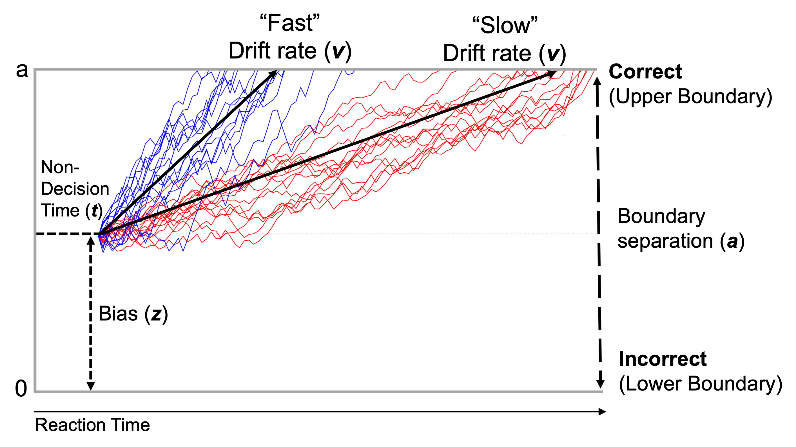

```{r analysis-preferences, include=FALSE}
# Seed for random number generation
knitr::opts_chunk$set(set.seed(312), echo=FALSE, message=FALSE, echo=FALSE, warning=FALSE, error=FALSE, out.width='100%')
```

```{r}
    options(width=80, Ncpus = 6, mc.cores=6, scipen=999) #Set width
    rm(list=ls())     #Remove everything from environment
    cat("\014")       #Clear Console

  library(knitr)      #allows rmarkdown files
  library(haven)      #helps import stata
  library(MASS)       #calculate residualized scores
  library(tidyverse)  #plotting/cleaning, etc.
  library(broom)      #nice statistical output
  library(expss)      #labeling variables/values
  library(psych)      #used for statistical analyses
  library(labelled)   #get labelled values when importing from SPSS
  library(confintr)   #get confidence intervals from models
  library(papaja)     #APA formatting
  library(DescTools)  #descriptive statistics
  library(irr)        #ICC
  library(lmerTest)   #p value from mixed effects models
  library(broom.mixed) #tidying output of mixed effects models
  library(ggplot2)    #plotting graphs
  library(ggpubr)
  library(scales)
  library(forcats)
  library(scipub)
  library(formattable) #keep trailing 0's with geom_text(aes(label = formattable::digits(VAR, digits = 2))
  library(here)       #nice file paths
  library(workflowr)  #helps with workflow

r_refs("LDDM.bib")
```

```{r Load data}
here::i_am("./manuscript/LDDM_tables_and_figures.Rmd")
load(file=here("./data/LDDM_do2_d1_not_outliers.RData"))
load(file=here("./data/LDDM_do2_d2_not_outliers.RData"))
load(file=here("./data/LDDM_do2_d3_not_outliers.RData"))

load(file=here("./data/LDDM_cleaning04_calc3_1to3.RData"))
load(file=here("./data/LDDM_do2_irr.RData"))
load(file=here("./data/LDDM_do2.RData"))
load(file=here("./data/spearman_brown_d1.RData"))
load(file=here("./data/spearman_brown_d2.RData"))
load(file=here("./data/spearman_brown_d3.RData"))

load(file=here("./data/LDDM_do3_rdoc.RData"))
load(file=here("./data/LDDM_do3_rdoc_no_outliers.RData"))
load(file=here("./data/spearman_brown_rdoc.RData"))
```

```{r}
 correlation_matrix <- function(df, 
                                type = "pearson",
                                digits = 2, 
                                decimal.mark = ".",
                                use = "all", 
                                show_significance = TRUE, 
                                replace_diagonal = FALSE, 
                                replacement = ""){
   
   # check arguments
   stopifnot({
     is.numeric(digits)
     digits >= 0
     use %in% c("all", "upper", "lower")
     is.logical(replace_diagonal)
     is.logical(show_significance)
     is.character(replacement)
   })
   # we need the Hmisc package for this
   require(Hmisc)
   
   # retain only numeric and boolean columns
   isNumericOrBoolean = vapply(df, function(x) is.numeric(x) | is.logical(x), logical(1))
   if (sum(!isNumericOrBoolean) > 0) {
     cat('Dropping non-numeric/-boolean column(s):', paste(names(isNumericOrBoolean)[!isNumericOrBoolean], collapse = ', '), '\n\n')
   }
   df = df[isNumericOrBoolean]
   
   # transform input data frame to matrix
   x <- as.matrix(df)
   
   # run correlation analysis using Hmisc package
   correlation_matrix <- Hmisc::rcorr(x, type = "pearson")
   R <- correlation_matrix$r # Matrix of correlation coeficients
   p <- correlation_matrix$P # Matrix of p-value 
   
   # transform correlations to specific character format
   Rformatted = formatC(R, format = 'f', digits = digits, decimal.mark = decimal.mark)
   
   # if there are any negative numbers, we want to put a space before the positives to align all
   if (sum(R < 0) > 0) {
     Rformatted = ifelse(R > 0, paste0(' ', Rformatted), Rformatted)
   }
   
   # add significance levels if desired
   if (show_significance) {
     # define notions for significance levels; spacing is important.
     stars <- ifelse(is.na(p), "   ", ifelse(p < .01, "**", ifelse(p < .05, "* ", "   ")))
     Rformatted = paste0(Rformatted, stars)
   }
   # build a new matrix that includes the formatted correlations and their significance stars
   Rnew <- matrix(Rformatted, ncol = ncol(x))
   rownames(Rnew) <- colnames(x)
   colnames(Rnew) <- paste(colnames(x), "", sep =" ")
   
   # replace undesired values
   if (use == 'upper') {
     Rnew[lower.tri(Rnew, diag = replace_diagonal)] <- replacement
   } else if (use == 'lower') {
     Rnew[upper.tri(Rnew, diag = replace_diagonal)] <- replacement
   } else if (replace_diagonal) {
     diag(Rnew) <- replacement
   }
   
   return(Rnew)
 }

 save_correlation_matrix = function(df, filename, ...) {
   write.csv2(correlation_matrix(df, ...), file = filename)
 }
```

```{r}
make_CI <- function(lower, upper) {
  paste0("[", round(lower,2), ", ", round(upper,2), "]")
}

group.colors <- c(`Drift rate` = "blue", `Drift rate (congruent)` = "#911eb4", `Drift rate (incongruent)` ="#000075", `Boundary separation` = "#3cb44b", `NIH Toolbox` = "#e6194B", `Accuracy (incongruent)` = "#f58231", `RT interference` = "gold")
```

```{r}
load(file=here("./data/LDDM_cleaning02_demo.RData"))
LDDM_do2_d1_demo <- full_join(LDDM_do2_d1_not_outliers, LDDM_cleaning02_demo)
LDDM_do2_d1_demo$Gender <- case_match(LDDM_do2_d1_demo$Gender, 1~"Male", 2~"Female")
LDDM_do2_d2_not_outliers <- LDDM_do2_d2_not_outliers %>%
  full_join(dplyr::select(LDDM_do2_d1_demo, ID, Gender), by="ID")
LDDM_do2_d3_not_outliers <- LDDM_do2_d3_not_outliers %>%
  full_join(dplyr::select(LDDM_do2_d1_demo, ID, Gender), by="ID")

LDDM_do3_rdoc_no_outliers$exec_composite_pos <- -1*LDDM_do3_rdoc_no_outliers$exec_composite
LDDM_do3_rdoc_no_outliers$Gender <- case_match(LDDM_do3_rdoc_no_outliers$Gender, 1~"Male", 2~"Female")
demo_rdoc <- FullTable1(vars=c("Gender","Age","accuracy","accuracy_congruent","accuracy_incongruent","rt_interference","flanker_score_rdoc","Pred_FSIQ","Motor_time","Inhib_time","exec_composite_pos"), 
                        var_names=c("Gender","Age","Raw accuracy","Accuracy (congruent)","Accuracy (incongruent)","RT interference",
                                    "NIH Toolbox score","IQ","Motor speed","Inhibition","Set-shifting"),
                        data=filter(LDDM_do3_rdoc_no_outliers, complete.cases(accuracy)))

demo_d1 <- FullTable1(vars=c("Gender","Age","accuracy","accuracy_congruent","accuracy_incongruent","rt_interference","flanker_score"),
                      var_names=c("Gender","Age","Overall accuracy","Accuracy (congruent)","Accuracy (incongruent)","RT interference",
                                    "NIH Toolbox score"),
                      data=filter(LDDM_do2_d1_demo, complete.cases(accuracy)))
demo_d2 <- FullTable1(vars=c("Gender","Age","accuracy","accuracy_congruent","accuracy_incongruent","rt_interference","flanker_score"),
                      var_names=c("Gender","Age","Overall accuracy","Accuracy (congruent)","Accuracy (incongruent)","RT interference",
                                    "NIH Toolbox score"),
                      data=filter(LDDM_do2_d2_not_outliers, complete.cases(accuracy)))
demo_d3 <- FullTable1(vars=c("Gender","Age","accuracy","accuracy_congruent","accuracy_incongruent","rt_interference","flanker_score"),
                      var_names=c("Gender","Age","Overall accuracy","Accuracy (congruent)","Accuracy (incongruent)","RT interference",
                                    "NIH Toolbox score"),
                      data=filter(LDDM_do2_d3_not_outliers, complete.cases(accuracy)))

full_demo <- data.frame("Variable"= c(demo_rdoc$table[,1]),
                        "Study1"= c(demo_rdoc$table[,2]),
                        "Session1"= c(demo_d1$table[,2],"--","--","--","--"),
                        "Session2"= c(demo_d2$table[,2],"--","--","--","--"),
                        "Session3"= c(demo_d3$table[,2],"--","--","--","--"))
```
```{r}
# Print the demographic table
apa_table(full_demo,
          caption="Demographics of two study samples",
          note=paste0("Means (SD) for continuous variables, N (%) for dichotomous variables. Study 1: ",substr(demo_rdoc$caption,7,100),"Study 2: ",substr(demo_d1$caption,7,100)),
          col_spanners = list(`Variables` = c(1,1),`Study 1` = c(2,2), `Study 2` = c(3,5)),
          col.names = c("", "", "Session 1", "Session 2", "Session 3"),
          align = c("l", rep("c", 4))
)
```

```{r schematic, fig.cap = "Depiction drift-diffusion modeling of flanker behavioral data.", out.width='100%'}
# Include the image of the DDM modeling that Allie made

```

```{r Correlation tables}
all_measures_sttr <- c("FCZ_ERN_080_d1_z","flanker_score_d1_z","accuracy_incongruent_d1_z","rt_interference_d1_z",
                   "B11_avtz_v_d1_z","B11_avtz_a_d1_z",
                   "FCZ_ERN_080_d2_z","flanker_score_d2_z","accuracy_incongruent_d2_z","rt_interference_d2_z",
                   "B11_avtz_v_d2_z","B11_avtz_a_d2_z",
                   "FCZ_ERN_080_d3_z","flanker_score_d3_z","accuracy_incongruent_d3_z","rt_interference_d3_z",
                   "B11_avtz_v_d3_z","B11_avtz_a_d3_z")

all_measures_rdoc <- c("FCz_ERN_080_z","flanker_score_rdoc_z","accuracy_incongruent_z","rt_interference_z",
                   "B11_avtz_v_z","B11_avtz_a_z","Inhib_time_rev_z","exec_composite_z")

# Merge all STTR datasets together
LDDM_do2_sttr_not_outliers <- LDDM_do2_d1_not_outliers %>%
   full_join(LDDM_do2_d2_not_outliers, by="id") %>%
   full_join(LDDM_do2_d3_not_outliers, by="id")

# Make correlation matrices for STTR and RDOC
sttr_correlations <- correlation_matrix(LDDM_do2_sttr_not_outliers[c(all_measures_sttr)], 
                                        type = c("pearson"), use = 'lower', replace_diagonal=TRUE, replacement="")
rdoc_correlations <- correlation_matrix(LDDM_do3_rdoc_no_outliers[c(all_measures_rdoc)], 
                                        type = c("pearson"), use = 'lower', replace_diagonal=TRUE, replacement="")

# For STTR, specify variables in each Session
`Session 1` <- 1:6
`Session 2` <- 7:12
`Session 3` <- 13:18
table_list <- list(`Session 1`, `Session 2`, `Session 3`)

# Set all missing values to be empty
sttr_correlations[is.na(sttr_correlations)] <- ""
sttr_correlations[is.na(rdoc_correlations)] <- ""

# Rename all columns and rows for STTR and RDOC correlation matrices
# colnames(sttr_correlations)=rep(c(expression("ERN"[resid]),"NIH","Acc",
#                    "DR","DR (con)","Drift rate (incon)","BS"),3)
sttr_correlations <-  as.data.frame(sttr_correlations) %>%
  mutate(measures=rep(c("ERN","NIH","Acc","RT","DR","BS"),3)) %>%
  select(measures, everything())
 
# colnames(rdoc_correlations)=rep(c("ERN","NIH","Acc",
#                    "DR","DR (co)","Drift rate (incon)","BS","Inhibition","SS"),1)
rownames(rdoc_correlations)=rep(c("ERN\\textsubscript{r}","NIH","Acc","RT",
                   "DR","BS","Inhibition","SS"),1)
```
<!-- \begin{landscape} -->

\setlength{\tabcolsep}{-2pt}
```{r}
# Make the actual tables
apa_table(rdoc_correlations[,-8],
           row.names=TRUE,
           align = c("p{2.6cm}", rep("p{1.6cm}", ncol(rdoc_correlations)-1)),
           col.names=c("Measures","ERN\\textsubscript{r}","NIH","Acc","RT",
                   "DR","BS","Inhibition"),
           font_size="footnotesize",
           caption = "Bivariate pearson correlations among Study 1 variables",
           note = "** p < .01, * p < .05. ERN\\textsubscript{r}: error-related negativity residualized score, NIH: NIH Toolbox flanker score, Acc: raw accuracy (incongruent), RT: reaction time interference, DR: drift rate, BS: boundary separation, SS: set-shifting.",
           landscape=TRUE,
           escape=FALSE
)
  
apa_table(sttr_correlations[,-19],
           row.names=FALSE,
           align = c("p{1.7cm}", rep("p{1cm}", ncol(sttr_correlations)-1)),
           col.names=c("Measures",rep(c("ERN\\textsubscript{r}","NIH","Acc","RT","DR","BS"),2),
                   c("ERN\\textsubscript{r}","NIH","Acc","RT","DR")),
           font_size="tiny",
           col_spanners = list(` ` = c(1,1),`Session 1` = c(2,7), `Session 2` = c(8,13), `Session 3` = c(14,18)),
           caption = "Bivariate pearson correlations among Study 2 variables",
           note = "** p < .01, * p < .05. ERN\\textsubscript{r}: error-related negativity residualized score, NIH: NIH Toolbox, Acc: raw accuracy (incongruent), RT: reaction time interference, DR: drift rate, BS: boundary separation.",
           stub_indents=list(`Session 1`=c(1:6), `Session 2`=c(7:12), `Session 3`=c(13:18)),
           landscape=TRUE,
           escape=FALSE
)
```
\setlength{\tabcolsep}{6pt}
<!-- \end{landscape} -->

```{r Split-half}
spearman_brown_d1_plot <- spearman_brown_d1 %>%
  pivot_longer(-c(trials), names_to="Measure") %>%
  separate(Measure, "_", into = c("Measure", "Stat")) %>%
  pivot_wider(names_from=Stat, values_from=value) %>%
  mutate(r=`NA`, `NA`=NULL)

spearman_brown_d1_plot$Measure_long <- recode_factor(spearman_brown_d1_plot$Measure, rv = "Drift rate", ra = "Boundary separation", rnih = "NIH Toolbox", racc = "Accuracy (incongruent)", rrt = "RT interference")

ymin <- plyr::round_any(as.numeric(spearman_brown_d1_plot %>% filter(cilower>-5) %>% reframe(min(cilower))),0.1)

sh_d1 <- ggplot(spearman_brown_d1_plot, aes(x=trials*2, y=r, fill=Measure_long)) +
  geom_line(aes(color=Measure_long)) +
  geom_point(aes(color=Measure_long)) +
  geom_ribbon(aes(ymin = cilower, ymax = ciupper, fill=Measure_long), alpha = 0.1) +
  scale_x_continuous(breaks=spearman_brown_d1$trials*2) +
  scale_y_continuous(limits = c(ymin, 1), breaks=seq(ymin,1,by=0.10)) +
  scale_color_manual(name="Measure", values=group.colors,
                    labels=c(str_wrap("Drift rate", 10), str_wrap("Boundary separation",10),
                             str_wrap("NIH Toolbox",10), str_wrap("Accuracy (incongruent)",10),
                             str_wrap("RT interference",10))) +
  scale_fill_manual(guide=NULL, values=group.colors) +
  geom_hline(yintercept=0) +
  theme_apa() +
  theme(legend.position="top")


spearman_brown_d2_plot <- spearman_brown_d2 %>%
  pivot_longer(-c(trials), names_to="Measure") %>%
  separate(Measure, "_", into = c("Measure", "Stat")) %>%
  pivot_wider(names_from=Stat, values_from=value) %>%
  mutate(r=`NA`, `NA`=NULL)

spearman_brown_d2_plot$Measure_long <- recode_factor(spearman_brown_d2_plot$Measure, rv = "Drift rate", ra = "Boundary separation", rnih = "NIH Toolbox", racc = "Accuracy (incongruent)", rrt = "RT interference")

ymin <- plyr::round_any(as.numeric(spearman_brown_d2_plot %>% filter(cilower>-5) %>% reframe(min(cilower))),0.1)

sh_d2 <- ggplot(spearman_brown_d2_plot, aes(x=trials*2, y=r, fill=Measure_long)) +
  geom_line(aes(color=Measure_long)) +
  geom_point(aes(color=Measure_long)) +
  geom_ribbon(aes(ymin = cilower, ymax = ciupper, fill=Measure_long), alpha = 0.1) +
  scale_x_continuous(breaks=spearman_brown_d2$trials*2) +
  scale_y_continuous(limits = c(ymin, 1), breaks=seq(ymin,1,by=0.10)) +
  scale_color_manual(name="Measure", values=group.colors,
                    labels=c(str_wrap("Drift rate", 10), str_wrap("Boundary separation",10),
                             str_wrap("NIH Toolbox",10), str_wrap("Accuracy (incongruent)",10),
                             str_wrap("RT interference",10))) +
  scale_fill_manual(guide=NULL, values=group.colors) +
  geom_hline(yintercept=0) +
  theme_apa() +
  theme(legend.position="top")

spearman_brown_d3_plot <- spearman_brown_d3 %>%
  pivot_longer(-c(trials), names_to="Measure") %>%
  separate(Measure, "_", into = c("Measure", "Stat")) %>%
  pivot_wider(names_from=Stat, values_from=value) %>%
  mutate(r=`NA`, `NA`=NULL)

spearman_brown_d3_plot$Measure_long <- recode_factor(spearman_brown_d3_plot$Measure, rv = "Drift rate", ra = "Boundary separation", rnih = "NIH Toolbox", racc = "Accuracy (incongruent)", rrt = "RT interference")

ymin <- plyr::round_any(as.numeric(spearman_brown_d3_plot %>% filter(cilower>-5) %>% reframe(min(cilower))),0.1)

sh_d3 <- ggplot(spearman_brown_d3_plot, aes(x=trials*2, y=r, fill=Measure_long)) +
  geom_line(aes(color=Measure_long)) +
  geom_point(aes(color=Measure_long)) +
  geom_ribbon(aes(ymin = cilower, ymax = ciupper, fill=Measure_long), alpha = 0.1) +
  scale_x_continuous(breaks=spearman_brown_d3$trials*2) +
  scale_y_continuous(limits = c(-0.9, 1), breaks=round(seq(-0.9,1,by=0.10),2)) +
  scale_color_manual(name="Measure", values=group.colors,
                    labels=c(str_wrap("Drift rate", 10), str_wrap("Boundary separation",10),
                             str_wrap("NIH Toolbox",10), str_wrap("Accuracy (incongruent)",10),
                             str_wrap("RT interference",10))) +
  scale_fill_manual(guide=NULL, values=group.colors) +
  geom_hline(yintercept=0) +
  theme_apa() +
  theme(legend.position="top")

spearman_brown_rdoc_plot <- spearman_brown_rdoc %>%
  pivot_longer(-c(trials), names_to="Measure") %>%
  separate(Measure, "_", into = c("Measure", "Stat")) %>%
  pivot_wider(names_from=Stat, values_from=value) %>%
  mutate(r=`NA`, `NA`=NULL)

spearman_brown_rdoc_plot$Measure_long <- recode_factor(spearman_brown_rdoc_plot$Measure, rv = "Drift rate", ra = "Boundary separation", rnih = "NIH Toolbox", racc = "Accuracy (incongruent)", rrt = "RT interference")

ymin <- spearman_brown_rdoc_plot %>% filter(cilower>-5) %>% reframe(range = min(cilower))

sh_rdoc <- ggplot(spearman_brown_rdoc_plot, aes(x=trials*2, y=r)) +
  geom_line(aes(color=Measure_long)) +
  geom_point(aes(color=Measure_long)) +
  geom_ribbon(aes(ymin = cilower, ymax = ciupper, fill=Measure_long), alpha = 0.1) +
  scale_x_continuous(breaks=spearman_brown_rdoc$trials*2) +
  scale_y_continuous(limits = c(0, 1), breaks=seq(0,1,by=0.10)) +
  scale_color_manual(name="Measure", values=group.colors,
                    labels=c(str_wrap("Drift rate",10), str_wrap("Boundary separation",10),
                             str_wrap("NIH Toolbox",10), str_wrap("Accuracy (incongruent)",10),
                             str_wrap("RT interference",10))) +
  scale_fill_manual(guide=NULL, values=group.colors) +
  labs(y="Spearman-Brown", x="Total trials") +
  # geom_hline(yintercept=0) +
  theme_apa() +
  theme(legend.position="bottom")
```

\newpage
\begin{landscape}
```{r, fig.cap = "Spearman-Brown split-half reliability with increasing trials across Study 1 and all three sessions of Study 2.", fig.width=10, fig.height=8}
sh <- ggarrange(sh_rdoc + rremove("xylab") + rremove("x.text") + rremove("legend"),
          sh_d1 + rremove("xylab") + rremove("x.text") + rremove("legend") + 
            scale_y_continuous(limits = c(-0.7, 1), breaks=round(seq(-0.7,1,by=0.1),1)),
          sh_d2 + rremove("xylab") + rremove("legend"),
          sh_d3 + rremove("xylab") + rremove("legend") + 
            scale_y_continuous(limits = c(-0.9, 1), breaks=round(seq(-0.9,1,by=0.1),1)),
          labels=c("Study 1","Study 2: Session 1","Study 2: Session 2","Study 2: Session 3"),
          hjust=c(-5.75, -1.75, -1.75, -1.75),
          vjust=c(20, 20, 20, 20),
          common.legend = TRUE,
          align="hv",
          legend="top",
          ncol=2, nrow=2,
          heights = c(1, 1, 1, 1))

sh <- annotate_figure(sh, left = grid::textGrob("Spearman-Brown split-half [95% CI]", rot = 90, vjust = 1, gp = grid::gpar(cex = 1.3)),
                bottom = grid::textGrob("Number of total trials", gp = grid::gpar(cex = 1.3)),
                fig.lab.size=12)
sh
```
\end{landscape}
\newpage
```{r Test-retest}
sttr_hddm_variables <- c("B11_avtz_v_d1_z","B11_avtz_v_d2_z","B11_avtz_v_d3_z",
                         "B11_avtz_a_d1_z","B11_avtz_a_d2_z","B11_avtz_a_d3_z",
                         "B11_avtz_t_d1_z","B11_avtz_t_d2_z","B11_avtz_t_d3_z",
                         "B11_avtz_z_d1_z","B11_avtz_z_d2_z","B11_avtz_z_d3_z",
                         "flanker_score_d1_z","flanker_score_d2_z","flanker_score_d3_z",
                         "accuracy_incongruent_d1_z","accuracy_incongruent_d2_z","accuracy_incongruent_d3_z",
                         "rt_interference_d1_z","rt_interference_d2_z","rt_interference_d3_z")

sttr_icc_table <- data.frame(
                           parameters= c("Drift rate", "Boundary separation", 
                                         "Non-decision time", "Starting bias", 
                                         "NIH Toolbox", "Accuracy (incongruent)", "RT interference"),
                                 
                           ICC=c(icc(LDDM_do2_irr[sttr_hddm_variables[1:3]])$value,
                           icc(LDDM_do2_irr[sttr_hddm_variables[4:6]])$value,
                           icc(LDDM_do2_irr[sttr_hddm_variables[7:9]])$value,
                           icc(LDDM_do2_irr[sttr_hddm_variables[10:12]])$value,
                           icc(LDDM_do2_irr[sttr_hddm_variables[13:15]])$value,
                           icc(LDDM_do2_irr[sttr_hddm_variables[16:18]])$value,
                           icc(LDDM_do2_irr[sttr_hddm_variables[19:21]])$value),
                           
                           CI=c(make_CI(icc(LDDM_do2_irr[sttr_hddm_variables[1:3]])$lbound,icc(LDDM_do2_irr[sttr_hddm_variables[1:3]])$ubound),
                           make_CI(icc(LDDM_do2_irr[sttr_hddm_variables[4:6]])$lbound,icc(LDDM_do2_irr[sttr_hddm_variables[4:6]])$ubound),
                           make_CI(icc(LDDM_do2_irr[sttr_hddm_variables[7:9]])$lbound,icc(LDDM_do2_irr[sttr_hddm_variables[7:9]])$ubound),
                           make_CI(icc(LDDM_do2_irr[sttr_hddm_variables[10:12]])$lbound,icc(LDDM_do2_irr[sttr_hddm_variables[10:12]])$ubound),
                           make_CI(icc(LDDM_do2_irr[sttr_hddm_variables[13:15]])$lbound,icc(LDDM_do2_irr[sttr_hddm_variables[13:15]])$ubound),
                           make_CI(icc(LDDM_do2_irr[sttr_hddm_variables[16:18]])$lbound,icc(LDDM_do2_irr[sttr_hddm_variables[16:18]])$ubound),
                           make_CI(icc(LDDM_do2_irr[sttr_hddm_variables[19:21]])$lbound,icc(LDDM_do2_irr[sttr_hddm_variables[19:21]])$ubound)),
                           
                           lower_ci=c(icc(LDDM_do2_irr[sttr_hddm_variables[1:3]])$lbound,
                           icc(LDDM_do2_irr[sttr_hddm_variables[4:6]])$lbound,
                           icc(LDDM_do2_irr[sttr_hddm_variables[7:9]])$lbound,
                           icc(LDDM_do2_irr[sttr_hddm_variables[10:12]])$lbound,
                           icc(LDDM_do2_irr[sttr_hddm_variables[13:15]])$lbound,
                           icc(LDDM_do2_irr[sttr_hddm_variables[16:18]])$lbound,
                           icc(LDDM_do2_irr[sttr_hddm_variables[19:21]])$lbound),

                           upper_ci=c(icc(LDDM_do2_irr[sttr_hddm_variables[1:3]])$ubound,
                           icc(LDDM_do2_irr[sttr_hddm_variables[4:6]])$ubound,
                           icc(LDDM_do2_irr[sttr_hddm_variables[7:9]])$ubound,
                           icc(LDDM_do2_irr[sttr_hddm_variables[10:12]])$ubound,
                           icc(LDDM_do2_irr[sttr_hddm_variables[13:15]])$ubound,
                           icc(LDDM_do2_irr[sttr_hddm_variables[16:18]])$ubound,
                           icc(LDDM_do2_irr[sttr_hddm_variables[19:21]])$ubound)
                           )

sttr_icc_table$ICC <- round(sttr_icc_table$ICC, 2)
write.csv(sttr_icc_table, here("./tables/sttr_icc_table.csv"))
```

```{r fig.cap = "Test-retest reliability of DDM parameters and traditional behavioral measures across three sessions.", out.width='100%'}
sttr_icc_table$parameters <- fct_rev(factor(sttr_icc_table$parameters, levels = sttr_icc_table$parameters))

ggplot(sttr_icc_table[c(1,2,5:7),], aes(y=parameters, x=ICC, color=parameters)) +
  geom_point() +
  geom_text(aes(label=round(ICC,2)),vjust=-0.75)+
  geom_errorbar(aes(xmin=lower_ci, xmax=upper_ci), colour="black", width=.1) +
  scale_x_continuous(limits = c(0,1), breaks=seq(0,1,0.1)) +
  scale_y_discrete(labels = label_wrap(10)) +
  labs(y="Flanker behavioral measures", x="ICC (95% CI)") +
  scale_color_manual(values=group.colors) +
  # scale_x_discrete(guide = guide_axis(n.dodge = 2)) +
  theme_apa() +
  theme(legend.position="none")
```


```{r Multiple regression RDoC table}
mr_ERN_table_rdoc <- read.csv(file=here("./tables/mr_ERN_table_rdoc.csv"))

mr_table_names <- c("X","parameters", "ddm_est", "ddm_lci", "ddm_uci",
                                                 "nih_est", "nih_lci", "nih_uci",
                                                 "acc_est", "acc_lci", "acc_uci",
                                                 "rt_est", "rt_lci", "rt_uci")

# RDoC Study
mr_ERN_table_rdoc_raw <- read.csv(file=here("./tables/mr_ERN_table_rdoc_raw.csv"))
colnames(mr_ERN_table_rdoc_raw) <- mr_table_names
mr_ERN_table_rdoc_raw_new <- mr_ERN_table_rdoc_raw %>%
  select(-X) %>%
  pivot_longer(cols=ddm_est:rt_uci, names_to=c("measure","stat"), names_sep="_") %>%
  pivot_wider(names_from=stat, values_from=value)

fit_rdoc <- lmer(FCz_ERN_080 ~ B11_avtz_DO_v_v + flanker_score_rdoc_z + accuracy_incongruent_z + rt_interference_z + (1 | F_ID), LDDM_do3_rdoc_no_outliers)
# ggplot(LDDM_do3_rdoc_no_outliers, aes(x = B11_avtz_DO_v_v, y = FCz_ERN_080)) +
#   labs(x="ERN mean ampitude (µV)",y="Drift rate")+
#   geom_point(shape = 16, size=1.8) +
#   geom_abline(aes(intercept=`(Intercept)`, slope=B11_avtz_DO_v_v), as.data.frame(t(fixef(fit_rdoc)))) +
#   theme_apa()

mr_ERN_table_rdoc_raw_new <- mr_ERN_table_rdoc_raw_new %>%
  mutate(measure_new = ifelse(measure=="ddm", parameters, ifelse(measure=="nih", "NIH Toolbox", ifelse(measure=="acc", "Accuracy (incongruent)", ifelse(measure=="rt", "RT interference", NA))))) %>%
  mutate(measure_new = factor(measure_new, levels=c("NIH Toolbox", "Accuracy (incongruent)", "RT interference", "Drift rate","Boundary separation")))

# New facet label names for supp variable
param.labs <- c("Model 1", "Model 2")
names(param.labs) <- c("Drift rate", "Boundary separation")

ern_rdoc <- ggplot(mr_ERN_table_rdoc_raw_new[c(1:8),], aes(x=est, label=parameters, y=measure_new, color=measure_new)) +
  geom_point(position=position_dodge(width = 1), stat = "identity") +
  geom_errorbar(aes(xmin=lci, xmax=uci), width=.1,  position=position_dodge(width = 1), stat="identity") +
  geom_vline(xintercept = 0) +
  labs(y="Flanker behavioral measure", x="beta [95% CI]", title=expression("ERN"[resid])) +
  scale_color_manual(values=group.colors) +
  facet_grid(parameters~., scales = "free", space = "fixed", labeller = as_labeller(
    c(`Boundary separation` = "Model 2", 
      `Drift rate` = "Model 1"))) +
  theme_apa() +
  theme(strip.background = element_blank(), #remove background for facet labels
        strip.text.y = element_blank(),
        panel.border = element_rect(colour = "black", fill = NA), #add black border
        panel.spacing = unit(0, "lines"), #remove space between facets)
        legend.position = "none") #hide legend
```

```{r Multiple regression SS tables}
# mr_Inhib_table_rdoc_nocov <- read.csv(file=here("./tables/mr_INHIB_table_rdoc_nocov.csv"))
mr_Inhib_table_rdoc_cov <- read.csv(file=here("./tables/mr_INHIB_table_rdoc_cov.csv"))

mr_Inhib_table_rdoc_cov_raw <- read.csv(file=here("./tables/mr_INHIB_table_rdoc_cov_raw.csv"))
colnames(mr_Inhib_table_rdoc_cov_raw) <- mr_table_names
mr_Inhib_table_rdoc_cov_raw_new <- mr_Inhib_table_rdoc_cov_raw %>%
  select(-X) %>%
  pivot_longer(cols=ddm_est:rt_uci, names_to=c("measure","stat"), names_sep="_") %>%
  pivot_wider(names_from=stat, values_from=value)

mr_Inhib_table_rdoc_cov_raw_new <- mr_Inhib_table_rdoc_cov_raw_new %>%
  mutate(measure_new = ifelse(measure=="ddm", parameters, ifelse(measure=="nih", "NIH Toolbox", ifelse(measure=="acc", "Accuracy (incongruent)", ifelse(measure=="rt", "RT interference", NA))))) %>%
  mutate(measure_new = factor(measure_new, levels=c("NIH Toolbox", "Accuracy (incongruent)", "RT interference", "Drift rate","Boundary separation")))

inh <- ggplot(mr_Inhib_table_rdoc_cov_raw_new[c(1:8),], aes(x=est, label=parameters, y=measure_new, color=measure_new)) +
  geom_point(position=position_dodge(width = 1), stat = "identity") +
  geom_errorbar(aes(xmin=lci, xmax=uci), width=.1,  position=position_dodge(width = 1), stat="identity") +
  geom_vline(xintercept = 0) +
  labs(y="Flanker behavioral measure", x="beta [95% CI]", title="Inhibition") +
  scale_color_manual(values=group.colors) +
  facet_grid(parameters~., scales = "free", space = "fixed", labeller = as_labeller(
    c(`Boundary separation` = "Model 2", 
      `Drift rate` = "Model 1"))) +
  theme_apa() +
  theme(strip.background = element_blank(), #remove background for facet labels
        strip.text.y = element_blank(),
        panel.border = element_rect(colour = "black", fill = NA), #add black border
        panel.spacing = unit(0, "lines"), #remove space between facets)
        legend.position = "none") #hide legend

# mr_Exec_table_rdoc_nocov <- read.csv(file=here("./tables/mr_Exec_table_rdoc_nocov.csv"))
mr_Exec_table_rdoc_cov <- read.csv(file=here("./tables/mr_Exec_table_rdoc_cov.csv"))

mr_Exec_table_rdoc_cov_raw <- read.csv(file=here("./tables/mr_Exec_table_rdoc_cov_raw.csv"))
colnames(mr_Exec_table_rdoc_cov_raw) <- mr_table_names
mr_Exec_table_rdoc_cov_raw_new <- mr_Exec_table_rdoc_cov_raw %>%
  select(-X) %>%
  pivot_longer(cols=ddm_est:rt_uci, names_to=c("measure","stat"), names_sep="_") %>%
  pivot_wider(names_from=stat, values_from=value)

mr_Exec_table_rdoc_cov_raw_new <- mr_Exec_table_rdoc_cov_raw_new %>%
  mutate(measure_new = ifelse(measure=="ddm", parameters, ifelse(measure=="nih", "NIH Toolbox", ifelse(measure=="acc", "Accuracy (incongruent)", ifelse(measure=="rt", "RT interference", NA))))) %>%
  mutate(measure_new = factor(measure_new, levels=c("NIH Toolbox", "Accuracy (incongruent)", "RT interference", "Drift rate","Boundary separation")))

model_names <- list(
  'Boundary separation'="Model 2",
  'Drift rate'="Model 1"
)

ss <- ggplot(mr_Exec_table_rdoc_cov_raw_new[c(1:8),], aes(x=est, label=parameters, y=measure_new, color=measure_new)) +
  geom_point(position=position_dodge(width = 1), stat = "identity") +
  geom_errorbar(aes(xmin=lci, xmax=uci), width=.1,  position=position_dodge(width = 1), stat="identity") +
  geom_vline(xintercept = 0) +
  labs(y="Flanker behavioral measure", x="beta [95% CI]", title="Set-shifting") +
  scale_color_manual(values=group.colors) +
  facet_grid(parameters~., scales = "free", space = "fixed", labeller = as_labeller(
    c(`Boundary separation` = "Model 2", 
      `Drift rate` = "Model 1"))) +
  theme_apa() +
  theme(strip.background = element_blank(), #remove background for facet labels
        panel.border = element_rect(colour = "black", fill = NA), #add black border
        panel.spacing = unit(0, "lines"), #remove space between facets)
        legend.position = "none") #hide legend
```

```{r}
acc_ern_r <- cor.test(LDDM_do3_rdoc_no_outliers$accuracy_incongruent_z, LDDM_do3_rdoc_no_outliers$FCz_ERN_080_z, method="pearson")
acc_inhib_r <- cor.test(LDDM_do3_rdoc_no_outliers$accuracy_incongruent_z, LDDM_do3_rdoc_no_outliers$Inhib_time_rev_z, method="pearson")
acc_exec_r <- cor.test(LDDM_do3_rdoc_no_outliers$accuracy_incongruent_z, LDDM_do3_rdoc_no_outliers$exec_composite_z, method="pearson")
```

\newpage
\begin{landscape}
```{r, fig.cap = paste0("Multiple regression of behavioral measures predicting ERN and neuropsychological tests of inhibition and set-shifting Note: The bivariate correlations between accuracy and ERN ($r$ = ", round(acc_ern_r$estimate,3),", $p$ = ", round(acc_ern_r$p.value,3),"), accuracy and inhibition ($r$ = ",round(acc_inhib_r$estimate,3),", $p$ = ", round(acc_inhib_r$p.value,3),") and between accuracy and set-shifting ($r$ = ",round(acc_exec_r$estimate,3),", $p$ = ", round(acc_exec_r$p.value,3),") are non-significant, suggesting the presence of a suppression effect."), out.width='1\\linewidth', fig.width=10, fig.height=8}

val_rdoc <- ggarrange(ern_rdoc + rremove("xylab"),
                      inh + rremove("xylab") + rremove("y.text") + rremove("y.ticks"),
          ss + rremove("xylab") + rremove("y.text") + rremove("y.ticks"),
          ncol=3, nrow=1,
          widths = c(1.6, .9, 1))

val_rdoc <- annotate_figure(val_rdoc, left = grid::textGrob("Flanker behavioral measure", rot = 90, vjust = 1, gp = grid::gpar(cex = 1.3)),
                bottom = grid::textGrob("beta [95% CI]", gp = grid::gpar(cex = 1.3)),
                fig.lab.size=12)
val_rdoc
```
\end{landscape}

```{r For Poster, eval=FALSE}
# Split-half plot
sh_rdoc <- ggplot(spearman_brown_rdoc_plot, aes(x=trials*2, y=r)) +
  geom_line(aes(color=Measure_long), linewidth=2) +
  geom_point(aes(color=Measure_long), size=4) +
  geom_ribbon(aes(ymin = cilower, ymax = ciupper, fill=Measure_long), alpha = 0.1) +
  labs(y = str_wrap("Spearman-Brown split-half [95% CI]",20),
       x = "Number of total trials") +
  scale_x_continuous(breaks=spearman_brown_rdoc$trials*2) +
  scale_y_continuous(limits = c(0, 1), breaks=seq(0,1,by=0.10)) +
  scale_color_manual(name="Measure", values=group.colors,
                    labels=c(str_wrap("Drift rate", 10), str_wrap("Boundary separation",10),
                             str_wrap("NIH Toolbox",10), str_wrap("Accuracy (incongruent)",10),
                             str_wrap("RT interference",10))) +
  scale_fill_manual(guide=NULL, values=group.colors) +
  theme_apa() +
  theme(legend.position="none",
        text=element_text(size=40))

ggsave(here("./../presentations/splithalf.png"), sh_rdoc, device="png", width=17.5, height=10)

# Test-retest plot
group.colors <- c(`Drift rate` = "#469990", `Drift rate (congruent)` = "#911eb4", `Drift rate (incongruent)` ="#000075", `Boundary separation` = "#3cb44b", `NIH Toolbox` = "#f58231", `Accuracy (incongruent)` = "#e6194B", `RT interference` = "gold")

test_retest_plot <- ggplot(sttr_icc_table[c(1:4,7:9),], aes(y=parameters, x=ICC, color=parameters)) +
  geom_point(size=4) +
  geom_text(aes(label=formattable::digits(ICC, digits = 2)),parse = FALSE, vjust=-0.75, size=10)+
  geom_errorbar(aes(xmin=lower_ci, xmax=upper_ci), colour="black", width=.1, linewidth=1) +
  scale_x_continuous(limits = c(0.2, 1), breaks=seq(0,1,0.1)) +
  scale_y_discrete(labels = label_wrap(20)) +
  labs(y=" ", x="ICC (95% CI)") +
  scale_color_manual(values=group.colors) +
  # scale_x_discrete(guide = guide_axis(n.dodge = 2)) +
  theme_apa() +
  theme(legend.position="none",
        text=element_text(size=40))

ggsave(here("./../presentations/test_retest_plot.png"), test_retest_plot, device="png", width=17.5, height=10)

# Validity plot
group.colors <- c(`Drift \nrate` = "#469990", `Drift rate (congruent)` = "#911eb4", `Drift rate (incongruent)` ="#000075", `Boundary \nseparation` = "#3cb44b", `NIH \nToolbox` = "#f58231", `Accuracy \n(incongruent)` = "#e6194B", `RT \ninterference` = "gold")

mr_ERN_table_rdoc_raw_plot <- mr_ERN_table_rdoc_raw_new %>%
  mutate(measure_new = ifelse(measure=="nih", "NIH \nToolbox", 
                                     ifelse(measure=="acc", "Accuracy \n(incongruent)",
                                            ifelse(measure=="rt", "RT \ninterference",
                                            ifelse(parameters=="Drift rate", "Drift \nrate",
                                            ifelse(parameters=="Boundary separation", "Boundary \nseparation", NA)))))) %>%
  mutate(measure_new = factor(measure_new, levels=c("NIH \nToolbox", "Accuracy \n(incongruent)", "RT \ninterference", "Drift \nrate","Boundary \nseparation")))

ern_rdoc <- ggplot(mr_ERN_table_rdoc_raw_plot[c(1:4, 13:16),], aes(x=est, label=parameters, y=measure_new, color=measure_new)) +
  geom_point(position=position_dodge(width = 1), stat = "identity", size=4) +
  geom_errorbar(aes(xmin=lci, xmax=uci), width=.15,  position=position_dodge(width = 1), stat="identity", linewidth=2) +
  geom_vline(xintercept = 0) +
  labs(y="Flanker behavioral measure", x="beta [95% CI]", title=expression("ERN"[resid])) +
  scale_x_continuous(breaks=seq(-0.3, 0.3, 0.3)) +
  scale_color_manual(values=group.colors) +
  facet_grid(parameters~., scales = "free", space = "fixed", labeller = as_labeller(
    c(`Boundary separation` = "Model 2", 
      `Drift rate` = "Model 1"))) +
  theme_apa() +
  theme(strip.background = element_blank(), #remove background for facet labels
        strip.text.y = element_blank(),
        panel.border = element_rect(colour = "black", fill = NA), #add black border
        panel.spacing = unit(0, "lines"), #remove space between facets)
        legend.position="none",
        text=element_text(size=30))

mr_Inhib_table_rdoc_cov_raw_plot <- mr_Inhib_table_rdoc_cov_raw_new %>%
  mutate(measure_new = ifelse(measure=="nih", "NIH \nToolbox", 
                                     ifelse(measure=="acc", "Accuracy \n(incongruent)",
                                            ifelse(measure=="rt", "RT \ninterference",
                                            ifelse(parameters=="Drift rate", "Drift \nrate",
                                            ifelse(parameters=="Boundary separation", "Boundary \nseparation", NA)))))) %>%
  mutate(measure_new = factor(measure_new, levels=c("NIH \nToolbox", "Accuracy \n(incongruent)", "RT \ninterference", "Drift \nrate","Boundary \nseparation")))

inh <- ggplot(mr_Inhib_table_rdoc_cov_raw_plot[c(1:4, 13:16),], aes(x=est, label=parameters, y=measure_new, color=measure_new)) +
  geom_point(position=position_dodge(width = 1), stat = "identity", size=4) +
  geom_errorbar(aes(xmin=lci, xmax=uci), width=.15,  position=position_dodge(width = 1), stat="identity", linewidth=2) +
  geom_vline(xintercept = 0) +
  labs(y="Flanker behavioral measure", x="beta [95% CI]", title="Inhibition") +
  scale_x_continuous(breaks=seq(-0.3, 0.3, 0.3)) +
  scale_color_manual(values=group.colors) +
  facet_grid(parameters~., scales = "free", space = "fixed", labeller = as_labeller(
    c(`Boundary separation` = "Model 2", 
      `Drift rate` = "Model 1"))) +
  theme_apa() +
  theme(strip.background = element_blank(), #remove background for facet labels
        strip.text.y = element_blank(),
        panel.border = element_rect(colour = "black", fill = NA), #add black border
        panel.spacing = unit(0, "lines"), #remove space between facets)
        legend.position="none",
        text=element_text(size=30))

mr_Exec_table_rdoc_cov_raw_plot <- mr_Exec_table_rdoc_cov_raw_new %>%
  mutate(measure_new = ifelse(measure=="nih", "NIH \nToolbox", 
                                     ifelse(measure=="acc", "Accuracy \n(incongruent)",
                                            ifelse(measure=="rt", "RT \ninterference",
                                            ifelse(parameters=="Drift rate", "Drift \nrate",
                                            ifelse(parameters=="Boundary separation", "Boundary \nseparation", NA)))))) %>%
  mutate(measure_new = factor(measure_new, levels=c("NIH \nToolbox", "Accuracy \n(incongruent)", "RT \ninterference", "Drift \nrate","Boundary \nseparation")))

ss <- ggplot(mr_Exec_table_rdoc_cov_raw_plot[c(1:4, 13:16),], aes(x=est, label=parameters, y=measure_new, color=measure_new)) +
  geom_point(position=position_dodge(width = 1), stat = "identity", size=4) +
  geom_errorbar(aes(xmin=lci, xmax=uci), width=.15,  position=position_dodge(width = 1), stat="identity", linewidth=2) +
  geom_vline(xintercept = 0) +
  labs(y="Flanker behavioral measure", x="beta [95% CI]", title="Set-shifting") +
  scale_x_continuous(breaks=seq(-0.3, 0.3, 0.3)) +
  scale_color_manual(values=group.colors) +
  facet_grid(parameters~., scales = "free", space = "fixed", labeller = as_labeller(
    c(`Boundary separation` = "Model 2", 
      `Drift rate` = "Model 1"))) +
  theme_apa() +
  theme(strip.background = element_blank(), #remove background for facet labels
        panel.border = element_rect(colour = "black", fill = NA), #add black border
        panel.spacing = unit(0, "lines"), #remove space between facets)
        legend.position="none",
        text=element_text(size=30))

val_rdoc <- ggarrange(ern_rdoc + rremove("xylab"),
                      inh + rremove("xylab") + rremove("y.text") + rremove("y.ticks"),
          ss + rremove("xylab") + rremove("y.text") + rremove("y.ticks"),
          ncol=3, nrow=1,
          widths = c(1.5, .9, 1))
# val_rdoc <- annotate_figure(val_rdoc, left = grid::textGrob("Flanker behavioral measure", rot = 90, vjust = 1, gp = grid::gpar(fontsize = 20)),
                # bottom = grid::textGrob("beta [95% CI]", gp = grid::gpar(fontsize=20)))
val_rdoc
ggsave(here("./../presentations/val_rdoc.png"), val_rdoc, device="png", width=17.5, height=10)
```

```{r}
rdoc_heritability_table <- read.csv(here("./tables/rdoc_heritability_table.csv"))[,-1]
rdoc_heritability_table <- rdoc_heritability_table[-c(3:4),]
rdoc_heritability_table[,1] <- c("Drift rate","Boundary separation", "NIH Toolbox", "Raw accuracy", "RT interference")
rdoc_heritability_table[,2:3] <- round(rdoc_heritability_table[,2:3], 2)
rdoc_heritability_table[,4] <- rdoc_heritability_table[,3]
rdoc_heritability_table[,3] <- "  "

apa_table(rdoc_heritability_table,
          align = c("l","c","c"),
          col.names=c("Measures", "ICC", "   ", "p value"),
          caption="Familiality of flanker task measures")
```

